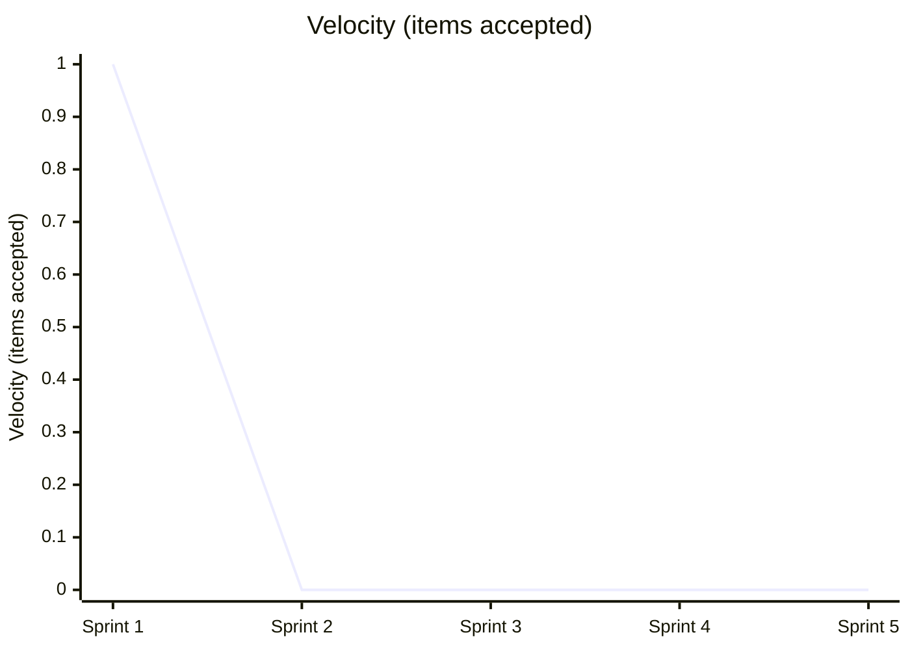
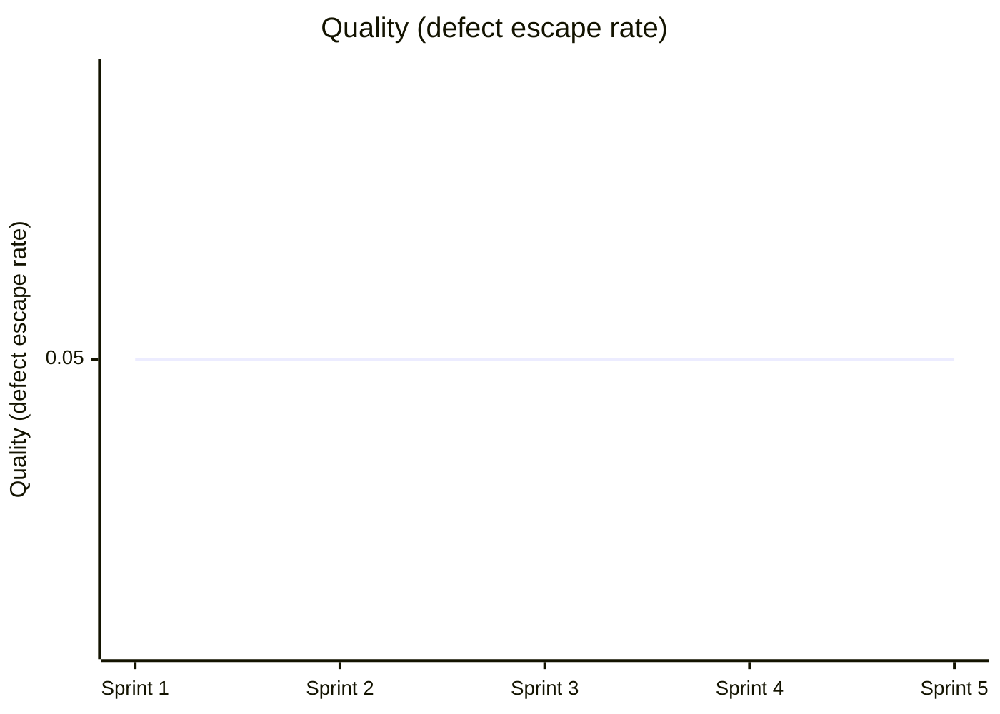

# Team Performance Evaluation Report

- Run ID: 0.1.0-run32
- Horseless Carriage commit: 8992f62614b3f0cb92682e9e876059e97c927067
- Branch: eval/0.1.0-run32/main
- Model: scrum-eval-cheap
- Sprints requested: 5, completed: 5
- Started: 2026-09-24T06:12:55.243270+00:00
- Finished: 2026-09-24T06:20:59.007820+00:00

## Methodology note
This run used a scripted, unattended driver (`run_eval.py`) that pre-approves every sprint goal/backlog and auto-merges any PR that opens against the eval branch, standing in for the human review gate real usage requires. Results reflect the team's real behavior under those conditions, not under full human-in-the-loop review - a lower bar in that one specific respect.

## Per-sprint metrics
| Sprint | Tokens Used | Stories Planned | Sprint Report? | PR Merges (after) |
|---|---|---|---|---|
| 1 | 1753418 | 3 | yes | 0/0 |
| 2 | 3047314 | 3 | yes | 1/1 |
| 3 | 2234249 | 3 | yes | 0/0 |
| 4 | 2495821 | 3 | yes | 0/0 |
| 5 | 2668971 | 3 | yes | 0/0 |

## KPI Trends

| KPI | Sprint 1 | Sprint 2 | Sprint 3 | Sprint 4 | Sprint 5 |
|---|---|---|---|---|---|
| Velocity (items accepted) | 1 | 0 | 0 | 0 | 0 |
| Issues fixed | 0 | 0 | 0 | 0 | 0 |
| Stories implemented | 1 | 1 | 1 | 1 | 1 |
| Testplan scenarios | 3 | 3 | 3 | 3 | 3 |
| Say-Do Ratio | 0.8 | 0.8 | 0.8 | 0.8 | 0.8 |
| Quality (defect escape rate) | 0.05 | 0.05 | 0.05 | 0.05 | 0.05 |
| Test Coverage | 0.77 | 0.77 | 0.77 | 0.77 | 0.77 |

### Velocity (items accepted)



### Issues fixed

```mermaid
xychart-beta
    title "Issues fixed"
    x-axis ["Sprint 1", "Sprint 2", "Sprint 3", "Sprint 4", "Sprint 5"]
    y-axis "Issues fixed"
    line [0, 0, 0, 0, 0]
```

### Stories implemented

```mermaid
xychart-beta
    title "Stories implemented"
    x-axis ["Sprint 1", "Sprint 2", "Sprint 3", "Sprint 4", "Sprint 5"]
    y-axis "Stories implemented"
    line [1, 1, 1, 1, 1]
```

### Testplan scenarios

```mermaid
xychart-beta
    title "Testplan scenarios"
    x-axis ["Sprint 1", "Sprint 2", "Sprint 3", "Sprint 4", "Sprint 5"]
    y-axis "Testplan scenarios"
    line [3, 3, 3, 3, 3]
```

### Say-Do Ratio

```mermaid
xychart-beta
    title "Say-Do Ratio"
    x-axis ["Sprint 1", "Sprint 2", "Sprint 3", "Sprint 4", "Sprint 5"]
    y-axis "Say-Do Ratio"
    line [0.8, 0.8, 0.8, 0.8, 0.8]
```

### Quality (defect escape rate)



### Test Coverage

```mermaid
xychart-beta
    title "Test Coverage"
    x-axis ["Sprint 1", "Sprint 2", "Sprint 3", "Sprint 4", "Sprint 5"]
    y-axis "Test Coverage"
    line [0.77, 0.77, 0.77, 0.77, 0.77]
```

## Token & Cost Summary

- Total tokens used: 12,199,773
- Expected cost: $3.6599 - $30.4994 (rough estimate from litellm's static pricing for `gemini/gemini-flash-lite-latest` - token_usage doesn't split prompt/completion tokens, so this is an all-input-vs-all-output bound, not an exact figure)

## Code Quality

**Score: 4/5**

The application logic in app.py and templates/index.html is clean, functional, and accurately delivers the core to-do list MVP requirements using Flask. The in-memory data structures correctly handle multiple lists, task addition, deletion, and status toggles. Furthermore, test_app.py provides working unit tests verifying the index route, list creation, and task insertion.

## Requirements Quality

**Score: 3/5**

While individual story cards like specs/stories/US-0001-Create-a-New-To-Do-List.md and specs/stories/US-0003-Add-Task-to-a-List.md are clearly articulated, the product roadmap in specs/ROADMAP.md remains largely incomplete with empty goal and story sections. Additionally, the tracking of story progression across multiple sprints reveals chronic stage synchronization failures.

## Team Efficiency

**Score: 2/5**

The AI Scrum team burned millions of tokens across 5 sprints while failing to advance or complete planned stories after Sprint 1, resulting in 0/3 stories completed in Sprints 2 through 5. The workflow transcripts show repetitive agent loops, transfer handoffs, and superficial reporting rather than genuine velocity or task execution.

## Top Problems

1. **The product roadmap file is left unpopulated with empty release plan sections.** (severity: medium)
   - Evidence: specs/ROADMAP.md contains empty goal and story lists under '### v0.1 — MVP' and '### v0.2 — Iteration'.
   - Suggested fix: Update specs/ROADMAP.md to accurately list tracked story IDs and milestone goals corresponding to the PRD.

2. **Stories are repeatedly marked as unfinished or uncompleted across Sprints 2 through 5 despite massive token expenditure.** (severity: high)
   - Evidence: specs/reports/SPRINT-REPORT-002.md states: 'Stories: 0/3 completed this sprint' for multiple consecutive sprints.
   - Suggested fix: no clear fix - the multi-agent scrum simulation framework exhibits a control loop deadlock where stories fail to transition to 'Done'.

3. **Story status tracking in markdown files contradicts actual implementation completion.** (severity: low)
   - Evidence: specs/stories/US-0003-Add-Task-to-a-List.md lists its status as 'Ready' and roadmap checkboxes as uncompleted, even though the task addition functionality is fully implemented in app.py.
   - Suggested fix: Implement an automated synchronization script to update story markdown statuses when code PRs merge successfully.
