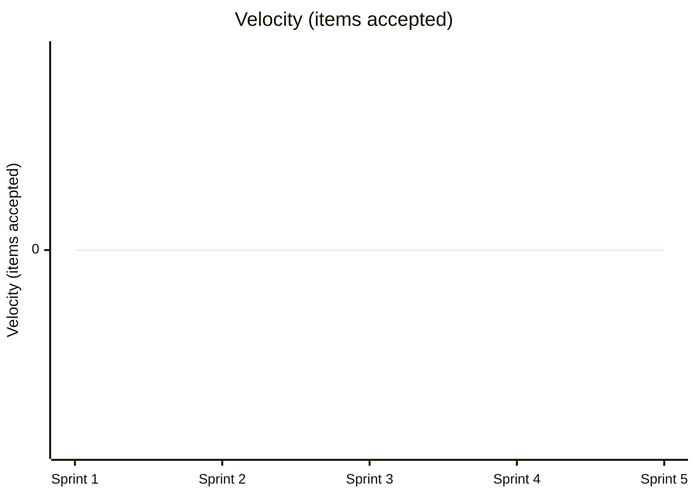

# Team Performance Evaluation Report

- Run ID: 0.1.0-run19
- Horseless Carriage commit: 409cfd46e705296a06d7d883b1f94201b5107c51
- Branch: eval/0.1.0-run19/main
- Model: scrum-eval-cheap
- Sprints requested: 5, completed: 5
- Started: 2026-07-31T14:22:58.700639+00:00
- Finished: 2026-07-31T14:26:31.571567+00:00

## Methodology note
This run used a scripted, unattended driver (`run_eval.py`) that pre-approves every sprint goal/backlog and auto-merges any PR that opens against the eval branch, standing in for the human review gate real usage requires. Results reflect the team's real behavior under those conditions, not under full human-in-the-loop review - a lower bar in that one specific respect.

## Per-sprint metrics
| Sprint | Tokens Used | Stories Planned | Sprint Report? | PR Merges (after) |
|---|---|---|---|---|
| 1 | 1995827 | 1 | yes | 0/0 |
| 2 | 1548663 | 1 | yes | 0/0 |
| 3 | 1166537 | 1 | yes | 0/0 |
| 4 | 591887 | 1 | yes | 0/0 |
| 5 | 619403 | 1 | yes | 0/0 |

## KPI Trends

| KPI | Sprint 1 | Sprint 2 | Sprint 3 | Sprint 4 | Sprint 5 |
|---|---|---|---|---|---|
| Velocity (items accepted) | 0 | 0 | 0 | 0 | 0 |
| Issues fixed | 0 | 0 | 0 | 0 | 0 |
| Stories implemented | 1 | 1 | 1 | 1 | 1 |
| Testplan scenarios | 2 | 2 | 2 | 2 | 2 |
| Say-Do Ratio | n/a | n/a | n/a | n/a | n/a |
| Quality (defect escape rate) | n/a | n/a | n/a | n/a | n/a |
| Test Coverage | n/a | n/a | n/a | n/a | n/a |

### Velocity (items accepted)



### Issues fixed

```mermaid
xychart-beta
    title "Issues fixed"
    x-axis ["Sprint 1", "Sprint 2", "Sprint 3", "Sprint 4", "Sprint 5"]
    y-axis "Issues fixed"
    line [0, 0, 0, 0, 0]
```

### Stories implemented

```mermaid
xychart-beta
    title "Stories implemented"
    x-axis ["Sprint 1", "Sprint 2", "Sprint 3", "Sprint 4", "Sprint 5"]
    y-axis "Stories implemented"
    line [1, 1, 1, 1, 1]
```

### Testplan scenarios

```mermaid
xychart-beta
    title "Testplan scenarios"
    x-axis ["Sprint 1", "Sprint 2", "Sprint 3", "Sprint 4", "Sprint 5"]
    y-axis "Testplan scenarios"
    line [2, 2, 2, 2, 2]
```

### Say-Do Ratio

No data available for this run - never computed (QualityGuardian's calculate_kpis/update_sprint_report was not called in any sprint).

### Quality (defect escape rate)

No data available for this run - never computed (QualityGuardian's calculate_kpis/update_sprint_report was not called in any sprint).

### Test Coverage

No data available for this run - never computed (QualityGuardian's calculate_kpis/update_sprint_report was not called in any sprint).

## Token & Cost Summary

- Total tokens used: 5,922,317
- Expected cost: $0.5922 - $2.3689 (rough estimate from litellm's static pricing for `gemini/gemini-flash-lite-latest` - token_usage doesn't split prompt/completion tokens, so this is an all-input-vs-all-output bound, not an exact figure)

## Code Quality

**Score: 2/5**

The application successfully implements basic list creation and viewing via `app.py` and `test_app.py`, but it falls severely short of a complete to-do list application. Core functionality like adding tasks, marking tasks complete/incomplete, and deleting lists or tasks are completely absent from both backend routes and frontend templates. Furthermore, duplicate test files (`test_app.py` and `tests/test_app.py`) indicate sloppy file management.

## Requirements Quality

**Score: 2/5**

While the project contains a comprehensive set of user story files (`specs/stories/`) and an initial PRD, the execution tracking in `specs/ROADMAP.md` is broken. Stories `US-002` through `US-005` were never implemented, and `US-001` is stuck in an inconsistent state where test coverage checks failed across all sprints. Documentation was maintained, but it completely drifted from the actual delivery state.

## Team Efficiency

**Score: 1/5**

The team burned over 5.9 million tokens across 5 sprints while only successfully implementing a fraction of a single user story (`US-001`). Every single sprint report logs identical unresolved impediments regarding `pytest-cov` output parsing and story stage advancement. The agent team got stuck in a repetitive loop of administrative sprint reporting without pivoting or resolving the underlying test execution blockers.

## Top Problems

1. **Core product requirements (tasks, completion, deletion) are completely unimplemented.** (severity: high)
   - Evidence: `app.py` only contains routes for `index()` and `create_list()`, omitting all task management logic.
   - Suggested fix: Implement the missing backend routes for adding, updating, and deleting tasks as outlined in `specs/stories/US-002-Add-tasks-to-a-list.md` through `US-004`.

2. **Persistent test execution pipeline failure blocks story advancement across all sprints.** (severity: high)
   - Evidence: `specs/reports/SPRINT-REPORT-001.md` states: 'Pytest execution environment fails to return coverage summary or execute tests correctly when advancing story US-001 to Tested stage'.
   - Suggested fix: Configure `pytest` with `pytest-cov` and ensure output flags match the expectations of the `advance_story_stage` tool.

3. **Roadmap status tracking is completely out of sync with actual development progress.** (severity: medium)
   - Evidence: `specs/ROADMAP.md` lists US-002 through US-005 with all checkboxes unchecked, while sprint reports repeatedly claim progress.
   - Suggested fix: Enforce strict synchronization between Kanban boards, story checklist files, and sprint reports during the review phase.

4. **Redundant test files exist in the repository root and tests directory.** (severity: low)
   - Evidence: Both `test_app.py` and `tests/test_app.py` exist with identical test code.
   - Suggested fix: Remove the duplicate `test_app.py` from the root directory and keep tests exclusively under `tests/`.

5. **Multi-sprint run produced zero completed stories after sprint 1 despite massive token expenditure.** (severity: high)
   - Evidence: Per-sprint metrics show 0/1 stories completed in Sprints 2, 3, 4, and 5 while consuming millions of tokens.
   - Suggested fix: no clear fix - multi-agent framework lacks self-correction loops to break out of administrative reporting loops when technical impediments block progress.
