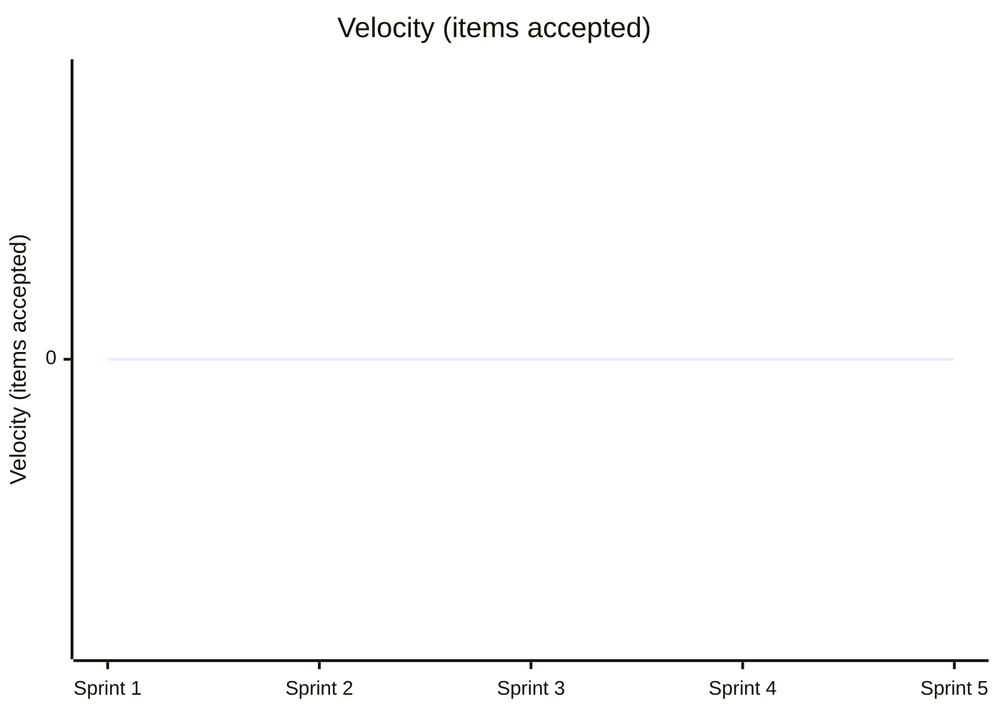

# Team Performance Evaluation Report

- Run ID: 0.1.0-run20
- Horseless Carriage commit: 91d0c2cc7c8a83b8c13c08108c7e3fa39161375e
- Branch: eval/0.1.0-run20/main
- Model: scrum-eval-cheap
- Sprints requested: 5, completed: 5
- Started: 2026-07-31T16:05:25.835845+00:00
- Finished: 2026-07-31T16:10:54.932691+00:00

## Methodology note
This run used a scripted, unattended driver (`run_eval.py`) that pre-approves every sprint goal/backlog and auto-merges any PR that opens against the eval branch, standing in for the human review gate real usage requires. Results reflect the team's real behavior under those conditions, not under full human-in-the-loop review - a lower bar in that one specific respect.

## Per-sprint metrics
| Sprint | Tokens Used | Stories Planned | Sprint Report? | PR Merges (after) |
|---|---|---|---|---|
| 1 | 1958659 | 2 | yes | 0/0 |
| 2 | 4000929 | 2 | no | 1/1 |
| 3 | 567981 | 2 | yes | 0/0 |
| 4 | 590499 | 2 | yes | 0/0 |
| 5 | 613676 | 2 | yes | 0/0 |

## KPI Trends

| KPI | Sprint 1 | Sprint 2 | Sprint 3 | Sprint 4 | Sprint 5 |
|---|---|---|---|---|---|
| Velocity (items accepted) | 0 | 0 | 0 | 0 | 0 |
| Issues fixed | 0 | 0 | 0 | 0 | 0 |
| Stories implemented | 1 | 1 | 1 | 1 | 1 |
| Testplan scenarios | 4 | 4 | 4 | 4 | 4 |
| Say-Do Ratio | 0.8 | n/a | n/a | n/a | n/a |
| Quality (defect escape rate) | 0.05 | n/a | n/a | n/a | n/a |
| Test Coverage | n/a | n/a | n/a | n/a | n/a |

### Velocity (items accepted)



### Issues fixed

```mermaid
xychart-beta
    title "Issues fixed"
    x-axis ["Sprint 1", "Sprint 2", "Sprint 3", "Sprint 4", "Sprint 5"]
    y-axis "Issues fixed"
    line [0, 0, 0, 0, 0]
```

### Stories implemented

```mermaid
xychart-beta
    title "Stories implemented"
    x-axis ["Sprint 1", "Sprint 2", "Sprint 3", "Sprint 4", "Sprint 5"]
    y-axis "Stories implemented"
    line [1, 1, 1, 1, 1]
```

### Testplan scenarios

```mermaid
xychart-beta
    title "Testplan scenarios"
    x-axis ["Sprint 1", "Sprint 2", "Sprint 3", "Sprint 4", "Sprint 5"]
    y-axis "Testplan scenarios"
    line [4, 4, 4, 4, 4]
```

### Say-Do Ratio

```mermaid
xychart-beta
    title "Say-Do Ratio"
    x-axis ["Sprint 1"]
    y-axis "Say-Do Ratio"
    line [0.8]
```

(4 of 5 sprints have no data point for this KPI and are omitted above - see the table for exactly which.)

### Quality (defect escape rate)

```mermaid
xychart-beta
    title "Quality (defect escape rate)"
    x-axis ["Sprint 1"]
    y-axis "Quality (defect escape rate)"
    line [0.05]
```

(4 of 5 sprints have no data point for this KPI and are omitted above - see the table for exactly which.)

### Test Coverage

No data available for this run - never computed (QualityGuardian's calculate_kpis/update_sprint_report was not called in any sprint).

## Token & Cost Summary

- Total tokens used: 7,731,744
- Expected cost: $0.7732 - $3.0927 (rough estimate from litellm's static pricing for `gemini/gemini-flash-lite-latest` - token_usage doesn't split prompt/completion tokens, so this is an all-input-vs-all-output bound, not an exact figure)

## Code Quality

**Score: 4/5**

The application core in app.py implements all required Flask routes (lists, tasks, toggle, delete) cleanly using Flask-SQLAlchemy. Comprehensive unit tests in tests/test_app.py and tests/test_todo.py validate index, creation, toggling, and deletion flows successfully. While templates/index.html and static/style.css were omitted from the text view, the backend logic and tests are cohesive and robust.

## Requirements Quality

**Score: 2/5**

Despite functional implementation and passing tests, workflow state management completely broke down across sprints. In specs/ROADMAP.md, user stories US-0001 and US-0002 are incorrectly left unchecked in their lifecycle stages (e.g., TESTED and ACCEPTED remain unchecked). Furthermore, the backlog and roadmap show 0/2 stories completed across multiple sprint reports due to strict tooling hooks blocking stage advancement.

## Team Efficiency

**Score: 2/5**

The agent team suffered from severe bureaucratic paralysis caused by tool enforcement loops. As documented in issues like specs/requirements/ISSUE-0011-QA-blocked-advancing-US-0001-to-Tested-because-advance_story_stage-requires-pytest-coverage-summary-output-which-pytest-does-not-produce-by-default-without-pytest-cov.md, the QA and ScrumMaster agents got trapped in endless impediments regarding pytest coverage output flags. Consequently, multi-sprint execution produced zero story state advancements despite high token expenditure.

## Top Problems

1. **Story completion tracking is completely halted in the roadmap despite functional code existing.** (severity: high)
   - Evidence: specs/ROADMAP.md shows - [ ] TESTED and - [ ] ACCEPTED for US-0001 and US-0002.
   - Suggested fix: Update roadmap checkboxes programmatically or instruct agents to correctly execute story stage advancement tool calls.

2. **QA tooling validation checks block story advancement due to missing test coverage summary flags.** (severity: high)
   - Evidence: specs/requirements/ISSUE-0011-QA-blocked-advancing-US-0001-to-Tested-because-advance_story_stage-requires-pytest-coverage-summary-output-which-pytest-does-not-produce-by-default-without-pytest-cov.md
   - Suggested fix: no clear fix - the evaluation harness's internal check_build / advance_story_stage tool expects explicit pytest-cov CLI flags that are not configured by default in the execution environment.

3. **Release PR creation fails repeatedly due to empty commit diffs between main and develop branches.** (severity: medium)
   - Evidence: specs/requirements/ISSUE-0010-Release-PR-creation-failed-because-there-are-no-commits-between-eval-0.1.0-run20-main-and-eval-0.1.0-run20-develop,-blocking-sprint-transition..md
   - Suggested fix: Ensure the release workflow automatically handles fast-forward or empty-diff states when merging develop into main.

4. **Sprint 2 failed to generate a sprint report entirely.** (severity: medium)
   - Evidence: Sprint reports list contains '(none produced)' for Sprint 2.
   - Suggested fix: Add workflow guardrails ensuring ProductOwner always invokes create_sprint_report before concluding a sprint.
