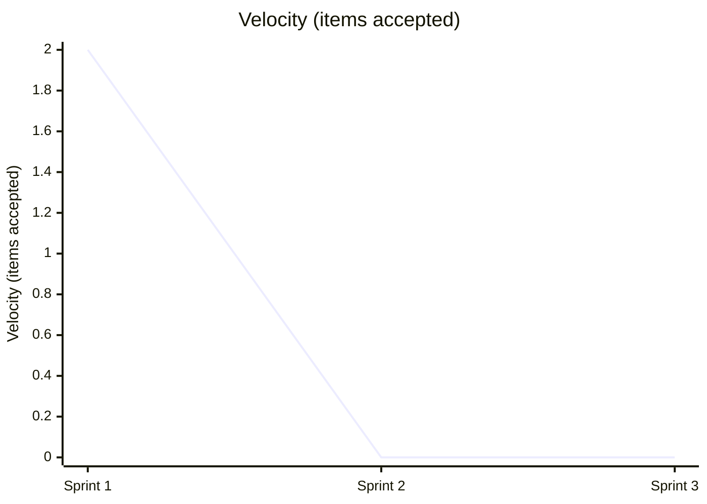
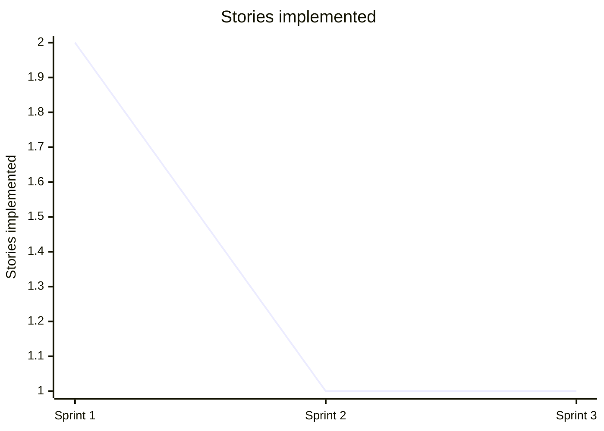
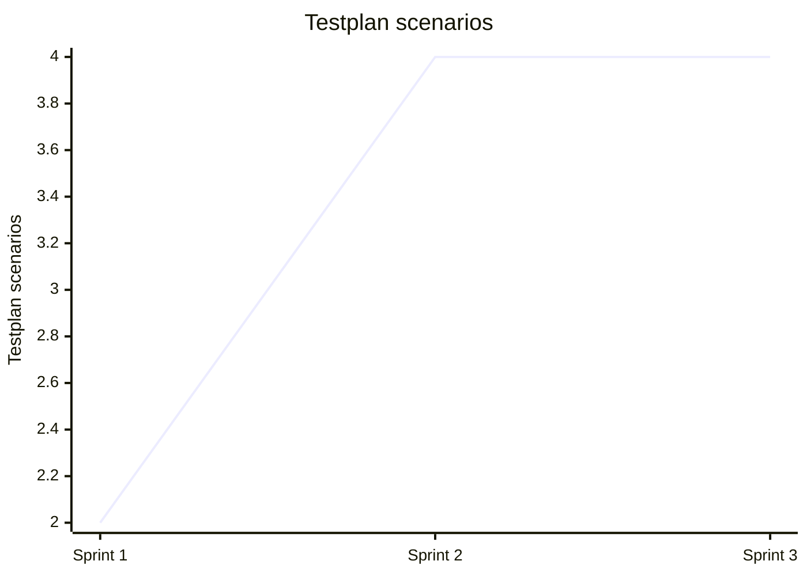
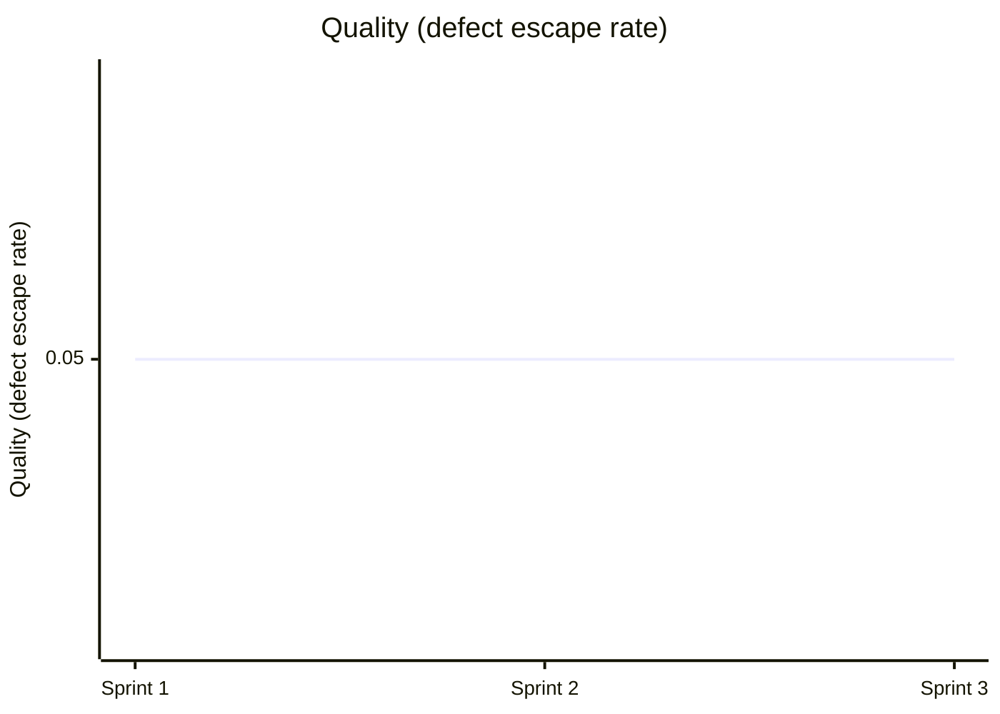
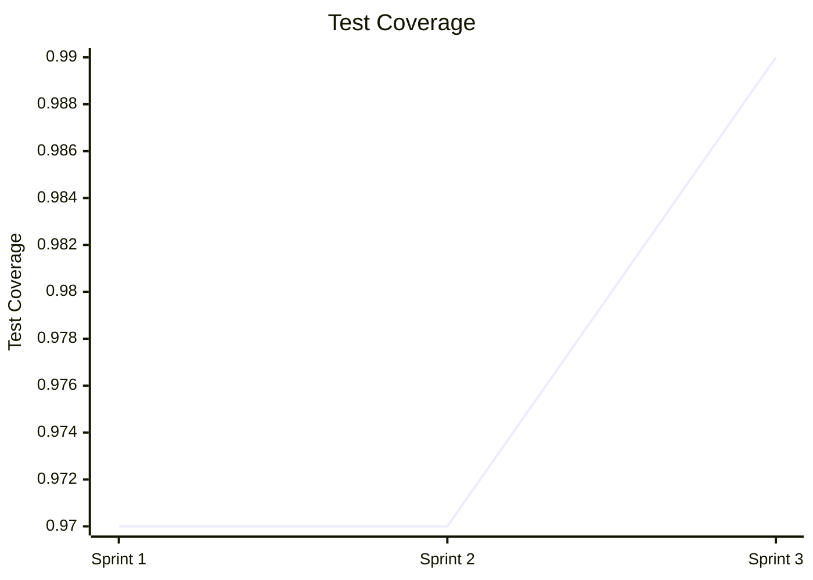

# Team Performance Evaluation Report

- Run ID: 0.1.0-run33
- Horseless Carriage commit: 357428f7daa08b62107e37d8e6602daefdea73a9
- Branch: eval/0.1.0-run33/main
- Model: scrum-eval-cheap
- Sprints requested: 5, completed: 3
- Started: 2026-09-24T08:28:11.454448+00:00
- Finished: 2026-09-24T08:35:22.230633+00:00

## Methodology note
This run used a scripted, unattended driver (`run_eval.py`) that pre-approves every sprint goal/backlog and auto-merges any PR that opens against the eval branch, standing in for the human review gate real usage requires. Results reflect the team's real behavior under those conditions, not under full human-in-the-loop review - a lower bar in that one specific respect.

## Per-sprint metrics
| Sprint | Tokens Used | Stories Planned | Sprint Report? | PR Merges (after) |
|---|---|---|---|---|
| 1 | 1928811 | 2 | yes | 1/1 |
| 2 | 6032161 | 4 | yes | 1/1 |
| 3 | 6038895 | 4 | no | 0/0 |

## KPI Trends

| KPI | Sprint 1 | Sprint 2 | Sprint 3 |
|---|---|---|---|
| Velocity (items accepted) | 2 | 0 | 0 |
| Issues fixed | 0 | 0 | 0 |
| Stories implemented | 2 | 1 | 1 |
| Testplan scenarios | 2 | 4 | 4 |
| Say-Do Ratio | 0.8 | 0.8 | 0.8 |
| Quality (defect escape rate) | 0.05 | 0.05 | 0.05 |
| Test Coverage | 0.97 | 0.97 | 0.99 |

### Velocity (items accepted)



### Issues fixed

```mermaid
xychart-beta
    title "Issues fixed"
    x-axis ["Sprint 1", "Sprint 2", "Sprint 3"]
    y-axis "Issues fixed"
    line [0, 0, 0]
```

### Stories implemented



### Testplan scenarios



### Say-Do Ratio

```mermaid
xychart-beta
    title "Say-Do Ratio"
    x-axis ["Sprint 1", "Sprint 2", "Sprint 3"]
    y-axis "Say-Do Ratio"
    line [0.8, 0.8, 0.8]
```

### Quality (defect escape rate)



### Test Coverage



## Token & Cost Summary

- Total tokens used: 13,999,867
- Expected cost: $4.2000 - $34.9997 (rough estimate from litellm's static pricing for `gemini/gemini-flash-lite-latest` - token_usage doesn't split prompt/completion tokens, so this is an all-input-vs-all-output bound, not an exact figure)

## Code Quality

**Score: 2/5**

The application contains basic functional code in app.py and a minimal UI in templates/index.html that successfully allows creating and viewing lists. However, it completely fails to implement tasks, task deletion, or list deletion, despite these being core components of the product vision. Furthermore, the test suite in test_app.py only covers list creation and the home page, leaving critical functionality entirely untested.

## Requirements Quality

**Score: 3/5**

The documentation structure is robust, featuring a comprehensive PRD in specs/requirements/PRD-Todo-MVP.md, epics, and individual user stories like specs/stories/US-0001-Create-To-Do-List.md. Unfortunately, the roadmap in specs/ROADMAP.md and individual story states are inconsistently updated, with many stories left in 'Draft' or unexecuted Kanban columns. Additionally, Sprint 2 stalled out due to rigid pipeline stage gating, and Sprint 3 failed to produce a sprint report entirely.

## Team Efficiency

**Score: 1/5**

The AI Scrum team exhibited severe systemic process failures, blowing past the token budget in Sprint 2 (6,032,161 tokens used against a 5,000,000 limit) and failing to produce any output or report for Sprint 3. Excessive agent-to-agent transfer loops and strict sequential gating caused total pipeline lockup. As a result, the team exhausted resources and stopped progressing mid-run.

## Top Problems

1. **Sprint 2 and Sprint 3 suffered catastrophic budget exhaustion and pipeline lockup, causing the team to fail to complete the planned scope.** (severity: high)
   - Evidence: Sprint 2 report states: 'Token usage: 6,032,161 / 5000000', and Sprint 3 report shows 0 stories completed and no report produced.
   - Suggested fix: Optimize agent conversation efficiency, reduce redundant cross-agent transfers, and implement a circuit breaker for retry loops.

2. **Core features required by the product vision (tasks, task completion, and deletion) are entirely missing from the codebase.** (severity: high)
   - Evidence: app.py only implements list creation and viewing via index() and create_list(), lacking any routes for tasks or deletions.
   - Suggested fix: Implement task management routes in app.py and corresponding UI elements in templates/index.html.

3. **Roadmap and user story statuses are severely out of sync with actual code delivery.** (severity: medium)
   - Evidence: specs/ROADMAP.md shows stories US-0003 through US-0006 with incomplete checkbox states while code lacks their implementation entirely.
   - Suggested fix: Automate roadmap status updates or enforce strict DoD checks before marking tasks ready or moving sprints.

4. **Rigid stage-gating rules prevented the team from advancing user stories through the workflow.** (severity: medium)
   - Evidence: Sprint 2 report notes: 'Stories US-0003 and US-0004 were implemented in code and tested, but blocked from advancing through the mandatory pipeline stages'.
   - Suggested fix: no clear fix - the evaluation harness state-machine rules enforce strict sequencing that deadlocks when prerequisites aren't met.

5. **Test coverage is incomplete, with tests only covering list creation and the home page.** (severity: medium)
   - Evidence: test_app.py only contains test_index_page and test_create_list, with zero tests for task operations or deletions.
   - Suggested fix: Add comprehensive pytest test cases in test_app.py for all planned user stories and CRUD operations.
