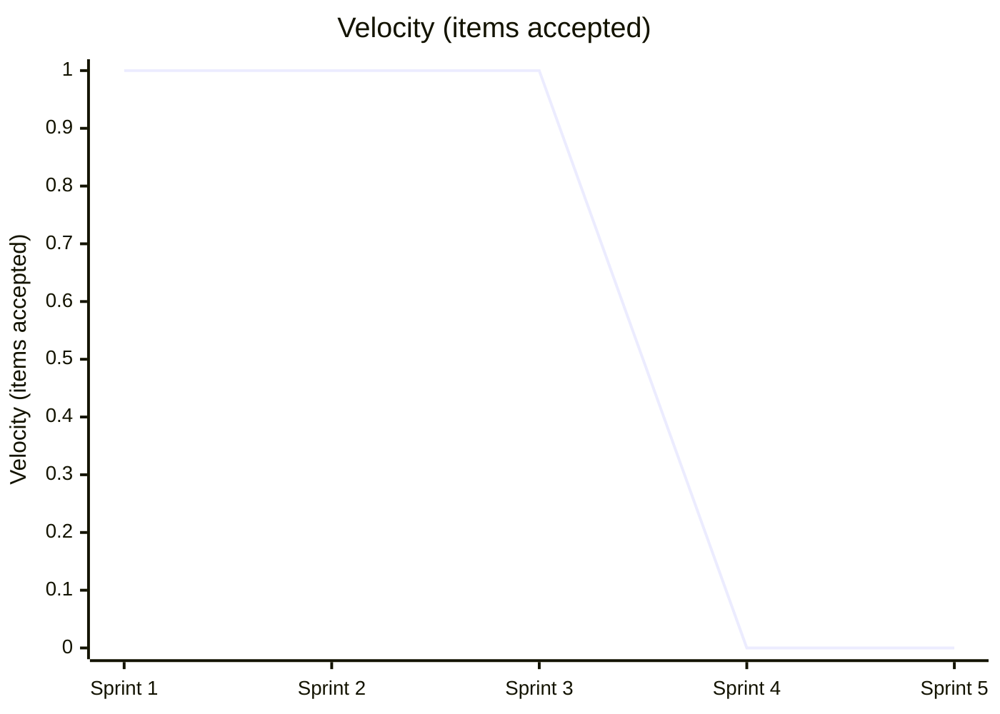
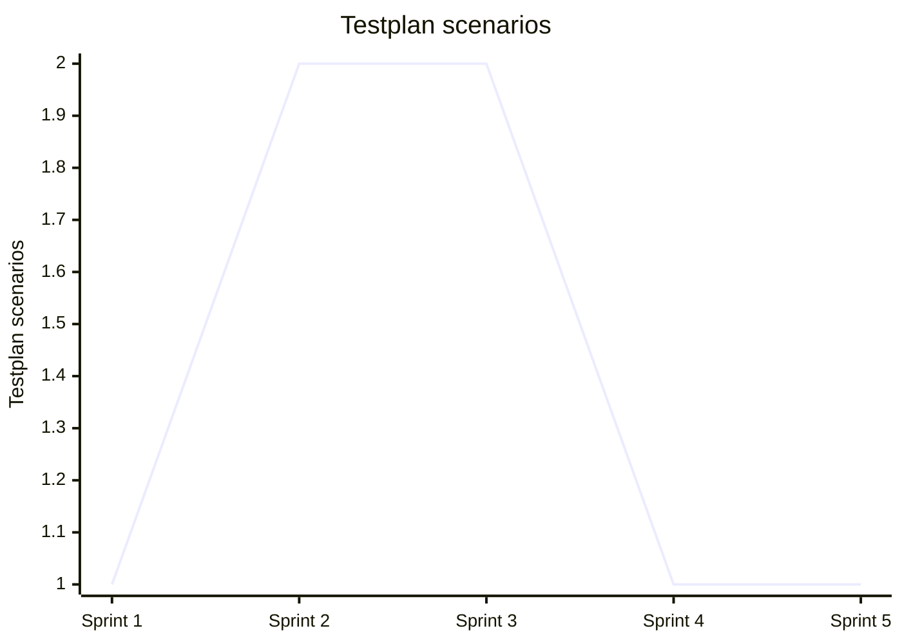
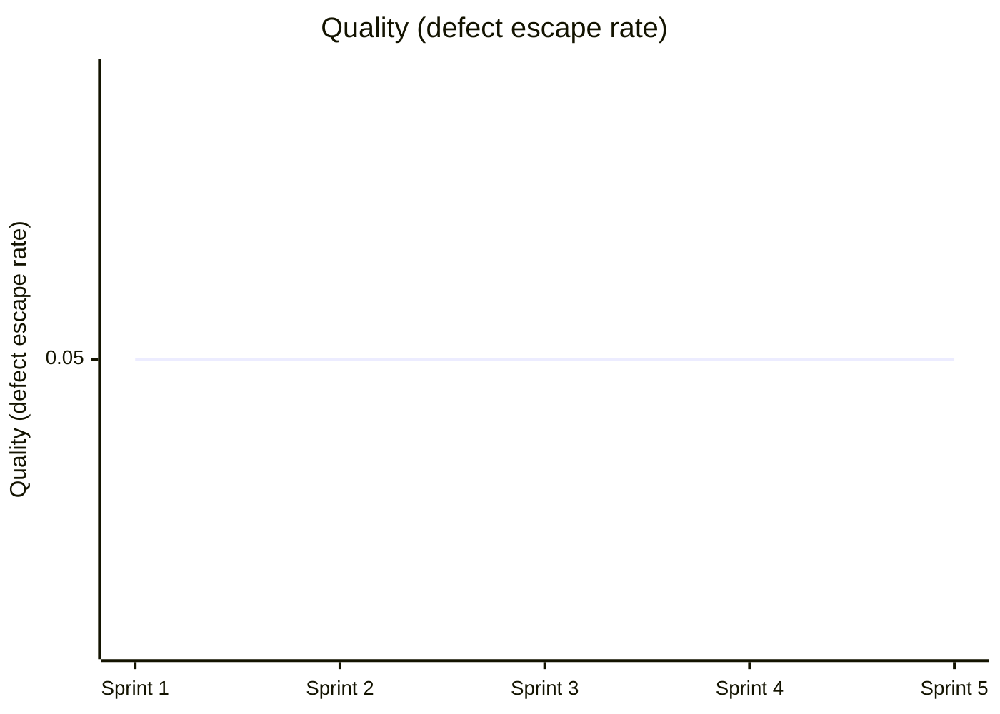

# Team Performance Evaluation Report

- Run ID: 0.1.0-run34
- Horseless Carriage commit: 3d8a6b9c957d112adb520bd6b615ff934d5be18e
- Branch: eval/0.1.0-run34/main
- Model: scrum-eval-cheap
- Sprints requested: 5, completed: 5
- Started: 2026-09-24T09:14:22.352663+00:00
- Finished: 2026-09-24T09:22:34.578468+00:00

## Methodology note
This run used a scripted, unattended driver (`run_eval.py`) that pre-approves every sprint goal/backlog and auto-merges any PR that opens against the eval branch, standing in for the human review gate real usage requires. Results reflect the team's real behavior under those conditions, not under full human-in-the-loop review - a lower bar in that one specific respect.

## Per-sprint metrics
| Sprint | Tokens Used | Stories Planned | Sprint Report? | PR Merges (after) |
|---|---|---|---|---|
| 1 | 3308959 | 1 | yes | 0/0 |
| 2 | 6070244 | 2 | yes | 0/0 |
| 3 | 1019732 | 2 | yes | 0/0 |
| 4 | 3471878 | 1 | yes | 0/0 |
| 5 | 1566488 | 1 | yes | 0/0 |

## KPI Trends

| KPI | Sprint 1 | Sprint 2 | Sprint 3 | Sprint 4 | Sprint 5 |
|---|---|---|---|---|---|
| Velocity (items accepted) | 1 | 1 | 1 | 0 | 0 |
| Issues fixed | 0 | 0 | 0 | 0 | 0 |
| Stories implemented | 1 | 1 | 1 | 1 | 1 |
| Testplan scenarios | 1 | 2 | 2 | 1 | 1 |
| Say-Do Ratio | 0.8 | 0.8 | 0.8 | 0.8 | 0.8 |
| Quality (defect escape rate) | 0.05 | 0.05 | 0.05 | 0.05 | 0.05 |
| Test Coverage | 0.98 | 0.98 | 0.98 | 0.98 | 0.98 |

### Velocity (items accepted)



### Issues fixed

```mermaid
xychart-beta
    title "Issues fixed"
    x-axis ["Sprint 1", "Sprint 2", "Sprint 3", "Sprint 4", "Sprint 5"]
    y-axis "Issues fixed"
    line [0, 0, 0, 0, 0]
```

### Stories implemented

```mermaid
xychart-beta
    title "Stories implemented"
    x-axis ["Sprint 1", "Sprint 2", "Sprint 3", "Sprint 4", "Sprint 5"]
    y-axis "Stories implemented"
    line [1, 1, 1, 1, 1]
```

### Testplan scenarios



### Say-Do Ratio

```mermaid
xychart-beta
    title "Say-Do Ratio"
    x-axis ["Sprint 1", "Sprint 2", "Sprint 3", "Sprint 4", "Sprint 5"]
    y-axis "Say-Do Ratio"
    line [0.8, 0.8, 0.8, 0.8, 0.8]
```

### Quality (defect escape rate)



### Test Coverage

```mermaid
xychart-beta
    title "Test Coverage"
    x-axis ["Sprint 1", "Sprint 2", "Sprint 3", "Sprint 4", "Sprint 5"]
    y-axis "Test Coverage"
    line [0.98, 0.98, 0.98, 0.98, 0.98]
```

## Token & Cost Summary

- Total tokens used: 15,437,301
- Expected cost: $4.6312 - $38.5933 (rough estimate from litellm's static pricing for `gemini/gemini-flash-lite-latest` - token_usage doesn't split prompt/completion tokens, so this is an all-input-vs-all-output bound, not an exact figure)

## Code Quality

**Score: 4/5**

The Python implementation in app.py is clean, highly readable, and correctly uses Flask with in-memory persistence. The HTML templates in templates/index.html properly implement the required CRUD workflows, lists, and task toggles. Additionally, the test suite in tests/test_app.py provides solid coverage of the core lifecycle routes.

## Requirements Quality

**Score: 3/5**

The repository contains a well-structured set of user story files in specs/stories/ and a Product Requirements Document in specs/requirements/PRD-TodoApp.md. However, stories like US-0008 (Input Validation and Error Handling) were left unimplemented in the roadmap despite being planned, leading to a mismatch between intended and completed scope.

## Team Efficiency

**Score: 1/5**

The agent team suffered from severe coordination loops, burning millions of tokens across sprints mostly through agent-to-agent transfers and narration rather than feature delivery. As shown in specs/reports/SPRINT-REPORT-002.md, the team completed zero stories in multiple sprints while exceeding token and budget limits.

## Top Problems

1. **Unimplemented backlog features due to process bottlenecks.** (severity: high)
   - Evidence: specs/ROADMAP.md shows US-0008 and US-0009 stuck in DRAFT and READY states with no implementation checkboxes ticked.
   - Suggested fix: Streamline the multi-agent orchestration workflow to prevent agents from getting trapped in review and transfer loops.

2. **Severe token and budget inefficiency during execution.** (severity: high)
   - Evidence: Sprint 2 report (specs/reports/SPRINT-REPORT-002.md) notes token usage of 6,070,244 / 5,000,000, exhausting the token budget mid-sprint.
   - Suggested fix: Implement strict limits on agent conversation turns and redundant transfer calls between ScrumOrchestrator and DevTeam.

3. **Strict story sequencing rules causing pipeline gridlock.** (severity: medium)
   - Evidence: Impediments log in specs/reports/SPRINT-REPORT-004.md states: 'Strict priority ordering in advance_story_stage prevents advancing US-0003 until US-0002 is fully accepted.'
   - Suggested fix: Relax rigid sequential gating in the evaluation harness or equip agents with better parallel handling mechanisms.
