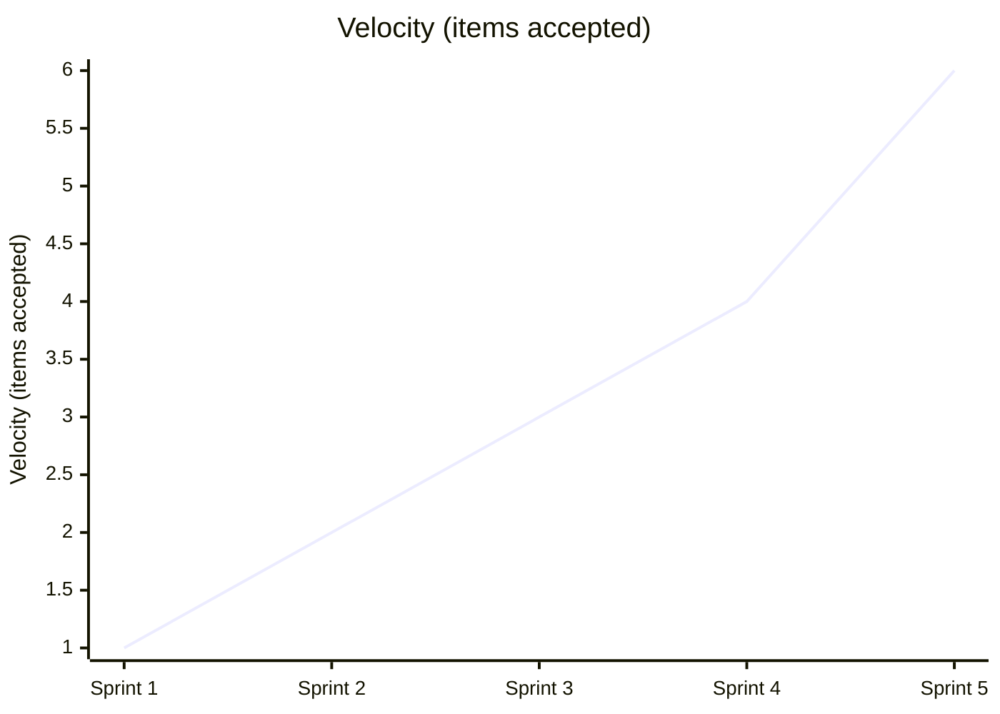
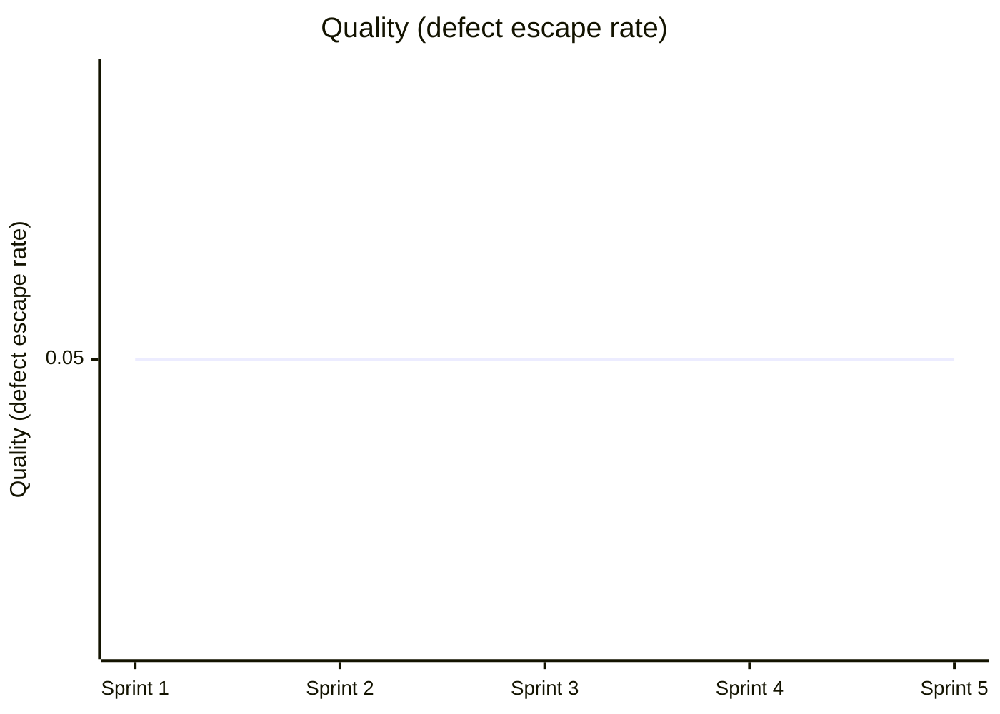
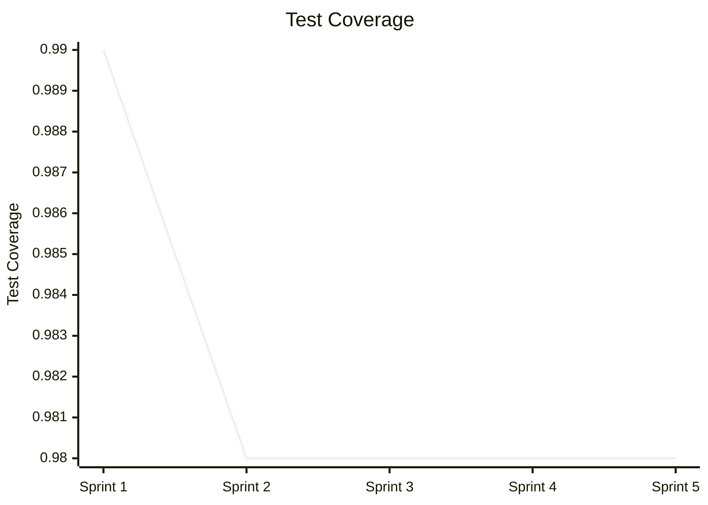

# Team Performance Evaluation Report

- Run ID: 0.1.0-run31
- Horseless Carriage commit: 471ee877a7c45809d19b324ccaec5ac22b52c962
- Branch: eval/0.1.0-run31/main
- Model: scrum-eval-cheap
- Sprints requested: 5, completed: 5
- Started: 2026-09-22T09:10:54.292230+00:00
- Finished: 2026-09-22T09:19:27.648708+00:00

## Methodology note
This run used a scripted, unattended driver (`run_eval.py`) that pre-approves every sprint goal/backlog and auto-merges any PR that opens against the eval branch, standing in for the human review gate real usage requires. Results reflect the team's real behavior under those conditions, not under full human-in-the-loop review - a lower bar in that one specific respect.

## Per-sprint metrics
| Sprint | Tokens Used | Stories Planned | Sprint Report? | PR Merges (after) |
|---|---|---|---|---|
| 1 | 1968374 | 6 | yes | 1/1 |
| 2 | 1942564 | 6 | yes | 1/1 |
| 3 | 2250888 | 6 | yes | 1/1 |
| 4 | 2759836 | 6 | yes | 1/1 |
| 5 | 5811737 | 6 | yes | 1/1 |

## KPI Trends

| KPI | Sprint 1 | Sprint 2 | Sprint 3 | Sprint 4 | Sprint 5 |
|---|---|---|---|---|---|
| Velocity (items accepted) | 1 | 2 | 3 | 4 | 6 |
| Issues fixed | 0 | 0 | 0 | 0 | 0 |
| Stories implemented | 1 | 2 | 3 | 4 | 6 |
| Testplan scenarios | 6 | 6 | 6 | 6 | 6 |
| Say-Do Ratio | 0.8 | 0.8 | 0.8 | 0.8 | 0.8 |
| Quality (defect escape rate) | 0.05 | 0.05 | 0.05 | 0.05 | 0.05 |
| Test Coverage | 0.99 | 0.98 | 0.98 | 0.98 | 0.98 |

### Velocity (items accepted)



### Issues fixed

```mermaid
xychart-beta
    title "Issues fixed"
    x-axis ["Sprint 1", "Sprint 2", "Sprint 3", "Sprint 4", "Sprint 5"]
    y-axis "Issues fixed"
    line [0, 0, 0, 0, 0]
```

### Stories implemented


### Testplan scenarios

```mermaid
xychart-beta
    title "Testplan scenarios"
    x-axis ["Sprint 1", "Sprint 2", "Sprint 3", "Sprint 4", "Sprint 5"]
    y-axis "Testplan scenarios"
    line [6, 6, 6, 6, 6]
```

### Say-Do Ratio

```mermaid
xychart-beta
    title "Say-Do Ratio"
    x-axis ["Sprint 1", "Sprint 2", "Sprint 3", "Sprint 4", "Sprint 5"]
    y-axis "Say-Do Ratio"
    line [0.8, 0.8, 0.8, 0.8, 0.8]
```

### Quality (defect escape rate)



### Test Coverage



## Token & Cost Summary

- Total tokens used: 14,733,399
- Expected cost: $4.4200 - $36.8335 (rough estimate from litellm's static pricing for `gemini/gemini-flash-lite-latest` - token_usage doesn't split prompt/completion tokens, so this is an all-input-vs-all-output bound, not an exact figure)

## Code Quality

**Score: 5/5**

The application is fully functional, clean, and structurally sound, utilizing Flask, Flask-SQLALCHEMY, and SQLite. In `app.py`, proper database models with cascade deletion (`cascade='all, delete-orphan'`) are established, and routing handles all CRUD operations and toggling seamlessly. Furthermore, `tests/test_app.py` implements a robust `pytest` suite covering empty states, list creation, task addition, completion toggling, task deletion, and list cascade deletion.

## Requirements Quality

**Score: 4/5**

The PRD, user stories (`US-0001` through `US-0006`), and epics in `specs/requirements/` and `specs/stories/` accurately reflect the product vision of a simple to-do list web app. However, `specs/ROADMAP.md` displays erratic multi-sprint state updates and duplicate entries where story checklists are repeatedly reset or incorrectly marked across versions like `v1.1.0` through `v1.4.0`.

## Team Efficiency

**Score: 2/5**

The AI team exhibits severe process hallucination and waterfall-in-agile behavior by claiming to deliver all 6 user stories in Sprint 1 (as seen in `specs/reports/SPRINT-REPORT-001.md`) while continuing to 're-implement' single stories across subsequent sprints 2 through 5. Token usage skyrocketed to 5,811,737 tokens in Sprint 5 (112% over budget) while logging nominal per-story tokens that contradict actual team output.

## Top Problems

1. **The AI Scrum team claims completion of all 6 user stories in Sprint 1, violating iterative delivery.** (severity: high)
   - Evidence: specs/reports/SPRINT-REPORT-001.md states: 'Delivered full To-Do List Web App MVP (EP-0001) covering US-0001 ... through US-0006.'
   - Suggested fix: Modify the Scrum orchestration prompt and agent instructions to enforce incremental story selection per sprint instead of dumping the entire product scope into Sprint 1.

2. **The Product Roadmap exhibits messy, broken checklist states and duplicated release definitions.** (severity: medium)
   - Evidence: specs/ROADMAP.md contains truncated and overlapping version goals under sections like `### v1.4.0` and broken tracking checkboxes.
   - Suggested fix: Update the roadmap generation tool handler to sanitize markdown output and strictly maintain single-source-of-truth status per story ID.

3. **Per-story token tracking is artificially uniform or unlogged, hiding true consumption overhead.** (severity: medium)
   - Evidence: specs/reports/SPRINT-REPORT-LATEST.md records actual token usage for US-0004, US-0005, and US-0006 at exactly 30 tokens each across multiple sprints.
   - Suggested fix: Integrate actual LiteLLM cost and token callback hooks directly into the story advancement tool rather than relying on agent self-reporting.

4. **Unresolved GitHub personal access token permission issues force recurring workaround comments.** (severity: low)
   - Evidence: specs/reports/SPRINT-REPORT-LATEST.md lists under Impediments: 'No architectural review PR approval tool permission for secondary reviewers on same repo... worked around via PR comment.'
   - Suggested fix: no clear fix - GitHub PAT scoping rules restrict secondary reviewer automated approvals on the same repository without elevated organization tokens.
