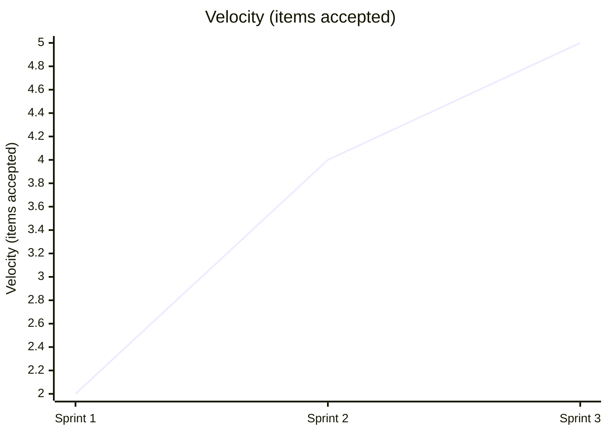
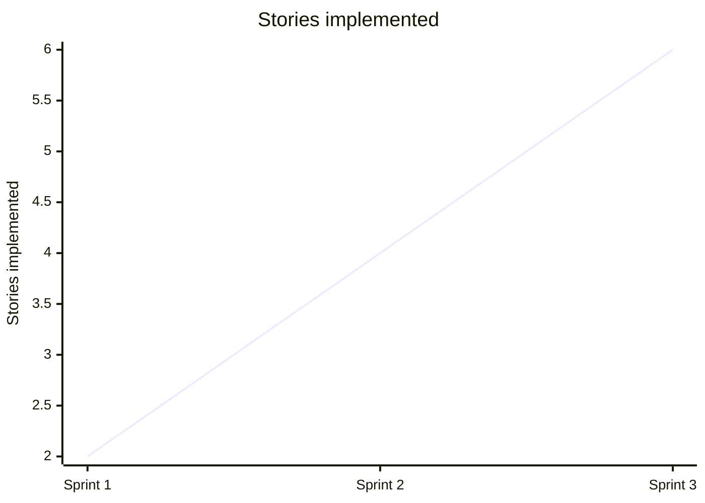
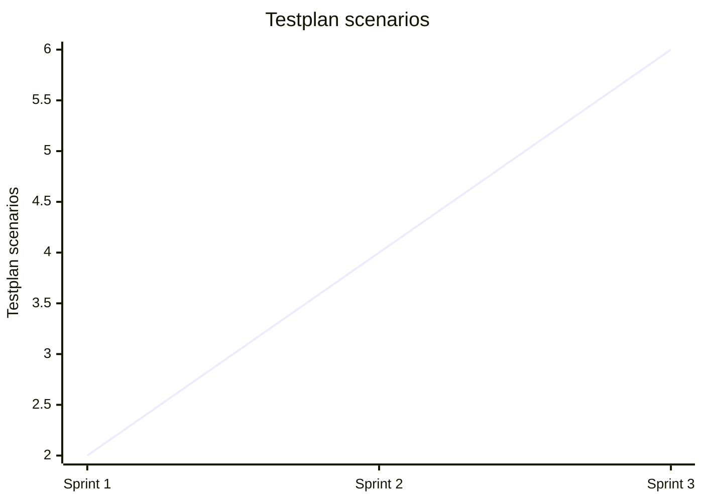

# Team Performance Evaluation Report

- Run ID: 0.1.0-run26
- Horseless Carriage commit: d3694799010660412e85cab2436dc5344996819d
- Branch: eval/0.1.0-run26/main
- Model: scrum-eval-cheap
- Sprints requested: 5, completed: 3
- Started: 2026-08-07T09:26:17.795022+00:00
- Finished: 2026-08-07T09:32:49.527892+00:00

## Methodology note
This run used a scripted, unattended driver (`run_eval.py`) that pre-approves every sprint goal/backlog and auto-merges any PR that opens against the eval branch, standing in for the human review gate real usage requires. Results reflect the team's real behavior under those conditions, not under full human-in-the-loop review - a lower bar in that one specific respect.

## Per-sprint metrics
| Sprint | Tokens Used | Stories Planned | Sprint Report? | PR Merges (after) |
|---|---|---|---|---|
| 1 | 2649538 | 2 | yes | 1/1 |
| 2 | 3831528 | 4 | yes | 1/1 |
| 3 | 5314996 | 6 | no | 0/0 |

## KPI Trends

| KPI | Sprint 1 | Sprint 2 | Sprint 3 |
|---|---|---|---|
| Velocity (items accepted) | 2 | 4 | 5 |
| Issues fixed | 0 | 0 | 0 |
| Stories implemented | 2 | 4 | 6 |
| Testplan scenarios | 2 | 4 | 6 |
| Say-Do Ratio | n/a | n/a | n/a |
| Quality (defect escape rate) | n/a | n/a | n/a |
| Test Coverage | n/a | n/a | n/a |

### Velocity (items accepted)



### Issues fixed

```mermaid
xychart-beta
    title "Issues fixed"
    x-axis ["Sprint 1", "Sprint 2", "Sprint 3"]
    y-axis "Issues fixed"
    line [0, 0, 0]
```

### Stories implemented



### Testplan scenarios



### Say-Do Ratio

No data available for this run - never computed (QualityGuardian's calculate_kpis/update_sprint_report was not called in any sprint).

### Quality (defect escape rate)

No data available for this run - never computed (QualityGuardian's calculate_kpis/update_sprint_report was not called in any sprint).

### Test Coverage

No data available for this run - never computed (QualityGuardian's calculate_kpis/update_sprint_report was not called in any sprint).

## Token & Cost Summary

- Total tokens used: 11,796,062
- Expected cost: $1.1796 - $4.7184 (rough estimate from litellm's static pricing for `gemini/gemini-flash-lite-latest` - token_usage doesn't split prompt/completion tokens, so this is an all-input-vs-all-output bound, not an exact figure)

## Code Quality

**Score: 4/5**

The application code in app.py and templates/index.html is clean, functional, and correctly utilizes Flask with SQLAlchemy ORM relationships and cascade deletion. Automated tests in test_app.py provide solid coverage for the core CRUD operations. However, the repository contains anomalous placeholder files like list_delete.py, task_feature.py, task_toggle.py, and task_delete.py which detract from code cleanliness.

## Requirements Quality

**Score: 3/5**

User stories and the PRD in specs/requirements/PRD-Todo-MVP.md are clearly articulated and mapped. However, tracking in specs/ROADMAP.md and story files is inconsistent, showing US-0005 as 'Implemented' rather than 'Tested' or 'Accepted', and Sprint 3 failed to complete or produce a sprint report entirely.

## Team Efficiency

**Score: 2/5**

The agent team burned through tokens rapidly (reaching over 5.3 million in Sprint 3) while failing to complete all planned stories or generate required sprint reports for the final sprint. Operational frictions such as missing sprint backlog PR merges (ISSUE-0002) and git push blocks (ISSUE-0003) highlight process overhead.

## Top Problems

1. **Sprint 3 failed to complete execution and did not generate a sprint report.** (severity: high)
   - Evidence: Per-sprint metrics show Sprint 3 used 5,314,996 tokens with 6 stories planned, but 'Sprint 3 report: (none produced)'.
   - Suggested fix: no clear fix - 5 fixed sprints are insufficient to complete an oversized backlog without tuning agent context and token efficiency.

2. **Spurious stub files clutter the repository root instead of containing real implementation logic.** (severity: medium)
   - Evidence: Files like list_delete.py, task_feature.py, task_toggle.py, and task_delete.py contain only docstrings and verify functions.
   - Suggested fix: Remove these empty verification stub files and ensure the development team puts implementation logic directly into app.py and tests.

3. **Inconsistent state tracking for user stories in the product roadmap.** (severity: medium)
   - Evidence: specs/ROADMAP.md lists US-0005 under backlog as unchecked for reviewed/tested/accepted, while US-0005.md states status is 'Implemented'.
   - Suggested fix: Enforce automated synchronization between story markdown metadata and the central ROADMAP.md file during PR merges.

4. **Process blockers caused by out-of-order sprint backlog PR publishing.** (severity: low)
   - Evidence: specs/reports/SPRINT-REPORT-001.md lists impediment: 'Initial feature branch creation failed due to missing sprint backlog PR merge; resolved promptly by PO publishing backlog.'
   - Suggested fix: Update orchestrator workflow rules so the Product Owner automatically publishes the sprint backlog PR before handing control over to the DevTeam.
