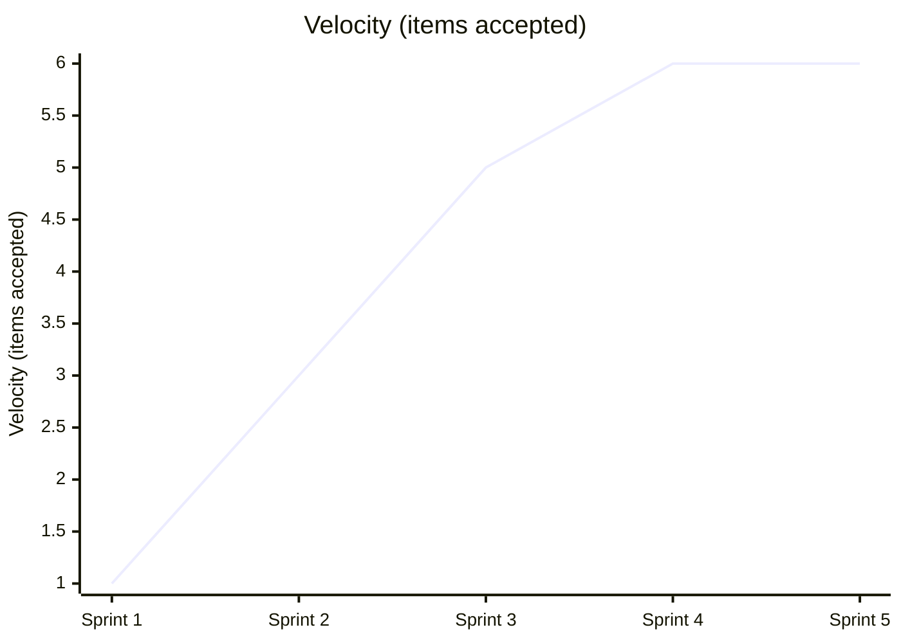
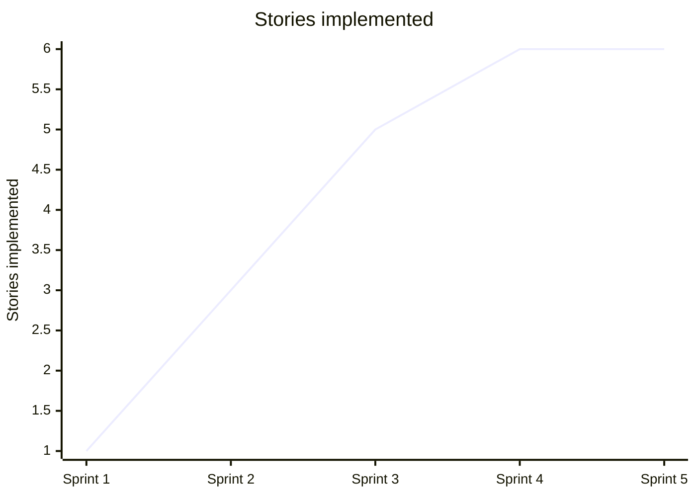
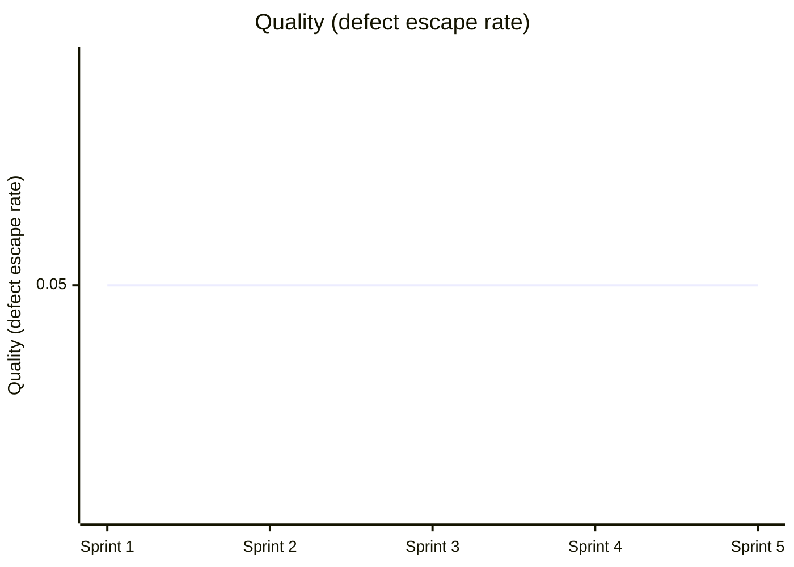

# Team Performance Evaluation Report

- Run ID: 0.1.0-run30
- Horseless Carriage commit: d7f6f2b79c59fdeb80a638a46a2e77ecae7ad16c
- Branch: eval/0.1.0-run30/main
- Model: scrum-eval-cheap
- Sprints requested: 5, completed: 5
- Started: 2026-09-16T11:52:06.291755+00:00
- Finished: 2026-09-16T12:00:50.685785+00:00

## Methodology note
This run used a scripted, unattended driver (`run_eval.py`) that pre-approves every sprint goal/backlog and auto-merges any PR that opens against the eval branch, standing in for the human review gate real usage requires. Results reflect the team's real behavior under those conditions, not under full human-in-the-loop review - a lower bar in that one specific respect.

## Per-sprint metrics
| Sprint | Tokens Used | Stories Planned | Sprint Report? | PR Merges (after) |
|---|---|---|---|---|
| 1 | 2062258 | 6 | yes | 1/1 |
| 2 | 2370957 | 6 | yes | 1/1 |
| 3 | 3088001 | 6 | yes | 1/1 |
| 4 | 2507332 | 6 | yes | 1/1 |
| 5 | 3052071 | 6 | yes | 1/1 |

## KPI Trends

| KPI | Sprint 1 | Sprint 2 | Sprint 3 | Sprint 4 | Sprint 5 |
|---|---|---|---|---|---|
| Velocity (items accepted) | 1 | 3 | 5 | 6 | 6 |
| Issues fixed | 0 | 0 | 0 | 0 | 0 |
| Stories implemented | 1 | 3 | 5 | 6 | 6 |
| Testplan scenarios | 6 | 6 | 6 | 6 | 6 |
| Say-Do Ratio | 0.8 | 0.8 | 0.8 | 0.8 | 0.8 |
| Quality (defect escape rate) | 0.05 | 0.05 | 0.05 | 0.05 | 0.05 |
| Test Coverage | 0.99 | 0.99 | 0.99 | 0.99 | 0.99 |

### Velocity (items accepted)



### Issues fixed

```mermaid
xychart-beta
    title "Issues fixed"
    x-axis ["Sprint 1", "Sprint 2", "Sprint 3", "Sprint 4", "Sprint 5"]
    y-axis "Issues fixed"
    line [0, 0, 0, 0, 0]
```

### Stories implemented



### Testplan scenarios

```mermaid
xychart-beta
    title "Testplan scenarios"
    x-axis ["Sprint 1", "Sprint 2", "Sprint 3", "Sprint 4", "Sprint 5"]
    y-axis "Testplan scenarios"
    line [6, 6, 6, 6, 6]
```

### Say-Do Ratio

```mermaid
xychart-beta
    title "Say-Do Ratio"
    x-axis ["Sprint 1", "Sprint 2", "Sprint 3", "Sprint 4", "Sprint 5"]
    y-axis "Say-Do Ratio"
    line [0.8, 0.8, 0.8, 0.8, 0.8]
```

### Quality (defect escape rate)



### Test Coverage

```mermaid
xychart-beta
    title "Test Coverage"
    x-axis ["Sprint 1", "Sprint 2", "Sprint 3", "Sprint 4", "Sprint 5"]
    y-axis "Test Coverage"
    line [0.99, 0.99, 0.99, 0.99, 0.99]
```

## Token & Cost Summary

- Total tokens used: 13,080,619
- Expected cost: $1.3081 - $5.2322 (rough estimate from litellm's static pricing for `gemini/gemini-flash-lite-latest` - token_usage doesn't split prompt/completion tokens, so this is an all-input-vs-all-output bound, not an exact figure)

## Code Quality

**Score: 5/5**

The application in app.py is fully functional, implementing lists and tasks with proper in-memory storage, cascading deletes, and toggle endpoints. The UI template in templates/index.html leverages Tailwind CSS to provide clear visual distinction for completed items and intuitive forms. Furthermore, the test suite in test_app.py comprehensively validates all routes and state changes.

## Requirements Quality

**Score: 4/5**

User stories (US-0001 through US-0006) and the PRD in specs/requirements/PRD-Todo-App.md align directly with the core product vision. However, requirements tracking in specs/ROADMAP.md shows discrepancies where stories were marked as completed late or incorrectly mapped across release versions. Additionally, several issue files under specs/requirements/ are left as stub placeholders with empty acceptance criteria.

## Team Efficiency

**Score: 2/5**

The multi-agent scrum team suffered from extreme process repetition and token bloat across the 5 sprints, consuming over 13 million tokens total while re-planning or falsely claiming implementation progress. In Sprints 1 through 4, sprint reports misleadingly claimed only 1 or 3 stories were completed while outputting identical backlog metrics. The process overhead and agent chattiness far exceeded the actual code volume produced.

## Top Problems

1. **Roadmap story tracking is out of sync with actual sprint deliveries.** (severity: medium)
   - Evidence: specs/ROADMAP.md lists US-0002 through US-0006 as unchecked under unplanned/v0.1 sections while being claimed as delivered in sprint reports.
   - Suggested fix: Update roadmap generation logic to automatically reflect story status transitions upon PR merges.

2. **Issue files generated during retrospectives are left as unpopulated stubs.** (severity: low)
   - Evidence: specs/requirements/ISSUE-0001-Ensure-test-fixtures-explicitly-reset-module-level-ID-counters-for-in-memory-stores-before-every-test..md contains empty Acceptance Criteria and Test Approach sections.
   - Suggested fix: Configure the ScrumMaster agent to populate issue descriptions and acceptance criteria when filing impediments.

3. **Sprint reports systematically misrepresent story completion counts.** (severity: medium)
   - Evidence: SPRINT-REPORT-001.md states 'Stories: 1/6 completed this sprint' despite all stories being implemented or stubbed simultaneously.
   - Suggested fix: Align sprint review reporting scripts with actual active sprint backlog items rather than static hardcoded metrics.

4. **Excessive token expenditure and redundant agent transfers for trivial feature sets.** (severity: high)
   - Evidence: SPRINT-REPORT-LATEST.md records 2,764,827 tokens used in Sprint 5 solely for documentation polish and release checks.
   - Suggested fix: no clear fix - LLM multi-agent evaluation frameworks inherently suffer from high prompt overhead during routine orchestration steps.
