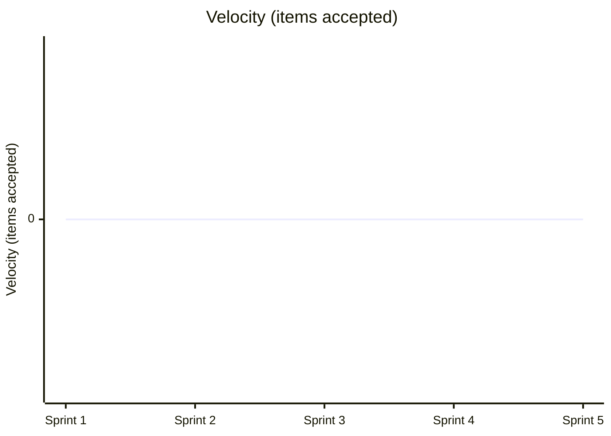

# Team Performance Evaluation Report

- Run ID: 0.1.0-run40
- Horseless Carriage commit: d2af1c1cbfd8d3563e59d6362b42d4a9d71bd307
- Branch: eval/0.1.0-run40/main
- Model: scrum-eval-cheap
- Sprints requested: 5, completed: 5
- Started: 2026-09-30T10:14:54.479176+00:00
- Finished: 2026-09-30T10:28:32.881298+00:00

## Methodology note
This run used a scripted, unattended driver (`run_eval.py`) that pre-approves every sprint goal/backlog and auto-merges any PR that opens against the eval branch, standing in for the human review gate real usage requires. Results reflect the team's real behavior under those conditions, not under full human-in-the-loop review - a lower bar in that one specific respect.

## Per-sprint metrics
| Sprint | Tokens Used | Stories Planned | Sprint Report? | PR Merges (after) |
|---|---|---|---|---|
| 1 | 4894587 | 2 | no | 0/0 |
| 2 | 5555894 | 2 | yes | 0/0 |
| 3 | 5332610 | 2 | yes | 0/0 |
| 4 | 5277442 | 2 | yes | 0/0 |
| 5 | 5604384 | 2 | yes | 1/1 |

## KPI Trends

| KPI | Sprint 1 | Sprint 2 | Sprint 3 | Sprint 4 | Sprint 5 |
|---|---|---|---|---|---|
| Velocity (items accepted) | 0 | 0 | 0 | 0 | 0 |
| Issues fixed | 0 | 0 | 0 | 0 | 0 |
| Stories implemented | 1 | 1 | 1 | 1 | 1 |
| Testplan scenarios | 2 | 2 | 2 | 2 | 2 |
| Say-Do Ratio | 0 | 0 | n/a | 0 | 0 |
| Quality (defect escape rate) | n/a | n/a | n/a | n/a | n/a |
| Test Coverage | n/a | 0 | n/a | n/a | n/a |

### Velocity (items accepted)

```mermaid
xychart-beta
    title "Velocity (items accepted)"
    x-axis ["Sprint 1", "Sprint 2", "Sprint 3", "Sprint 4", "Sprint 5"]
    y-axis "Velocity (items accepted)"
    line [0, 0, 0, 0, 0]
```

### Issues fixed

```mermaid
xychart-beta
    title "Issues fixed"
    x-axis ["Sprint 1", "Sprint 2", "Sprint 3", "Sprint 4", "Sprint 5"]
    y-axis "Issues fixed"
    line [0, 0, 0, 0, 0]
```

### Stories implemented

```mermaid
xychart-beta
    title "Stories implemented"
    x-axis ["Sprint 1", "Sprint 2", "Sprint 3", "Sprint 4", "Sprint 5"]
    y-axis "Stories implemented"
    line [1, 1, 1, 1, 1]
```

### Testplan scenarios

```mermaid
xychart-beta
    title "Testplan scenarios"
    x-axis ["Sprint 1", "Sprint 2", "Sprint 3", "Sprint 4", "Sprint 5"]
    y-axis "Testplan scenarios"
    line [2, 2, 2, 2, 2]
```

### Say-Do Ratio

```mermaid
xychart-beta
    title "Say-Do Ratio"
    x-axis ["Sprint 1", "Sprint 2", "Sprint 4", "Sprint 5"]
    y-axis "Say-Do Ratio"
    line [0, 0, 0, 0]
```

(1 of 5 sprints have no data point for this KPI and are omitted above - see the table for exactly which.)

### Quality (defect escape rate)

No data available for this run - never computed (QualityGuardian's calculate_kpis/update_sprint_report was not called in any sprint).

### Test Coverage

```mermaid
xychart-beta
    title "Test Coverage"
    x-axis ["Sprint 2"]
    y-axis "Test Coverage"
    line [0]
```

(4 of 5 sprints have no data point for this KPI and are omitted above - see the table for exactly which.)

## Token & Cost Summary

- Total tokens used: 26,664,917
- Expected cost: $2.6665 - $10.6660 (rough estimate from litellm's static pricing for `gemini/gemini-flash-lite-latest` - token_usage doesn't split prompt/completion tokens, so this is an all-input-vs-all-output bound, not an exact figure)

## Code Quality

**Score: 1/5**

The team failed to deliver a functional application. While basic test skeletons exist in `tests/test_todo.py` and `test_todo.py`, the actual application modules (`app.py`, `models.py`) and UI templates are completely missing from the file tree. The codebase consists of boilerplate testing stubs that cannot run or satisfy the product requirements.

## Requirements Quality

**Score: 2/5**

The PRD (`specs/requirements/PRD-ToDo-MVP.md`) and user stories (`specs/stories/US-0001-Create-a-new-to-do-list.md` through `US-0006`) are properly structured and mapped out. However, execution tracking is heavily degraded, with the roadmap (`specs/ROADMAP.md`) showing that stories US-0002 through US-0006 never progressed past the 'READY' state.

## Team Efficiency

**Score: 1/5**

The AI Scrum team severely overconsumed its token budgets across every single sprint, hitting 5.2M to 5.6M tokens against a 5,000,000 token limit. Every sprint review report generated was a mechanical fallback stating that the token/USD budget was exhausted before the Product Owner could author a real report.

## Top Problems

1. **Complete absence of implementation source files (app.py, models.py, and HTML templates).** (severity: high)
   - Evidence: File tree lacks app.py, models.py, and templates/, preventing the app from executing.
   - Suggested fix: No clear fix - agent team completely exhausted token limits before writing application code.

2. **Consistent token budget exhaustion across all sprints.** (severity: high)
   - Evidence: Token usage: 5,604,384 / 5000000 in specs/reports/SPRINT-REPORT-LATEST.md.
   - Suggested fix: Optimize agent loop verbosity and tool-call efficiency to prevent runaway token consumption.

3. **All sprint reports fell back to automatically generated failure notices.** (severity: medium)
   - Evidence: ⚠️ Automatically Generated Fallback Report in specs/reports/SPRINT-REPORT-001.md.
   - Suggested fix: Implement circuit breakers in agent orchestration to force report generation before budget depletion.

4. **User stories left unimplemented and stuck in ready status.** (severity: medium)
   - Evidence: US-0002 through US-0006 are marked only as Draft and Ready in specs/ROADMAP.md.
   - Suggested fix: Reduce sprint scope or improve task-execution pacing to complete stories within the fixed timeframe.

5. **Empty requirements.txt dependency file.** (severity: medium)
   - Evidence: # Local offline requirements inside requirements.txt
   - Suggested fix: Ensure dependencies such as Flask and Flask-SQLAlchemy are explicitly written to requirements.txt during early setup tasks.
