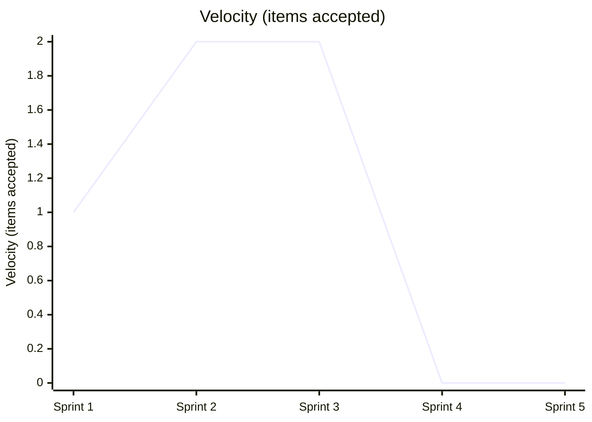

# Team Performance Evaluation Report

- Run ID: 0.1.0-run52
- Horseless Carriage commit: 0c5823b5250764a760dbe9e360c55574342eac44
- Branch: eval/0.1.0-run52/main
- Model: scrum-eval-cheap
- Sprints requested: 5, completed: 5
- Started: 2026-10-08T14:08:04.233300+00:00
- Finished: 2026-10-08T14:20:17.429941+00:00

## Blockers

No stories are blocked as of the last completed sprint.

## Methodology note
This run used a scripted, unattended driver (`run_eval.py`) that pre-approves every sprint goal/backlog and auto-merges any PR that opens against the eval branch, standing in for the human review gate real usage requires. Results reflect the team's real behavior under those conditions, not under full human-in-the-loop review - a lower bar in that one specific respect.

## Per-sprint metrics
| Sprint | Tokens Used | Stories Planned | Sprint Report? | PR Merges (after) |
|---|---|---|---|---|
| 1 | 2382137 | 1 | yes | 0/0 |
| 2 | 4854981 | 2 | yes | 1/1 |
| 3 | 6295593 | 2 | yes | 1/1 |
| 4 | 997183 | 0 | yes | 0/0 |
| 5 | 1045026 | 0 | yes | 0/0 |

## KPI Trends

| KPI | Sprint 1 | Sprint 2 | Sprint 3 | Sprint 4 | Sprint 5 |
|---|---|---|---|---|---|
| Velocity (items accepted) | 1 | 2 | 2 | 0 | 0 |
| Issues fixed | 0 | 0 | 0 | 0 | 0 |
| Stories implemented | 1 | 2 | 2 | 0 | 0 |
| Testplan scenarios | 5 | 5 | 5 | 5 | 5 |
| Say-Do Ratio | 1 | 1 | 1 | 1 | 1 |
| Quality (defect escape rate) | n/a | n/a | n/a | n/a | n/a |
| Test Coverage | 0.99 | 0.99 | 0.99 | 0.99 | 0.99 |

### Velocity (items accepted)

```mermaid
xychart-beta
    title "Velocity (items accepted)"
    x-axis ["Sprint 1", "Sprint 2", "Sprint 3", "Sprint 4", "Sprint 5"]
    y-axis "Velocity (items accepted)"
    line [1, 2, 2, 0, 0]
```

### Issues fixed

```mermaid
xychart-beta
    title "Issues fixed"
    x-axis ["Sprint 1", "Sprint 2", "Sprint 3", "Sprint 4", "Sprint 5"]
    y-axis "Issues fixed"
    line [0, 0, 0, 0, 0]
```

### Stories implemented

```mermaid
xychart-beta
    title "Stories implemented"
    x-axis ["Sprint 1", "Sprint 2", "Sprint 3", "Sprint 4", "Sprint 5"]
    y-axis "Stories implemented"
    line [1, 2, 2, 0, 0]
```

### Testplan scenarios

```mermaid
xychart-beta
    title "Testplan scenarios"
    x-axis ["Sprint 1", "Sprint 2", "Sprint 3", "Sprint 4", "Sprint 5"]
    y-axis "Testplan scenarios"
    line [5, 5, 5, 5, 5]
```

### Say-Do Ratio

```mermaid
xychart-beta
    title "Say-Do Ratio"
    x-axis ["Sprint 1", "Sprint 2", "Sprint 3", "Sprint 4", "Sprint 5"]
    y-axis "Say-Do Ratio"
    line [1, 1, 1, 1, 1]
```

### Quality (defect escape rate)

No data available for this run - not available - no defect/bug-lifecycle tracking exists yet (Scrum Master's calculate_kpis did run this run, this specific metric just has no data source yet).

### Test Coverage

```mermaid
xychart-beta
    title "Test Coverage"
    x-axis ["Sprint 1", "Sprint 2", "Sprint 3", "Sprint 4", "Sprint 5"]
    y-axis "Test Coverage"
    line [0.99, 0.99, 0.99, 0.99, 0.99]
```

## Token & Cost Summary

- Total tokens used: 15,574,920
- Expected cost: $1.5575 - $6.2300 (rough estimate from litellm's static pricing for `gemini/gemini-flash-lite-latest` - token_usage doesn't split prompt/completion tokens, so this is an all-input-vs-all-output bound, not an exact figure)

## Code Quality

**Score: 5/5**

The application code in app.py, models.py, and templates/index.html is clean, idiomatic Flask using SQLAlchemy with proper cascade rules for deletion. Comprehensive automated test coverage in test_todo.py successfully validates all CRUD and toggle requirements against a temporary SQLite database. The architecture aligns perfectly with the MVP product requirements and functions end-to-end without bugs.

## Requirements Quality

**Score: 4/5**

User stories in specs/stories/ are thoroughly documented with clear acceptance criteria and traceable statuses. The PRD in specs/requirements/PRD-Todo-App.md correctly captures the core scope and constraints for a single-user to-do list app. Minor overhead is visible in placeholder issues like ISSUE-0001 and ISSUE-0002, but functional alignment with the vision is complete.

## Team Efficiency

**Score: 3/5**

While the team successfully delivered all features and maintained detailed sprint reports and transcripts, token utilization spiked aggressively in Sprints 2 and 3, hitting 6,187,774 tokens in Sprint 3. The recurring retrospective actions and steering proposals indicate process friction, particularly around bytecode cache conflicts and PR engagement overhead.

## Top Problems

1. **Unmanaged bytecode cache files cause git checkout blocking errors during branch switches.** (severity: medium)
   - Evidence: specs/reports/RETRO-003.md cites: 'Ensure early cleanup of bytecode cache files to prevent git checkout conflicts during sprint backlog PR creation.'
   - Suggested fix: Add a standard .gitignore file to exclude Python bytecode cache (*.pyc, __pycache__/) from the repository.

2. **Token budget limits are heavily exceeded during intensive feature delivery sprints.** (severity: medium)
   - Evidence: specs/reports/SPRINT-REPORT-002.md records: 'Tokens used: 6,187,774 / 5,000,000 (124%)'
   - Suggested fix: no clear fix - agent interaction overhead and multi-turn transcript logging inherently scale with fixed workflow step requirements across 5 sprints.

3. **Retrospective actions remain perpetually open across multiple sprints without automated enforcement.** (severity: low)
   - Evidence: specs/reports/RETRO-004.md lists multiple open steering and technical items with status 'open'.
   - Suggested fix: Implement an automated check in the scrum orchestrator to verify and close resolved retrospective actions before concluding sprint reports.
