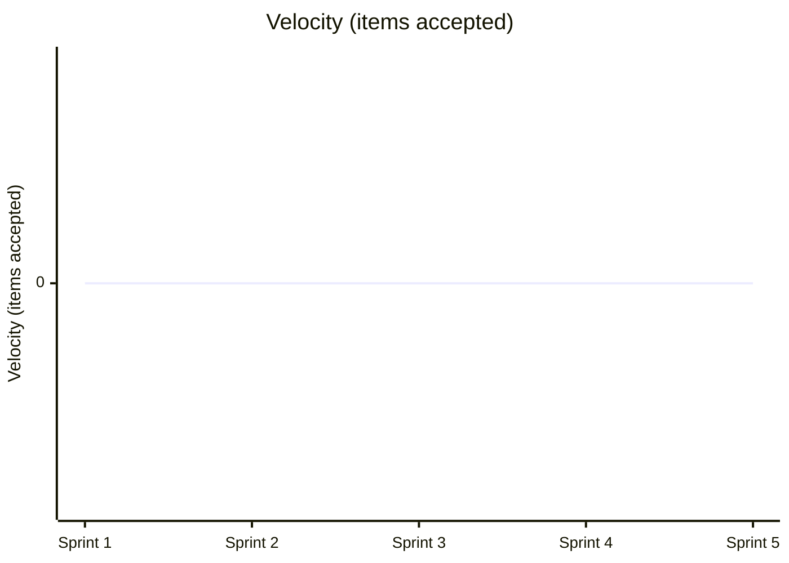
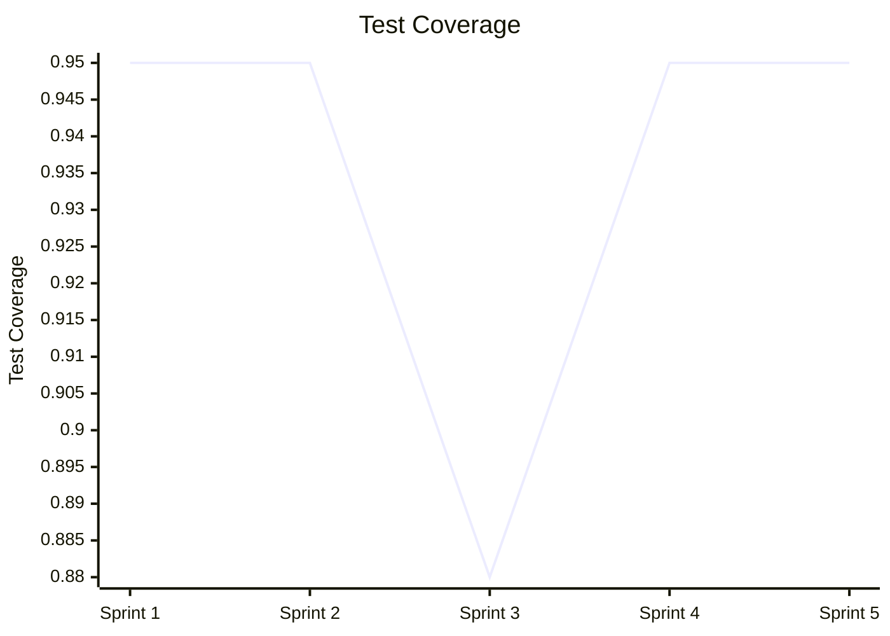

# Team Performance Evaluation Report

- Run ID: 0.1.0-run47
- Horseless Carriage commit: b81ae5640a36330c0ce61c54362e7a03dc25cbe5
- Branch: eval/0.1.0-run47/main
- Model: scrum-eval-cheap
- Sprints requested: 5, completed: 5
- Started: 2026-10-06T12:01:56.069029+00:00
- Finished: 2026-10-06T12:16:06.317105+00:00

## Blockers

No stories are blocked as of the last completed sprint.

## Methodology note
This run used a scripted, unattended driver (`run_eval.py`) that pre-approves every sprint goal/backlog and auto-merges any PR that opens against the eval branch, standing in for the human review gate real usage requires. Results reflect the team's real behavior under those conditions, not under full human-in-the-loop review - a lower bar in that one specific respect.

## Per-sprint metrics
| Sprint | Tokens Used | Stories Planned | Sprint Report? | PR Merges (after) |
|---|---|---|---|---|
| 1 | 2660371 | 0 | yes | 1/1 |
| 2 | 5567031 | 0 | yes | 0/0 |
| 3 | 5549008 | 0 | yes | 0/0 |
| 4 | 5634494 | 0 | yes | 0/0 |
| 5 | 5745047 | 0 | yes | 0/0 |

## KPI Trends

| KPI | Sprint 1 | Sprint 2 | Sprint 3 | Sprint 4 | Sprint 5 |
|---|---|---|---|---|---|
| Velocity (items accepted) | 0 | 0 | 0 | 0 | 0 |
| Issues fixed | 0 | 0 | 0 | 0 | 0 |
| Stories implemented | 0 | 0 | 0 | 0 | 0 |
| Testplan scenarios | 0 | 0 | 0 | 0 | 0 |
| Say-Do Ratio | n/a | n/a | n/a | n/a | n/a |
| Quality (defect escape rate) | n/a | n/a | n/a | n/a | n/a |
| Test Coverage | 0.95 | 0.95 | 0.88 | 0.95 | 0.95 |

### Velocity (items accepted)

```mermaid
xychart-beta
    title "Velocity (items accepted)"
    x-axis ["Sprint 1", "Sprint 2", "Sprint 3", "Sprint 4", "Sprint 5"]
    y-axis "Velocity (items accepted)"
    line [0, 0, 0, 0, 0]
```

### Issues fixed

```mermaid
xychart-beta
    title "Issues fixed"
    x-axis ["Sprint 1", "Sprint 2", "Sprint 3", "Sprint 4", "Sprint 5"]
    y-axis "Issues fixed"
    line [0, 0, 0, 0, 0]
```

### Stories implemented

```mermaid
xychart-beta
    title "Stories implemented"
    x-axis ["Sprint 1", "Sprint 2", "Sprint 3", "Sprint 4", "Sprint 5"]
    y-axis "Stories implemented"
    line [0, 0, 0, 0, 0]
```

### Testplan scenarios

```mermaid
xychart-beta
    title "Testplan scenarios"
    x-axis ["Sprint 1", "Sprint 2", "Sprint 3", "Sprint 4", "Sprint 5"]
    y-axis "Testplan scenarios"
    line [0, 0, 0, 0, 0]
```

### Say-Do Ratio

No data available for this run - no stories committed to this sprint yet (QualityGuardian's calculate_kpis did run this run, this specific metric just has no data source yet).

### Quality (defect escape rate)

No data available for this run - not available - no defect/bug-lifecycle tracking exists yet (QualityGuardian's calculate_kpis did run this run, this specific metric just has no data source yet).

### Test Coverage

```mermaid
xychart-beta
    title "Test Coverage"
    x-axis ["Sprint 1", "Sprint 2", "Sprint 3", "Sprint 4", "Sprint 5"]
    y-axis "Test Coverage"
    line [0.95, 0.95, 0.88, 0.95, 0.95]
```

## Token & Cost Summary

- Total tokens used: 25,155,951
- Expected cost: $2.5156 - $10.0624 (rough estimate from litellm's static pricing for `gemini/gemini-flash-lite-latest` - token_usage doesn't split prompt/completion tokens, so this is an all-input-vs-all-output bound, not an exact figure)

## Code Quality

**Score: 2/5**

The application runs a rudimentary Flask app in app.py that only supports creating lists and adding tasks, while lacking implementation for task completion toggling, task deletion, and list deletion. Only a basic test_app.py file exists with three passing tests covering just the implemented subset. The remaining user stories are left unbuilt and incomplete.

## Requirements Quality

**Score: 2/5**

The requirements files under specs/stories/ and specs/ROADMAP.md are populated with user stories and release plans, but the roadmap lacks structured checkboxes and tracking for later sprints. Multiple stories like US-0005 remain stuck in Ready status across multiple sprint reports.

## Team Efficiency

**Score: 1/5**

The team consistently exhausted its token and USD budgets across multiple sprints, triggering mechanically-rendered fallback sprint reports because Product Owner could not finish before the limit. Out of five planned sprints, only Sprint 1 completed substantive work, leaving subsequent sprints stalled.

## Top Problems

1. **Core user stories for task completion and deletion are completely unimplemented in the codebase.** (severity: high)
   - Evidence: app.py contains only routes for index, create_list, view_list, and add_task, omitting handlers for US-0003, US-0004, and US-0005.
   - Suggested fix: Implement routes and UI elements for toggling task completion, deleting tasks, and deleting lists as outlined in US-0003, US-0004, and US-0005.

2. **Sprint budgets are consistently exhausted before completing planned sprint work.** (severity: high)
   - Evidence: specs/reports/SPRINT-REPORT-002.md states: 'This sprint's token/USD budget... was used in full before Product Owner's own create_sprint_report call could run.'
   - Suggested fix: no clear fix - 5 sprints with fixed token budgets are insufficient for the agent team to complete multi-story feature sets without hitting rate/token limits.

3. **The product roadmap release plan lacks proper checkbox states and release mapping.** (severity: medium)
   - Evidence: specs/ROADMAP.md shows empty goal and story sections under '### v0.1 — MVP (target: YYYY-MM)' and '### v0.2 — Next iteration'.
   - Suggested fix: Update specs/ROADMAP.md to accurately map user stories to their respective release goals and maintain consistent markdown checkbox statuses.
