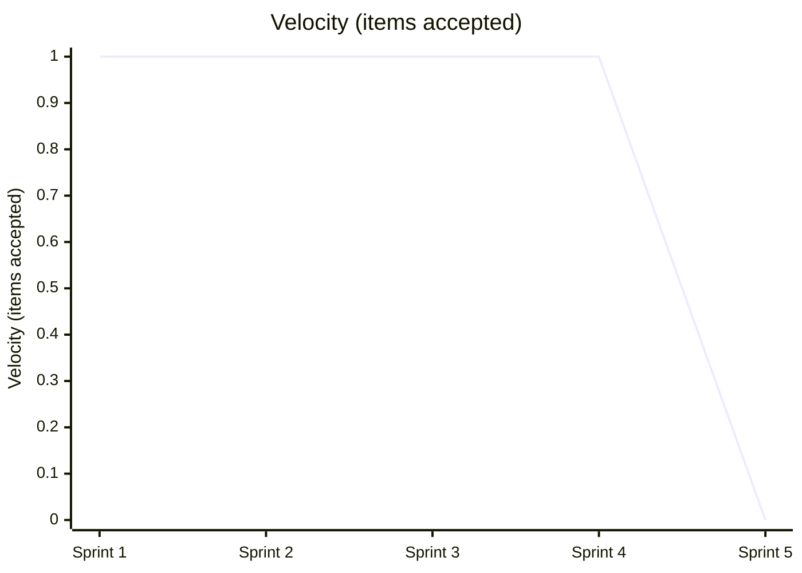
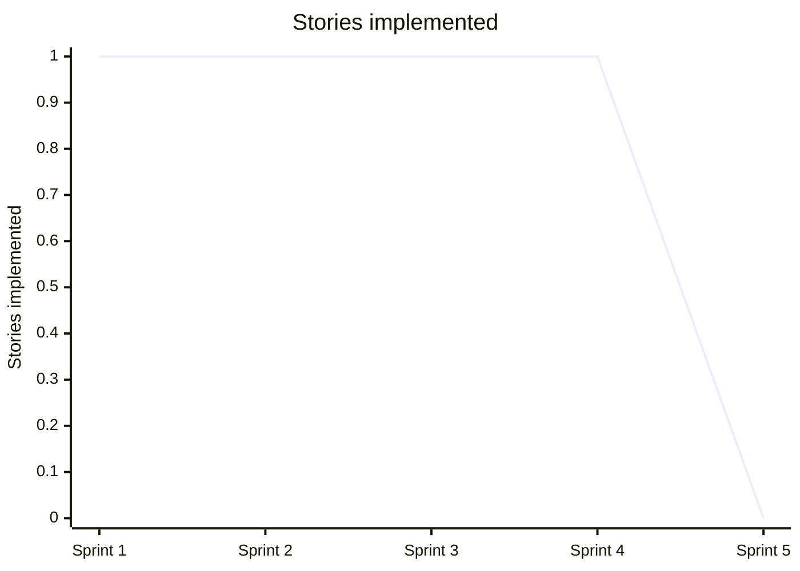
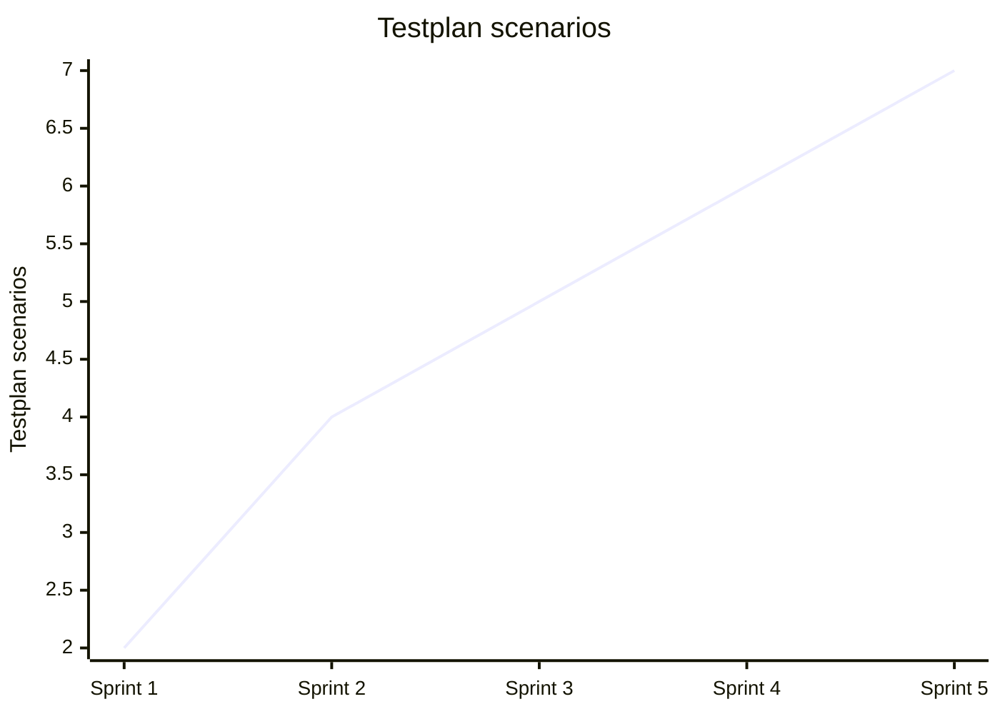

# Team Performance Evaluation Report

- Run ID: 0.1.0-run43
- Horseless Carriage commit: 153cffc9562aab31fcc35cef35fcf3c6dfecc0b4
- Branch: eval/0.1.0-run43/main
- Model: scrum-eval-cheap
- Sprints requested: 5, completed: 5
- Started: 2026-10-01T13:17:23.474126+00:00
- Finished: 2026-10-01T13:32:28.687804+00:00

## Blockers

No stories are blocked as of the last completed sprint.

## Methodology note
This run used a scripted, unattended driver (`run_eval.py`) that pre-approves every sprint goal/backlog and auto-merges any PR that opens against the eval branch, standing in for the human review gate real usage requires. Results reflect the team's real behavior under those conditions, not under full human-in-the-loop review - a lower bar in that one specific respect.

## Per-sprint metrics
| Sprint | Tokens Used | Stories Planned | Sprint Report? | PR Merges (after) |
|---|---|---|---|---|
| 1 | 4745551 | 1 | yes | 1/1 |
| 2 | 4422779 | 1 | yes | 1/1 |
| 3 | 5040952 | 1 | yes | 1/1 |
| 4 | 5474966 | 1 | yes | 0/0 |
| 5 | 5326349 | 1 | yes | 0/0 |

## KPI Trends

| KPI | Sprint 1 | Sprint 2 | Sprint 3 | Sprint 4 | Sprint 5 |
|---|---|---|---|---|---|
| Velocity (items accepted) | 1 | 1 | 1 | 1 | 0 |
| Issues fixed | 0 | 0 | 0 | 0 | 0 |
| Stories implemented | 1 | 1 | 1 | 1 | 0 |
| Testplan scenarios | 2 | 4 | 5 | 6 | 7 |
| Say-Do Ratio | 1 | 1 | 1 | 1 | n/a |
| Quality (defect escape rate) | n/a | n/a | n/a | n/a | n/a |
| Test Coverage | 0.73 | 0.73 | 0.73 | 0.73 | n/a |

### Velocity (items accepted)

```mermaid
xychart-beta
    title "Velocity (items accepted)"
    x-axis ["Sprint 1", "Sprint 2", "Sprint 3", "Sprint 4", "Sprint 5"]
    y-axis "Velocity (items accepted)"
    line [1, 1, 1, 1, 0]
```

### Issues fixed

```mermaid
xychart-beta
    title "Issues fixed"
    x-axis ["Sprint 1", "Sprint 2", "Sprint 3", "Sprint 4", "Sprint 5"]
    y-axis "Issues fixed"
    line [0, 0, 0, 0, 0]
```

### Stories implemented

```mermaid
xychart-beta
    title "Stories implemented"
    x-axis ["Sprint 1", "Sprint 2", "Sprint 3", "Sprint 4", "Sprint 5"]
    y-axis "Stories implemented"
    line [1, 1, 1, 1, 0]
```

### Testplan scenarios

```mermaid
xychart-beta
    title "Testplan scenarios"
    x-axis ["Sprint 1", "Sprint 2", "Sprint 3", "Sprint 4", "Sprint 5"]
    y-axis "Testplan scenarios"
    line [2, 4, 5, 6, 7]
```

### Say-Do Ratio

```mermaid
xychart-beta
    title "Say-Do Ratio"
    x-axis ["Sprint 1", "Sprint 2", "Sprint 3", "Sprint 4"]
    y-axis "Say-Do Ratio"
    line [1, 1, 1, 1]
```

(1 of 5 sprints have no data point for this KPI and are omitted above - see the table for exactly which.)

### Quality (defect escape rate)

No data available for this run - never computed (QualityGuardian's calculate_kpis/update_sprint_report was not called in any sprint).

### Test Coverage

```mermaid
xychart-beta
    title "Test Coverage"
    x-axis ["Sprint 1", "Sprint 2", "Sprint 3", "Sprint 4"]
    y-axis "Test Coverage"
    line [0.73, 0.73, 0.73, 0.73]
```

(1 of 5 sprints have no data point for this KPI and are omitted above - see the table for exactly which.)

## Token & Cost Summary

- Total tokens used: 25,010,597
- Expected cost: $2.5011 - $10.0042 (rough estimate from litellm's static pricing for `gemini/gemini-flash-lite-latest` - token_usage doesn't split prompt/completion tokens, so this is an all-input-vs-all-output bound, not an exact figure)

## Code Quality

**Score: 4/5**

The application code in app.py and HTML templates (templates/index.html and templates/list.html) is clean, correct, and fully functional for creating lists, adding tasks, toggling completion, and deleting tasks. Database models correctly define cascading behavior via `cascade='all, delete-orphan'` on TodoList.tasks, though US-0005 (Delete an Entire List) was left uncompleted in the roadmap.

## Requirements Quality

**Score: 3/5**

Product Owner and Architecture documentation (PRD-Todo-MVP.md, ARCHITECTURE-VISION.md, and US-0001 through US-0004) are well-structured and detailed. However, the team failed to finish US-0005 ('Delete an Entire List'), leaving it at 'Ready' status in specs/ROADMAP.md and incomplete in story files while marking later sprints as exhausted.

## Team Efficiency

**Score: 2/5**

The AI team chronically over-consumed tokens, hitting over 4.4M to 5.4M tokens per sprint and regularly exhausting token budgets (resulting in automated fallback reports for Sprint 5). Furthermore, US-0004 was marked with a review denial ('Pytest test execution reports a test failure') in its story file, showing repeated friction in test runner environments.

## Top Problems

1. **User Story US-0005 (Delete an Entire List) was left unimplemented and unaccepted at the end of the 5-sprint run.** (severity: high)
   - Evidence: specs/ROADMAP.md shows US-0005 with `[ ] IMPLEMENTED`, `[ ] REVIEWED`, `[ ] TESTED`, `[ ] ACCEPTED` under version v1.0.0.
   - Suggested fix: Allocate Sprint 5 specifically to implementing and testing list deletion rather than exhausting token budgets before reaching completion.

2. **Token usage vastly exceeded efficient operational thresholds across all sprints, frequently triggering budget exhaustion and fallback reports.** (severity: high)
   - Evidence: specs/reports/SPRINT-REPORT-005.md states: 'This sprint's token/USD budget... was exhausted before Product Owner could author and close the real sprint report'.
   - Suggested fix: no clear fix - 5 sprints with heavy multi-agent transcripts inherently push context windows and token consumption limits under current agent orchestration frameworks.

3. **Task deletion story US-0004 suffered from repeated test failures during QA review before eventually passing.** (severity: medium)
   - Evidence: specs/stories/US-0004-Delete-a-Task.md contains notes: '⚠️ REVIEW DENIED at Tested by QA: Pytest test suite execution reports a test failure on US-0004.'
   - Suggested fix: Ensure DevTeam runs local pytest verification matching container environments prior to submitting PRs for QA review.

4. **Multiple retrospective actions regarding test fixtures and container environments accumulated without closing.** (severity: low)
   - Evidence: specs/reports/SPRINT-REPORT-005.md lists persistent open retrospective items such as 'Ensure test fixtures use isolated temporary databases...'
   - Suggested fix: Implement robust isolated temporary database fixtures in conftest.py early in Sprint 1 to prevent recurring test runner issues.
