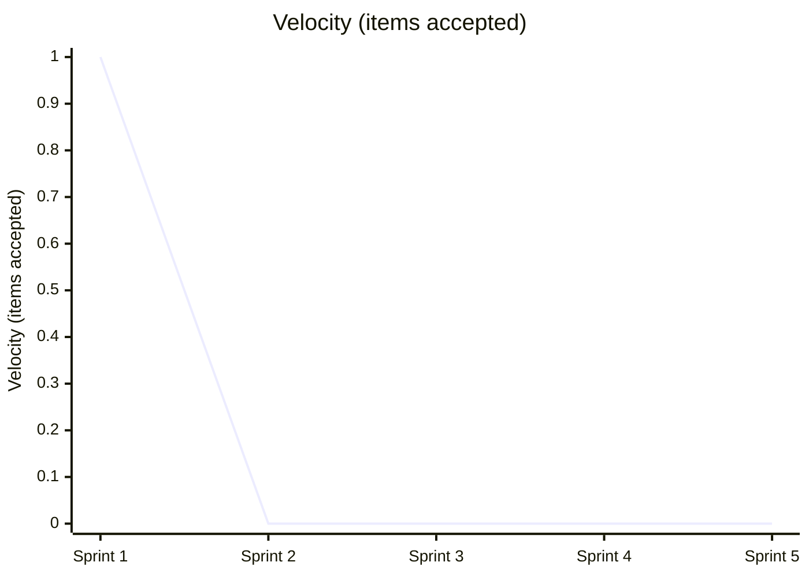
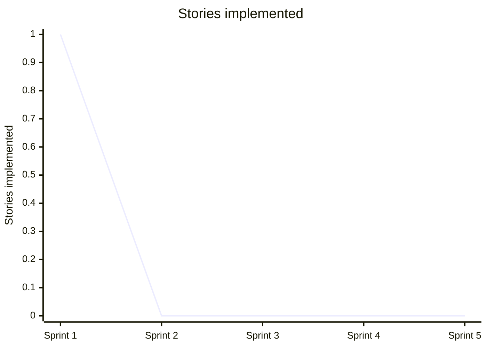
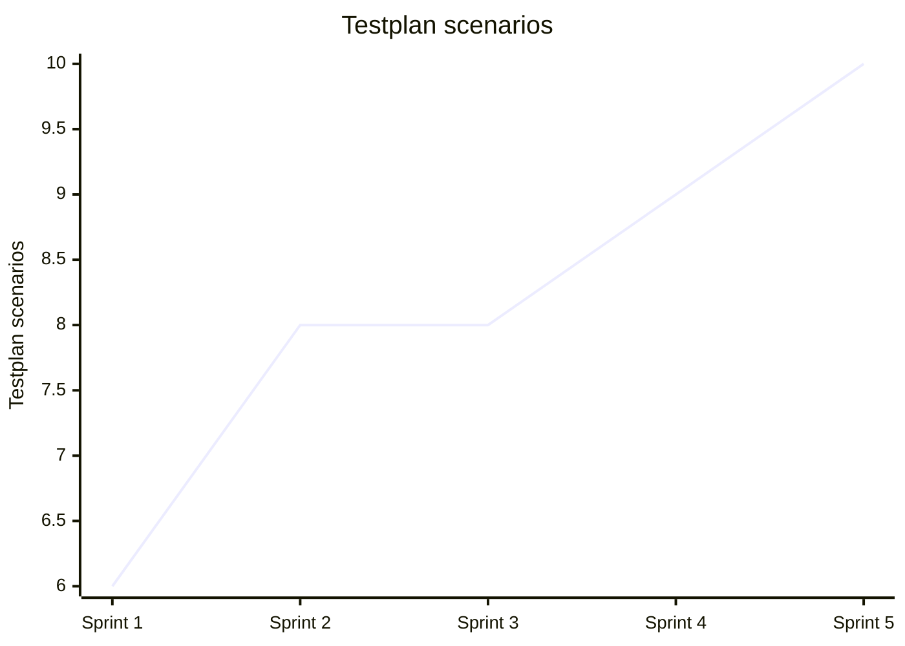
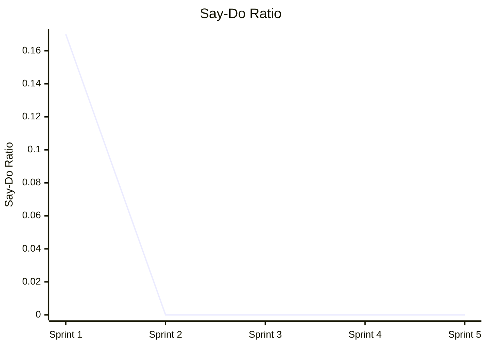

# Team Performance Evaluation Report

- Run ID: 0.1.0-run48
- Horseless Carriage commit: 30ec65d65a84d12870bd2fa10b3c509e76f86a02
- Branch: eval/0.1.0-run48/main
- Model: scrum-eval-cheap
- Sprints requested: 5, completed: 5
- Started: 2026-10-07T08:55:30.697844+00:00
- Finished: 2026-10-07T09:06:41.717214+00:00

## Blockers

No stories are blocked as of the last completed sprint.

## Methodology note
This run used a scripted, unattended driver (`run_eval.py`) that pre-approves every sprint goal/backlog and auto-merges any PR that opens against the eval branch, standing in for the human review gate real usage requires. Results reflect the team's real behavior under those conditions, not under full human-in-the-loop review - a lower bar in that one specific respect.

## Per-sprint metrics
| Sprint | Tokens Used | Stories Planned | Sprint Report? | PR Merges (after) |
|---|---|---|---|---|
| 1 | 4161594 | 6 | yes | 2/2 |
| 2 | 5515315 | 2 | fallback | 1/1 |
| 3 | 3319095 | 0 | yes | 1/1 |
| 4 | 3949874 | 0 | yes | 1/1 |
| 5 | 4657305 | 0 | yes | 1/1 |

## KPI Trends

| KPI | Sprint 1 | Sprint 2 | Sprint 3 | Sprint 4 | Sprint 5 |
|---|---|---|---|---|---|
| Velocity (items accepted) | 1 | 0 | 0 | 0 | 0 |
| Issues fixed | 0 | 0 | 0 | 0 | 0 |
| Stories implemented | 1 | 0 | 0 | 0 | 0 |
| Testplan scenarios | 6 | 8 | 8 | 9 | 10 |
| Say-Do Ratio | 0.17 | 0 | 0 | 0 | 0 |
| Quality (defect escape rate) | n/a | n/a | n/a | n/a | n/a |
| Test Coverage | 0.99 | 0.99 | 0.99 | 0.99 | 0.99 |

### Velocity (items accepted)

```mermaid
xychart-beta
    title "Velocity (items accepted)"
    x-axis ["Sprint 1", "Sprint 2", "Sprint 3", "Sprint 4", "Sprint 5"]
    y-axis "Velocity (items accepted)"
    line [1, 0, 0, 0, 0]
```

### Issues fixed

```mermaid
xychart-beta
    title "Issues fixed"
    x-axis ["Sprint 1", "Sprint 2", "Sprint 3", "Sprint 4", "Sprint 5"]
    y-axis "Issues fixed"
    line [0, 0, 0, 0, 0]
```

### Stories implemented

```mermaid
xychart-beta
    title "Stories implemented"
    x-axis ["Sprint 1", "Sprint 2", "Sprint 3", "Sprint 4", "Sprint 5"]
    y-axis "Stories implemented"
    line [1, 0, 0, 0, 0]
```

### Testplan scenarios

```mermaid
xychart-beta
    title "Testplan scenarios"
    x-axis ["Sprint 1", "Sprint 2", "Sprint 3", "Sprint 4", "Sprint 5"]
    y-axis "Testplan scenarios"
    line [6, 8, 8, 9, 10]
```

### Say-Do Ratio

```mermaid
xychart-beta
    title "Say-Do Ratio"
    x-axis ["Sprint 1", "Sprint 2", "Sprint 3", "Sprint 4", "Sprint 5"]
    y-axis "Say-Do Ratio"
    line [0.17, 0, 0, 0, 0]
```

### Quality (defect escape rate)

No data available for this run - not available - no defect/bug-lifecycle tracking exists yet (QualityGuardian's calculate_kpis did run this run, this specific metric just has no data source yet).

### Test Coverage

```mermaid
xychart-beta
    title "Test Coverage"
    x-axis ["Sprint 1", "Sprint 2", "Sprint 3", "Sprint 4", "Sprint 5"]
    y-axis "Test Coverage"
    line [0.99, 0.99, 0.99, 0.99, 0.99]
```

## Token & Cost Summary

- Total tokens used: 21,603,183
- Expected cost: $2.1603 - $8.6413 (rough estimate from litellm's static pricing for `gemini/gemini-flash-lite-latest` - token_usage doesn't split prompt/completion tokens, so this is an all-input-vs-all-output bound, not an exact figure)

## Code Quality

**Score: 4/5**

The application core in app.py and templates/index.html cleanly implements the required Flask and SQLAlchemy models, supporting list creation, task management, toggling, and cascading deletes. While input validation and robust error handling across routes are minimal, the implemented routes successfully fulfill the MVP feature requirements. The codebase is straightforward, readable, and properly structured.

## Requirements Quality

**Score: 3/5**

The PRD, user stories, and roadmap documents are well-structured, but story state tracking across sprints degraded significantly after Sprint 1. In specs/ROADMAP.md, user stories US-0002 through US-0007 remain marked as un-implemented or un-tested despite the functionality being present in the running application. Additionally, retrospective action issues like ISSUE-0003 and ISSUE-0004 were filed but never driven to completion.

## Team Efficiency

**Score: 2/5**

The multi-agent scrum team exhibited severe process inefficiencies, spending millions of tokens across 5 sprints while executing zero new stories after Sprint 1. Transcripts reveal repetitive agent hand-offs and communication loops that consumed significant token budgets without advancing product deliverables. Furthermore, Sprint 2 exhausted its token limit entirely, requiring a fallback mechanical report.

## Top Problems

1. **Story statuses in the roadmap are out of sync with actual codebase implementation.** (severity: high)
   - Evidence: specs/ROADMAP.md marks stories US-0002 through US-0007 as lacking implementation and testing stages, even though app.py and templates/index.html fully implement them.
   - Suggested fix: Implement automated synchronization between PR merges and roadmap story state updates, or require agents to update story checkboxes before closing sprints.

2. **Excessive agent transfer loops and process overhead without story advancement.** (severity: high)
   - Evidence: specs/reports/SPRINT-REPORT-002.md notes: 'QA and ScrumOrchestrator bounced transfer_to_agent 3x with no progress - 🔁 [TRANSFER LOOP DETECTED]'
   - Suggested fix: no clear fix - agent orchestration prompt constraints and routing logic require architectural redesign to prevent cyclic hand-off loops.

3. **Retrospective actions and technical issues are repeatedly logged without resolution.** (severity: medium)
   - Evidence: specs/reports/RETRO-004.md and specs/requirements/ISSUE-0003-Verify-robust-error-handling-and-input-validation-across-all-app-routes.md remain open and unaddressed across multiple sprints.
   - Suggested fix: Enforce a strict sprint backlog capacity rule where logged retrospective issues must be planned and resolved in the immediately following sprint.

4. **Sprint token budget exhaustion caused fallback mechanical reporting in Sprint 2.** (severity: medium)
   - Evidence: specs/reports/SPRINT-REPORT-002.md states: 'This sprint's token/USD budget... was used in full before Product Owner's own create_sprint_report call could run'
   - Suggested fix: Tune agent prompt verbosity and reduce redundant multi-agent review hops to stay comfortably within the per-sprint token limit.
