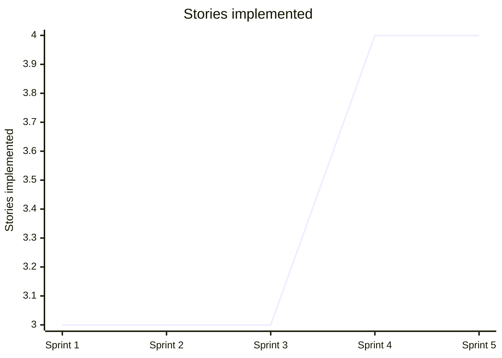
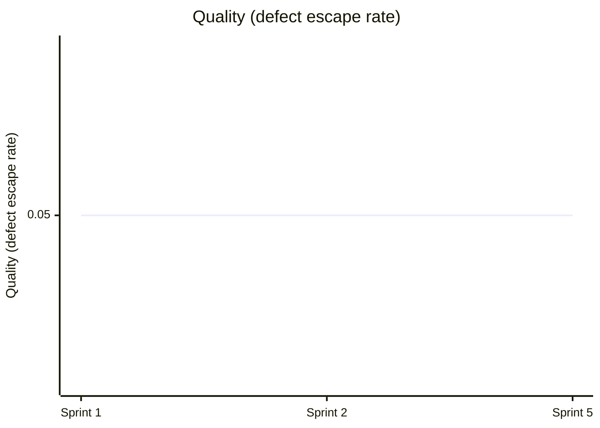

# Team Performance Evaluation Report

- Run ID: 0.1.0-run37
- Horseless Carriage commit: 142f5a35e2a8ca650c655153f9abbeeda3e939fa
- Branch: eval/0.1.0-run37/main
- Model: scrum-eval-cheap
- Sprints requested: 5, completed: 5
- Started: 2026-09-29T08:45:29.973214+00:00
- Finished: 2026-09-29T08:54:39.006421+00:00

## Methodology note
This run used a scripted, unattended driver (`run_eval.py`) that pre-approves every sprint goal/backlog and auto-merges any PR that opens against the eval branch, standing in for the human review gate real usage requires. Results reflect the team's real behavior under those conditions, not under full human-in-the-loop review - a lower bar in that one specific respect.

## Per-sprint metrics
| Sprint | Tokens Used | Stories Planned | Sprint Report? | PR Merges (after) |
|---|---|---|---|---|
| 1 | 4317999 | 3 | yes | 1/1 |
| 2 | 5683470 | 5 | yes | 0/0 |
| 3 | 682579 | 5 | yes | 0/0 |
| 4 | 5597469 | 5 | yes | 1/1 |
| 5 | 689784 | 5 | yes | 0/0 |

## KPI Trends

| KPI | Sprint 1 | Sprint 2 | Sprint 3 | Sprint 4 | Sprint 5 |
|---|---|---|---|---|---|
| Velocity (items accepted) | 3 | 2 | 2 | 3 | 3 |
| Issues fixed | 0 | 0 | 0 | 0 | 0 |
| Stories implemented | 3 | 3 | 3 | 4 | 4 |
| Testplan scenarios | 3 | 5 | 5 | 5 | 5 |
| Say-Do Ratio | 0.8 | 0.8 | n/a | n/a | 0.8 |
| Quality (defect escape rate) | 0.05 | 0.05 | n/a | n/a | 0.05 |
| Test Coverage | 0.99 | 0.99 | n/a | n/a | 0.99 |

### Velocity (items accepted)

```mermaid
xychart-beta
    title "Velocity (items accepted)"
    x-axis ["Sprint 1", "Sprint 2", "Sprint 3", "Sprint 4", "Sprint 5"]
    y-axis "Velocity (items accepted)"
    line [3, 2, 2, 3, 3]
```

### Issues fixed

```mermaid
xychart-beta
    title "Issues fixed"
    x-axis ["Sprint 1", "Sprint 2", "Sprint 3", "Sprint 4", "Sprint 5"]
    y-axis "Issues fixed"
    line [0, 0, 0, 0, 0]
```

### Stories implemented

```mermaid
xychart-beta
    title "Stories implemented"
    x-axis ["Sprint 1", "Sprint 2", "Sprint 3", "Sprint 4", "Sprint 5"]
    y-axis "Stories implemented"
    line [3, 3, 3, 4, 4]
```

### Testplan scenarios

```mermaid
xychart-beta
    title "Testplan scenarios"
    x-axis ["Sprint 1", "Sprint 2", "Sprint 3", "Sprint 4", "Sprint 5"]
    y-axis "Testplan scenarios"
    line [3, 5, 5, 5, 5]
```

### Say-Do Ratio

```mermaid
xychart-beta
    title "Say-Do Ratio"
    x-axis ["Sprint 1", "Sprint 2", "Sprint 5"]
    y-axis "Say-Do Ratio"
    line [0.8, 0.8, 0.8]
```

(2 of 5 sprints have no data point for this KPI and are omitted above - see the table for exactly which.)

### Quality (defect escape rate)

```mermaid
xychart-beta
    title "Quality (defect escape rate)"
    x-axis ["Sprint 1", "Sprint 2", "Sprint 5"]
    y-axis "Quality (defect escape rate)"
    line [0.05, 0.05, 0.05]
```

(2 of 5 sprints have no data point for this KPI and are omitted above - see the table for exactly which.)

### Test Coverage

```mermaid
xychart-beta
    title "Test Coverage"
    x-axis ["Sprint 1", "Sprint 2", "Sprint 5"]
    y-axis "Test Coverage"
    line [0.99, 0.99, 0.99]
```

(2 of 5 sprints have no data point for this KPI and are omitted above - see the table for exactly which.)

## Token & Cost Summary

- Total tokens used: 16,971,301
- Expected cost: $5.0914 - $42.4283 (rough estimate from litellm's static pricing for `gemini/gemini-flash-lite-latest` - token_usage doesn't split prompt/completion tokens, so this is an all-input-vs-all-output bound, not an exact figure)

## Code Quality

**Score: 3/5**

The application code in app.py implements basic Flask routes for lists and tasks, and test_app.py provides pytest coverage for core functionality. However, global in-memory state counters (list_counter, task_counter) and dictionary structures limit scalability and production readiness. Additionally, features like task deletion and list deletion mentioned in stories are incomplete or missing from the final app routing logic.

## Requirements Quality

**Score: 2/5**

While a Product Requirements Document and user stories exist in specs/requirements/ and specs/stories/, the roadmap and story tracking are severely desynchronized. For example, specs/ROADMAP.md shows US-0004 and US-0005 as incomplete or untracked despite being referenced in sprint reports. Moreover, agent handoff failures and repeated transfer loops (logged in story notes and transcripts) indicate poor process discipline.

## Team Efficiency

**Score: 1/5**

The team experienced severe agent coordination breakdowns, evidenced by repeated transfer loops (e.g., 6-7 consecutive agent-to-agent hops with no tool calls) and multiple token budget exhaustion events across sprints. Per-sprint token usage fluctuated wildly from over 5 million tokens down to under 700k, demonstrating a lack of predictable pacing or effective workflow management.

## Top Problems

1. **Agent transfer loops and redundant hops causing process gridlock.** (severity: high)
   - Evidence: specs/stories/US-0003-Toggle-Task-Completion.md cites: 'DevTeam and ScrumOrchestrator bounced transfer_to_agent 6x with no progress - 🔁 [TRANSFER LOOP DETECTED]'
   - Suggested fix: Implement strict orchestration limits or automated guardrails in Horseless Carriage to prevent agents from repetitively bouncing transfers without intermediate tool execution.

2. **Roadmap and task board status desynchronization with actual sprint deliverables.** (severity: medium)
   - Evidence: specs/ROADMAP.md lists US-0004 and US-0005 under v1.2.0 with unchecked boxes (- [ ] IMPLEMENTED), whereas sprint reports and transcripts claim task deletion was delivered.
   - Suggested fix: Enforce automated validation checks that require ProductOwner or ScrumMaster to update specs/ROADMAP.md checkboxes prior to concluding a sprint.

3. **Frequent token budget exhaustion mid-sprint disrupting execution flow.** (severity: high)
   - Evidence: specs/reports/SPRINT-REPORT-004.md states: '⚠️ Automatically Generated Fallback Report ... This sprint's token/USD budget ... was exhausted before Product Owner could author and close the real sprint report'
   - Suggested fix: no clear fix - fixed-length token budgets in evaluation harness runs inherently collide with verbose multi-agent prompt histories unless prompt compression or token budgeting per sprint is tuned.

4. **Fragile global state management in the Flask backend application.** (severity: medium)
   - Evidence: app.py uses global variables: 'todo_lists = {}', 'list_counter = 1', 'task_counter = 1' alongside a manual 'reset_store()' helper function.
   - Suggested fix: Refactor app.py to encapsulate state within an application factory pattern or a dedicated repository class rather than relying on mutable global module-level counters.
