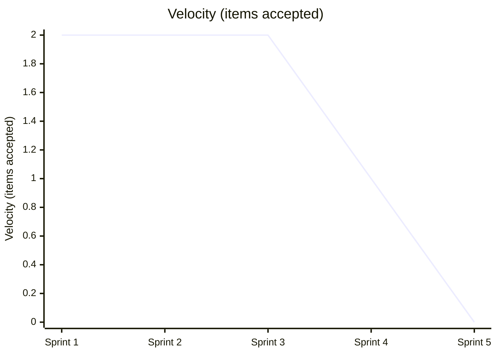
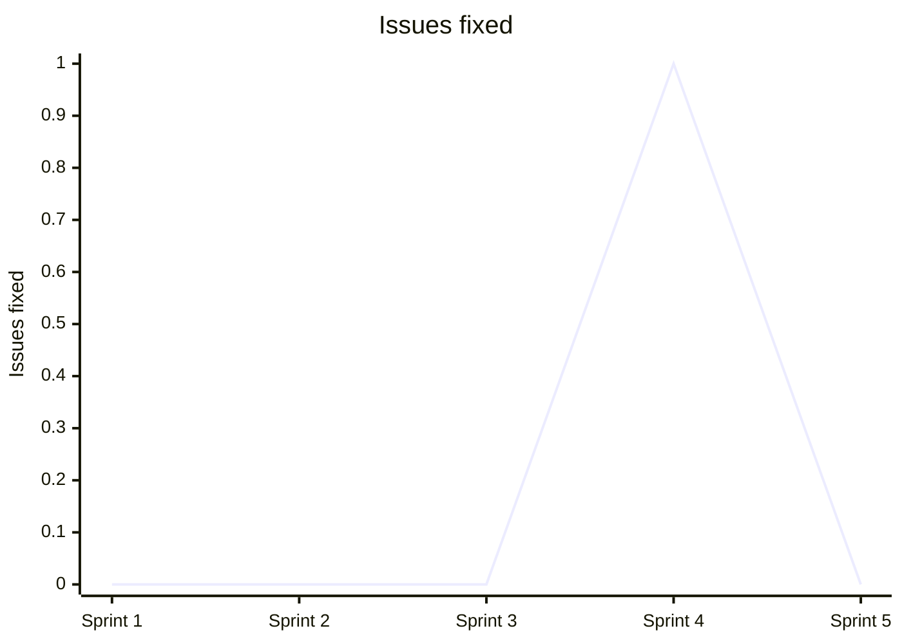
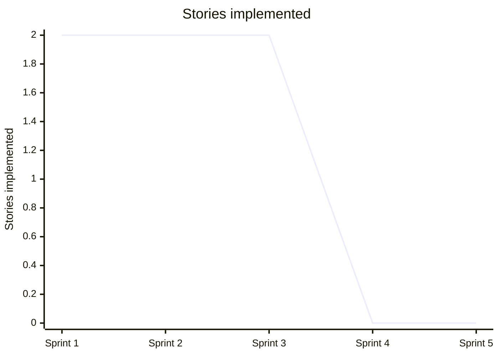
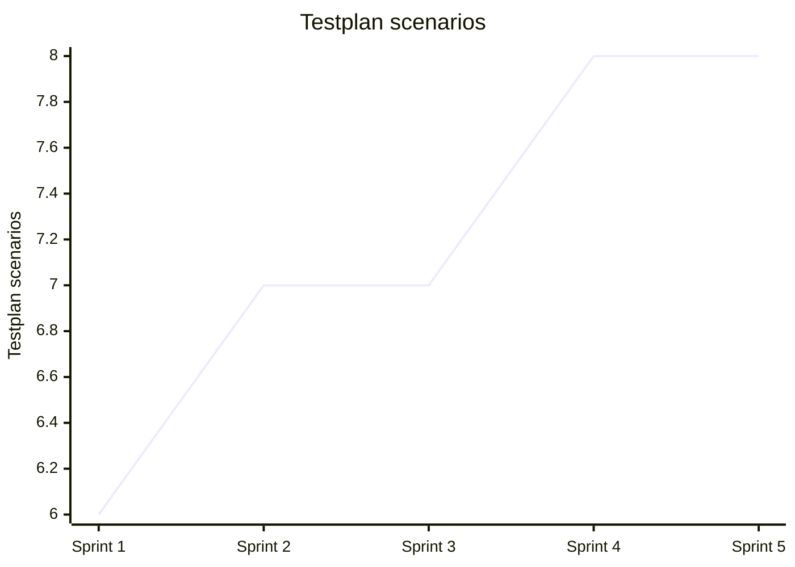
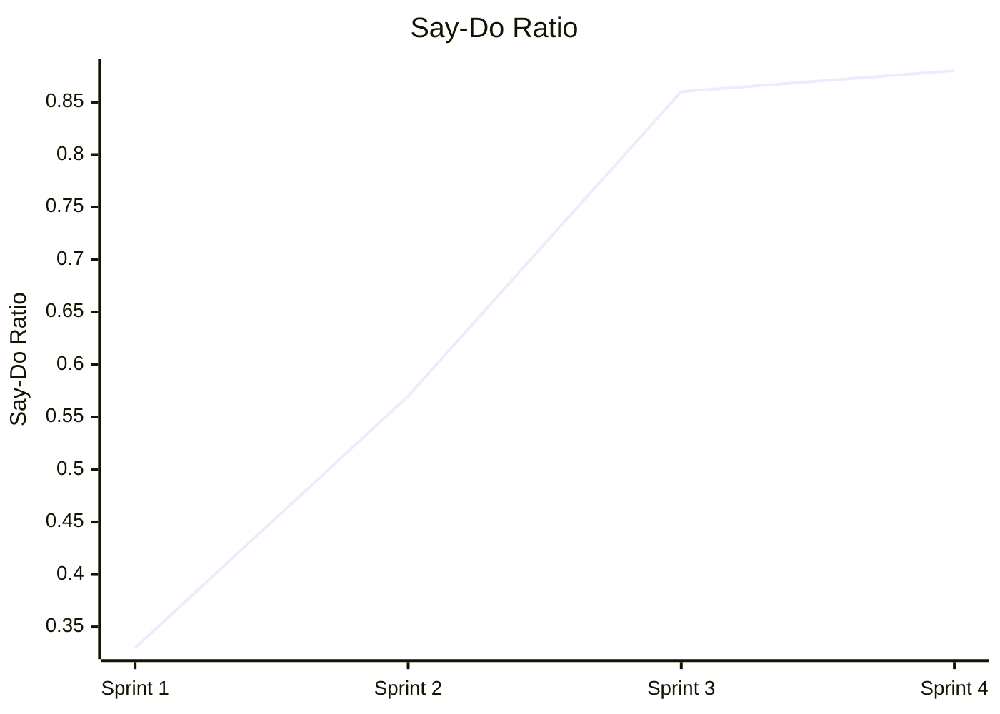

# Team Performance Evaluation Report

- Run ID: 0.1.0-run44
- Horseless Carriage commit: bd03735207f79eaff959a745c5fca243c6c8e849
- Branch: eval/0.1.0-run44/main
- Model: scrum-eval-cheap
- Sprints requested: 5, completed: 5
- Started: 2026-10-02T13:29:00.828162+00:00
- Finished: 2026-10-02T13:43:10.986085+00:00

## Blockers

No stories are blocked as of the last completed sprint.

## Methodology note
This run used a scripted, unattended driver (`run_eval.py`) that pre-approves every sprint goal/backlog and auto-merges any PR that opens against the eval branch, standing in for the human review gate real usage requires. Results reflect the team's real behavior under those conditions, not under full human-in-the-loop review - a lower bar in that one specific respect.

## Per-sprint metrics
| Sprint | Tokens Used | Stories Planned | Sprint Report? | PR Merges (after) |
|---|---|---|---|---|
| 1 | 5444463 | 6 | yes | 0/0 |
| 2 | 5662753 | 1 | yes | 0/0 |
| 3 | 5265559 | 0 | yes | 0/0 |
| 4 | 5640950 | 1 | yes | 0/0 |
| 5 | 5331319 | 0 | yes | 0/0 |

## KPI Trends

| KPI | Sprint 1 | Sprint 2 | Sprint 3 | Sprint 4 | Sprint 5 |
|---|---|---|---|---|---|
| Velocity (items accepted) | 2 | 2 | 2 | 1 | 0 |
| Issues fixed | 0 | 0 | 0 | 1 | 0 |
| Stories implemented | 2 | 2 | 2 | 0 | 0 |
| Testplan scenarios | 6 | 7 | 7 | 8 | 8 |
| Say-Do Ratio | 0.33 | 0.57 | 0.86 | 0.88 | n/a |
| Quality (defect escape rate) | n/a | n/a | n/a | n/a | n/a |
| Test Coverage | 0.99 | 0.99 | 0.99 | 0.99 | n/a |

### Velocity (items accepted)

```mermaid
xychart-beta
    title "Velocity (items accepted)"
    x-axis ["Sprint 1", "Sprint 2", "Sprint 3", "Sprint 4", "Sprint 5"]
    y-axis "Velocity (items accepted)"
    line [2, 2, 2, 1, 0]
```

### Issues fixed

```mermaid
xychart-beta
    title "Issues fixed"
    x-axis ["Sprint 1", "Sprint 2", "Sprint 3", "Sprint 4", "Sprint 5"]
    y-axis "Issues fixed"
    line [0, 0, 0, 1, 0]
```

### Stories implemented

```mermaid
xychart-beta
    title "Stories implemented"
    x-axis ["Sprint 1", "Sprint 2", "Sprint 3", "Sprint 4", "Sprint 5"]
    y-axis "Stories implemented"
    line [2, 2, 2, 0, 0]
```

### Testplan scenarios

```mermaid
xychart-beta
    title "Testplan scenarios"
    x-axis ["Sprint 1", "Sprint 2", "Sprint 3", "Sprint 4", "Sprint 5"]
    y-axis "Testplan scenarios"
    line [6, 7, 7, 8, 8]
```

### Say-Do Ratio

```mermaid
xychart-beta
    title "Say-Do Ratio"
    x-axis ["Sprint 1", "Sprint 2", "Sprint 3", "Sprint 4"]
    y-axis "Say-Do Ratio"
    line [0.33, 0.57, 0.86, 0.88]
```

(1 of 5 sprints have no data point for this KPI and are omitted above - see the table for exactly which.)

### Quality (defect escape rate)

No data available for this run - not available - no defect/bug-lifecycle tracking exists yet (QualityGuardian's calculate_kpis did run this run, this specific metric just has no data source yet).

### Test Coverage

```mermaid
xychart-beta
    title "Test Coverage"
    x-axis ["Sprint 1", "Sprint 2", "Sprint 3", "Sprint 4"]
    y-axis "Test Coverage"
    line [0.99, 0.99, 0.99, 0.99]
```

(1 of 5 sprints have no data point for this KPI and are omitted above - see the table for exactly which.)

## Token & Cost Summary

- Total tokens used: 27,345,044
- Expected cost: $2.7345 - $10.9380 (rough estimate from litellm's static pricing for `gemini/gemini-flash-lite-latest` - token_usage doesn't split prompt/completion tokens, so this is an all-input-vs-all-output bound, not an exact figure)

## Code Quality

**Score: 4/5**

The application code in app.py and templates/index.html cleanly implements all required to-do list and task management features using Flask and SQLAlchemy. Database models correctly establish a cascade delete relationship between TodoList and Task, preventing orphan records. While the codebase is functional and easy to run, error handling for edge cases like malformed IDs or empty submissions is minimal.

## Requirements Quality

**Score: 4/5**

The PRD, user stories under specs/stories/, and the roadmap capture all functional requirements outlined in the product vision. Stories are tracked across detailed lifecycle stages, and acceptance criteria are explicitly documented. However, housekeeping issues like ISSUE-0002 and ISSUE-0003 remain incomplete in the backlog despite multiple sprints passing.

## Team Efficiency

**Score: 2/5**

The AI team chronically exceeded the 5,000,000 token per-sprint budget across all evaluated sprints, triggering automatic fallback sprint reports due to token exhaustion. Multiple sprints ended without completing their planned backlog items or failing to close sprint reports properly before hitting limits. Process overhead and agent conversation counts were high relative to actual feature delivery.

## Top Problems

1. **Token budget exhaustion consistently occurred in every sprint, preventing clean sprint closures and forcing fallback reports.** (severity: high)
   - Evidence: specs/reports/SPRINT-REPORT-005.md states: 'This sprint's token/USD budget... was exhausted before Product Owner could author and close the real sprint report'
   - Suggested fix: Increase the per-sprint token limit to ~7,500,000 tokens as recommended by the team's sprint length feedback, or streamline agent prompt context to reduce redundant tool calls.

2. **Unresolved process issues and backlog items remain in a draft or ready state across multiple sprints.** (severity: medium)
   - Evidence: specs/requirements/ISSUE-0002-Maintain-rigorous-story-sequencing-and-ensure-all-planned-stories-have-acceptance-checks-recorded-promptly.md has status 'Ready' and unchecked boxes in specs/ROADMAP.md
   - Suggested fix: Enforce strict sprint capacity planning so that cross-cutting process issues and issues files are addressed rather than abandoned in backlog states.

3. **Fallback sprint reports are generated mechanically because agents run out of budget before completing the `create_sprint_report` call.** (severity: medium)
   - Evidence: specs/reports/SPRINT-REPORT-002.md and SPRINT-REPORT-LATEST.md both contain the warning 'Automatically Generated Fallback Report'
   - Suggested fix: Reserve a fixed token buffer at the end of each sprint exclusively for report generation and cleanup tasks.
