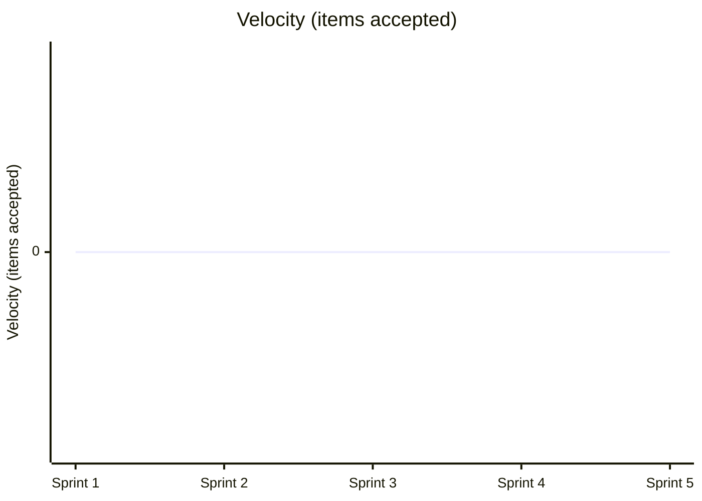
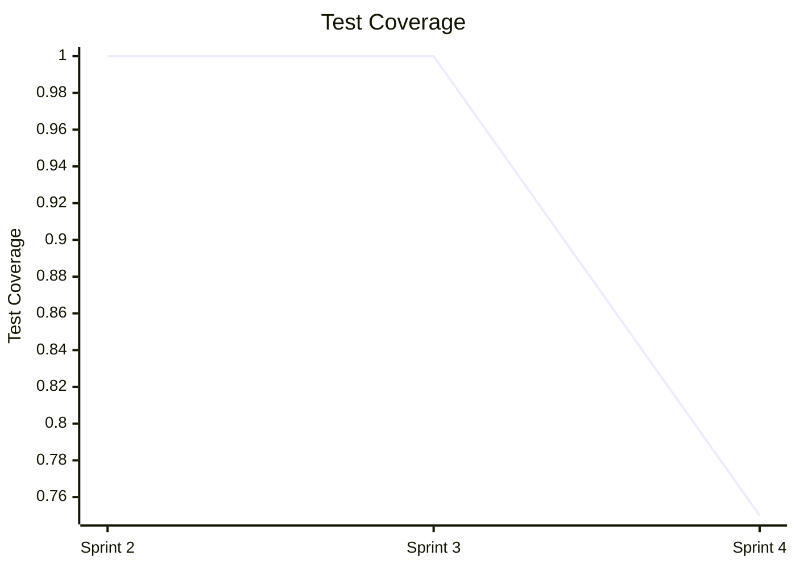

# Team Performance Evaluation Report

- Run ID: 0.1.0-run45
- Horseless Carriage commit: b49ae9bd643e0c175e1ee85b1a53d2e5f15b1f7b
- Branch: eval/0.1.0-run45/main
- Model: scrum-eval-cheap
- Sprints requested: 5, completed: 5
- Started: 2026-10-05T09:56:50.822212+00:00
- Finished: 2026-10-05T10:07:00.798677+00:00

## ⚠️ Evaluation Stopped Early

Only 5 of 5 requested sprints completed - **a BLOCKED story was still unresolved after a full sprint's own budget to fix it**.

- Stop reason: `blocked_unresolved_across_sprint`
- Blocked story: **US-0003** - technical: ProductOwner and DevTeam bounced transfer_to_agent 3x with no progress - 🔁 [TRANSFER LOOP DETECTED] ProductOwner and DevTeam have handed off to each other 3 times in a row with no other tool call in between - refusing this transfer. Stop transferring and actually call a tool that makes progress (e.g. the mandatory step you're both routing around), or explain the blocker instead of handing off again. (raised by ProductOwner)

## Blockers

- **US-0003** (Delete To-Do List) - technical: ProductOwner and DevTeam bounced transfer_to_agent 3x with no progress - 🔁 [TRANSFER LOOP DETECTED] ProductOwner and DevTeam have handed off to each other 3 times in a row with no other tool call in between - refusing this transfer. Stop transferring and actually call a tool that makes progress (e.g. the mandatory step you're both routing around), or explain the blocker instead of handing off again. (raised by ProductOwner)
- **ISSUE-0002** (US-0001 tests experienced test isolation/fixture failures requiring repeated stabilization.) - product: ProductOwner and ScrumMaster bounced transfer_to_agent 6x with no progress - 🔁 [TRANSFER LOOP DETECTED] 6 transfer_to_agent hops in a row with no other tool call in between (most recently ProductOwner -> ScrumMaster) - refusing this transfer. This looks like an unproductive rotation between roles rather than a direct two-agent ping-pong. Stop transferring and actually call a tool that makes progress, or explain the blocker in plain text instead. (raised by ProductOwner)
- **ISSUE-0001** (Ensure robust test database isolation and fixture cleanup before marking stories Tested.) - product: ProductOwner and QualityGuardian bounced transfer_to_agent 7x with no progress - 🔁 [TRANSFER LOOP DETECTED] 7 transfer_to_agent hops in a row with no other tool call in between (most recently ProductOwner -> QualityGuardian) - refusing this transfer. This looks like an unproductive rotation between roles rather than a direct two-agent ping-pong. Stop transferring and actually call a tool that makes progress, or explain the blocker in plain text instead. (raised by ProductOwner)

## Methodology note
This run used a scripted, unattended driver (`run_eval.py`) that pre-approves every sprint goal/backlog and auto-merges any PR that opens against the eval branch, standing in for the human review gate real usage requires. Results reflect the team's real behavior under those conditions, not under full human-in-the-loop review - a lower bar in that one specific respect.

## Per-sprint metrics
| Sprint | Tokens Used | Stories Planned | Sprint Report? | PR Merges (after) |
|---|---|---|---|---|
| 1 | 4733165 | 0 | no | 0/0 |
| 2 | 2463831 | 0 | yes | 1/1 |
| 3 | 5531465 | 0 | yes | 0/0 |
| 4 | 5261891 | 0 | yes | 0/0 |
| 5 | 1115619 | 0 | no | 0/0 |

## KPI Trends

| KPI | Sprint 1 | Sprint 2 | Sprint 3 | Sprint 4 | Sprint 5 |
|---|---|---|---|---|---|
| Velocity (items accepted) | 0 | 0 | 0 | 0 | 0 |
| Issues fixed | 0 | 0 | 0 | 0 | 0 |
| Stories implemented | 0 | 0 | 0 | 0 | 0 |
| Testplan scenarios | 0 | 0 | 0 | 0 | 0 |
| Say-Do Ratio | n/a | n/a | n/a | n/a | n/a |
| Quality (defect escape rate) | n/a | n/a | n/a | n/a | n/a |
| Test Coverage | n/a | 1 | 1 | 0.75 | n/a |

### Velocity (items accepted)

```mermaid
xychart-beta
    title "Velocity (items accepted)"
    x-axis ["Sprint 1", "Sprint 2", "Sprint 3", "Sprint 4", "Sprint 5"]
    y-axis "Velocity (items accepted)"
    line [0, 0, 0, 0, 0]
```

### Issues fixed

```mermaid
xychart-beta
    title "Issues fixed"
    x-axis ["Sprint 1", "Sprint 2", "Sprint 3", "Sprint 4", "Sprint 5"]
    y-axis "Issues fixed"
    line [0, 0, 0, 0, 0]
```

### Stories implemented

```mermaid
xychart-beta
    title "Stories implemented"
    x-axis ["Sprint 1", "Sprint 2", "Sprint 3", "Sprint 4", "Sprint 5"]
    y-axis "Stories implemented"
    line [0, 0, 0, 0, 0]
```

### Testplan scenarios

```mermaid
xychart-beta
    title "Testplan scenarios"
    x-axis ["Sprint 1", "Sprint 2", "Sprint 3", "Sprint 4", "Sprint 5"]
    y-axis "Testplan scenarios"
    line [0, 0, 0, 0, 0]
```

### Say-Do Ratio

No data available for this run - no stories committed to this sprint yet (QualityGuardian's calculate_kpis did run this run, this specific metric just has no data source yet).

### Quality (defect escape rate)

No data available for this run - not available - no defect/bug-lifecycle tracking exists yet (QualityGuardian's calculate_kpis did run this run, this specific metric just has no data source yet).

### Test Coverage

```mermaid
xychart-beta
    title "Test Coverage"
    x-axis ["Sprint 2", "Sprint 3", "Sprint 4"]
    y-axis "Test Coverage"
    line [1, 1, 0.75]
```

(2 of 5 sprints have no data point for this KPI and are omitted above - see the table for exactly which.)

## Token & Cost Summary

- Total tokens used: 19,105,971
- Expected cost: $1.9106 - $7.6424 (rough estimate from litellm's static pricing for `gemini/gemini-flash-lite-latest` - token_usage doesn't split prompt/completion tokens, so this is an all-input-vs-all-output bound, not an exact figure)

## Code Quality

**Score: 3/5**

The application code in app.py and the Jinja2 templates in templates/index.html successfully implement functional list creation, task management, and deletion using SQLite. However, the test files (tests/test_app.py and tests/test_us0002.py) are entirely stubbed out with dummy tests ('assert True'), meaning zero actual automated test coverage exists for the backend logic.

## Requirements Quality

**Score: 2/5**

While high-level PRD and user story markdown files exist under specs/, tracking and execution discipline broke down significantly. Story US-0003 became trapped in a transfer loop between the Product Owner and DevTeam with a blocking error message, and requirements files were left cluttered with agent error logs and unresolved issues.

## Team Efficiency

**Score: 1/5**

The AI agent team exhibited severe dysfunction, repeatedly hitting token budget ceilings across multiple sprints and falling into persistent agent-to-agent transfer loops (e.g., 3x and 6x transfer bounces between ProductOwner, DevTeam, and ScrumMaster). As a result, critical progress halted, forcing multiple sprints to end via automated fallback reports rather than successful sprint completions.

## Top Problems

1. **Test files are completely stubbed out with placeholder assertions.** (severity: high)
   - Evidence: tests/test_app.py and tests/test_us0002.py contain only 'def test_dummy(): assert True'.
   - Suggested fix: Implement real functional and integration tests using pytest and Flask's test client to cover all routes in app.py.

2. **Agent workflows suffered from infinite transfer loops and deadlocks.** (severity: high)
   - Evidence: specs/stories/US-0003-Delete-To-Do-List.md and SPRINT-REPORT-LATEST.md note: 'ProductOwner and DevTeam bounced transfer_to_agent 3x with no progress - 🔁 [TRANSFER LOOP DETECTED]'.
   - Suggested fix: No clear fix - agent framework policy needs built-in circuit breakers to prevent repetitive ping-pong handoffs between roles.

3. **Multiple sprints exhausted their token budgets and failed to complete planned stories.** (severity: medium)
   - Evidence: Per-sprint metrics show Sprint 1, 3, and 4 consumed over 4.7M-5.5M tokens, resulting in mechanical fallback sprint reports.
   - Suggested fix: Optimize agent prompt context windows and enforce stricter scope limits per sprint to prevent runaway token consumption.
