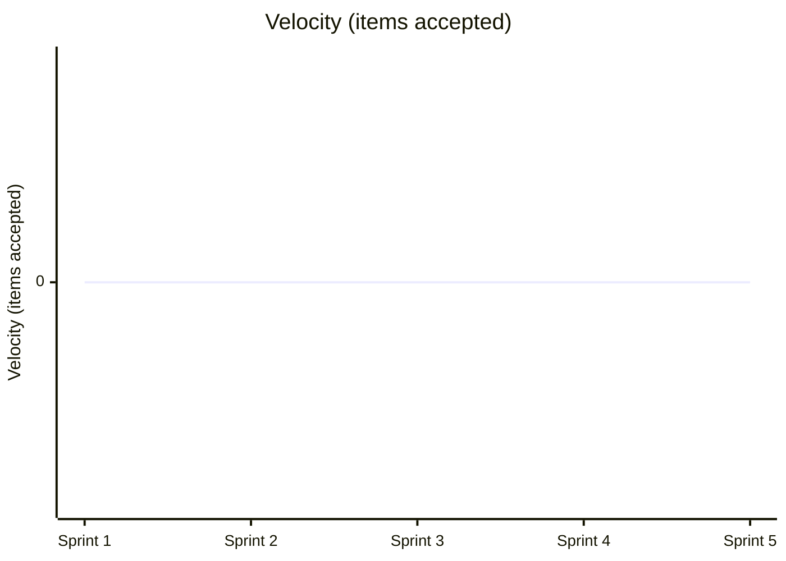

# Team Performance Evaluation Report

- Run ID: 0.1.0-run39
- Horseless Carriage commit: 79f0ec663457be004d004106e4df0b084f99912c
- Branch: eval/0.1.0-run39/main
- Model: scrum-eval-cheap
- Sprints requested: 5, completed: 5
- Started: 2026-09-30T08:15:35.849417+00:00
- Finished: 2026-09-30T08:26:00.333127+00:00

## Methodology note
This run used a scripted, unattended driver (`run_eval.py`) that pre-approves every sprint goal/backlog and auto-merges any PR that opens against the eval branch, standing in for the human review gate real usage requires. Results reflect the team's real behavior under those conditions, not under full human-in-the-loop review - a lower bar in that one specific respect.

## Per-sprint metrics
| Sprint | Tokens Used | Stories Planned | Sprint Report? | PR Merges (after) |
|---|---|---|---|---|
| 1 | 4656846 | 6 | no | 0/0 |
| 2 | 5507949 | 6 | yes | 0/0 |
| 3 | 854604 | 6 | yes | 0/0 |
| 4 | 5502022 | 6 | yes | 1/1 |
| 5 | 492795 | 6 | yes | 0/0 |

## KPI Trends

| KPI | Sprint 1 | Sprint 2 | Sprint 3 | Sprint 4 | Sprint 5 |
|---|---|---|---|---|---|
| Velocity (items accepted) | 0 | 0 | 0 | 0 | 0 |
| Issues fixed | 0 | 0 | 0 | 0 | 0 |
| Stories implemented | 1 | 1 | 1 | 2 | 2 |
| Testplan scenarios | 6 | 6 | 6 | 6 | 6 |
| Say-Do Ratio | n/a | 0.8 | n/a | 0.8 | n/a |
| Quality (defect escape rate) | n/a | 0.05 | n/a | 0.05 | n/a |
| Test Coverage | n/a | 0 | n/a | 0 | n/a |

### Velocity (items accepted)

```mermaid
xychart-beta
    title "Velocity (items accepted)"
    x-axis ["Sprint 1", "Sprint 2", "Sprint 3", "Sprint 4", "Sprint 5"]
    y-axis "Velocity (items accepted)"
    line [0, 0, 0, 0, 0]
```

### Issues fixed

```mermaid
xychart-beta
    title "Issues fixed"
    x-axis ["Sprint 1", "Sprint 2", "Sprint 3", "Sprint 4", "Sprint 5"]
    y-axis "Issues fixed"
    line [0, 0, 0, 0, 0]
```

### Stories implemented

```mermaid
xychart-beta
    title "Stories implemented"
    x-axis ["Sprint 1", "Sprint 2", "Sprint 3", "Sprint 4", "Sprint 5"]
    y-axis "Stories implemented"
    line [1, 1, 1, 2, 2]
```

### Testplan scenarios

```mermaid
xychart-beta
    title "Testplan scenarios"
    x-axis ["Sprint 1", "Sprint 2", "Sprint 3", "Sprint 4", "Sprint 5"]
    y-axis "Testplan scenarios"
    line [6, 6, 6, 6, 6]
```

### Say-Do Ratio

```mermaid
xychart-beta
    title "Say-Do Ratio"
    x-axis ["Sprint 2", "Sprint 4"]
    y-axis "Say-Do Ratio"
    line [0.8, 0.8]
```

(3 of 5 sprints have no data point for this KPI and are omitted above - see the table for exactly which.)

### Quality (defect escape rate)

```mermaid
xychart-beta
    title "Quality (defect escape rate)"
    x-axis ["Sprint 2", "Sprint 4"]
    y-axis "Quality (defect escape rate)"
    line [0.05, 0.05]
```

(3 of 5 sprints have no data point for this KPI and are omitted above - see the table for exactly which.)

### Test Coverage

```mermaid
xychart-beta
    title "Test Coverage"
    x-axis ["Sprint 2", "Sprint 4"]
    y-axis "Test Coverage"
    line [0, 0]
```

(3 of 5 sprints have no data point for this KPI and are omitted above - see the table for exactly which.)

## Token & Cost Summary

- Total tokens used: 17,014,216
- Expected cost: $1.7014 - $6.8057 (rough estimate from litellm's static pricing for `gemini/gemini-flash-lite-latest` - token_usage doesn't split prompt/completion tokens, so this is an all-input-vs-all-output bound, not an exact figure)

## Code Quality

**Score: 1/5**

The repository fails to implement or test any end-to-end functionality for the To-Do List Web App MVP, despite multiple sprint attempts. As documented in specs/reports/SPRINT-REPORT-LATEST.md, 0 out of 6 stories were completed, leaving an empty and non-functional codebase. The development team became permanently stuck in blocker loops regarding test discovery and packaging configuration.

## Requirements Quality

**Score: 2/5**

While a Product Requirements Document and individual user stories are properly structured under specs/requirements/PRD-Todo-App.md and specs/stories/, the actual execution tracking in specs/ROADMAP.md remains completely unchecked. Every story is frozen at early stages (Draft/Ready/Implemented) with none reaching Accepted status across all five sprints.

## Team Efficiency

**Score: 1/5**

The automated Scrum team displayed severe process dysfunction, repeatedly exhausting token budgets in Sprints 2 and 4 while making zero net progress on story completion. As revealed in the conversation transcripts (specs/reports/TRANSCRIPT-001.md), the team fell into endless loops of QA rejections and architectural overrides regarding pytest test discovery.

## Top Problems

1. **Complete failure to pass QA verification or achieve story acceptance due to persistent pytest test collection issues.** (severity: high)
   - Evidence: specs/reports/SPRINT-REPORT-LATEST.md: 'advance_story_stage('US-0001', 'Tested') has been rejected 3 times in a row for the same reason - most recently: Cannot mark 'US-0001' Tested - running the test suite found no tests actually ran'
   - Suggested fix: Ensure the testing framework and test file layout are established correctly during sprint setup before any feature implementation branches are opened.

2. **Multiple sprints exhausted token and USD budgets before closing cleanly, resulting in automatically generated fallback reports.** (severity: high)
   - Evidence: specs/reports/SPRINT-REPORT-002.md and SPRINT-REPORT-004.md: 'This sprint's token/USD budget... was exhausted before Product Owner could author and close the real sprint report'
   - Suggested fix: Implement strict budget throttling and early convergence logic in agent orchestration to prevent infinite debate loops between QA, DevTeam, and Architect.

3. **Release PR creation repeatedly hit push rejections due to branch synchronization issues with develop.** (severity: medium)
   - Evidence: specs/reports/TRANSCRIPT-LATEST.md: 'create_release_pr encountered a non-fast-forward push rejection due to upstream develop branch updates'
   - Suggested fix: Configure git workflow tools to automatically fetch and rebase or merge develop upstream before attempting to push release pull requests.

4. **Roadmap task board remains entirely uncompleted with zero stories marked Done or Accepted.** (severity: high)
   - Evidence: specs/ROADMAP.md: all items under v1.0.0 show checkboxes as `- [ ]` for IMPLEMENTED, REVIEWED, TESTED, and ACCEPTED
   - Suggested fix: no clear fix - the evaluation run terminated after 5 sprints without successfully resolving core testing blockers.
