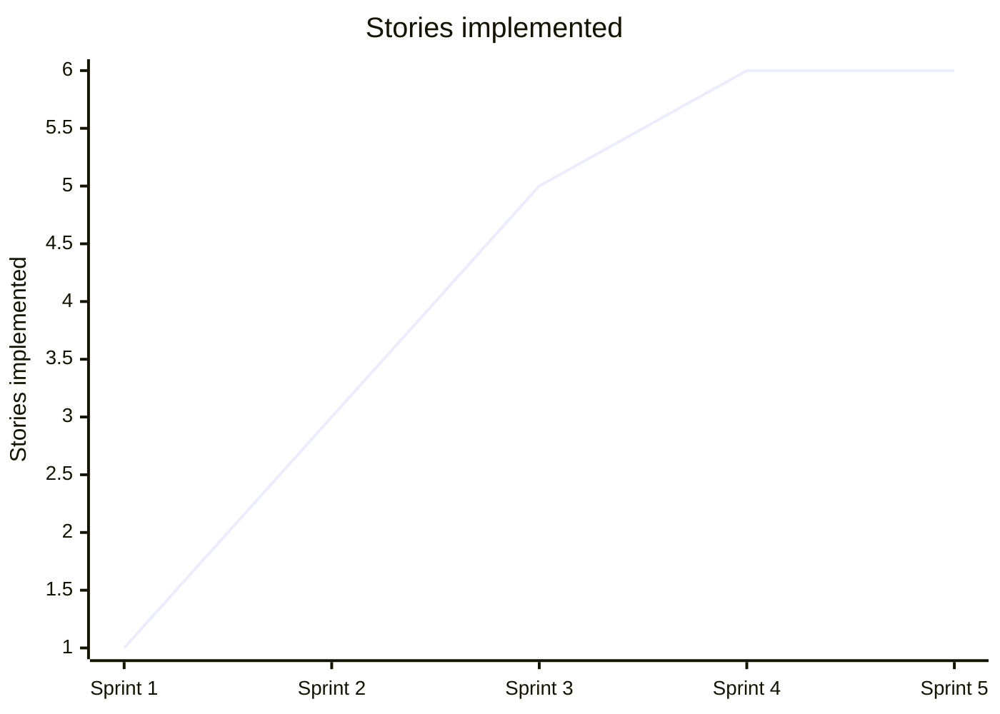

# Team Performance Evaluation Report

- Run ID: 0.1.0-run42
- Horseless Carriage commit: 335f24a4c3053310186566ddfa1ee4f7bad98a18
- Branch: eval/0.1.0-run42/main
- Model: scrum-eval-cheap
- Sprints requested: 5, completed: 5
- Started: 2026-09-30T12:34:00.873971+00:00
- Finished: 2026-09-30T12:46:57.413974+00:00

## Blockers

No stories are blocked as of the last completed sprint.

## Methodology note
This run used a scripted, unattended driver (`run_eval.py`) that pre-approves every sprint goal/backlog and auto-merges any PR that opens against the eval branch, standing in for the human review gate real usage requires. Results reflect the team's real behavior under those conditions, not under full human-in-the-loop review - a lower bar in that one specific respect.

## Per-sprint metrics
| Sprint | Tokens Used | Stories Planned | Sprint Report? | PR Merges (after) |
|---|---|---|---|---|
| 1 | 2797763 | 6 | yes | 1/1 |
| 2 | 3725698 | 6 | yes | 1/1 |
| 3 | 4961664 | 6 | yes | 1/1 |
| 4 | 4072144 | 6 | yes | 1/1 |
| 5 | 5517015 | 6 | yes | 1/1 |

## KPI Trends

| KPI | Sprint 1 | Sprint 2 | Sprint 3 | Sprint 4 | Sprint 5 |
|---|---|---|---|---|---|
| Velocity (items accepted) | 1 | 3 | 5 | 6 | 6 |
| Issues fixed | 0 | 0 | 0 | 0 | 0 |
| Stories implemented | 1 | 3 | 5 | 6 | 6 |
| Testplan scenarios | 7 | 7 | 7 | 7 | 7 |
| Say-Do Ratio | 0.17 | 0.5 | 0.83 | 1 | 1 |
| Quality (defect escape rate) | n/a | n/a | n/a | n/a | n/a |
| Test Coverage | 0.99 | 0.99 | 0.99 | 0.99 | 0.99 |

### Velocity (items accepted)

```mermaid
xychart-beta
    title "Velocity (items accepted)"
    x-axis ["Sprint 1", "Sprint 2", "Sprint 3", "Sprint 4", "Sprint 5"]
    y-axis "Velocity (items accepted)"
    line [1, 3, 5, 6, 6]
```

### Issues fixed

```mermaid
xychart-beta
    title "Issues fixed"
    x-axis ["Sprint 1", "Sprint 2", "Sprint 3", "Sprint 4", "Sprint 5"]
    y-axis "Issues fixed"
    line [0, 0, 0, 0, 0]
```

### Stories implemented

```mermaid
xychart-beta
    title "Stories implemented"
    x-axis ["Sprint 1", "Sprint 2", "Sprint 3", "Sprint 4", "Sprint 5"]
    y-axis "Stories implemented"
    line [1, 3, 5, 6, 6]
```

### Testplan scenarios

```mermaid
xychart-beta
    title "Testplan scenarios"
    x-axis ["Sprint 1", "Sprint 2", "Sprint 3", "Sprint 4", "Sprint 5"]
    y-axis "Testplan scenarios"
    line [7, 7, 7, 7, 7]
```

### Say-Do Ratio

```mermaid
xychart-beta
    title "Say-Do Ratio"
    x-axis ["Sprint 1", "Sprint 2", "Sprint 3", "Sprint 4", "Sprint 5"]
    y-axis "Say-Do Ratio"
    line [0.17, 0.5, 0.83, 1, 1]
```

### Quality (defect escape rate)

No data available for this run - never computed (QualityGuardian's calculate_kpis/update_sprint_report was not called in any sprint).

### Test Coverage

```mermaid
xychart-beta
    title "Test Coverage"
    x-axis ["Sprint 1", "Sprint 2", "Sprint 3", "Sprint 4", "Sprint 5"]
    y-axis "Test Coverage"
    line [0.99, 0.99, 0.99, 0.99, 0.99]
```

## Token & Cost Summary

- Total tokens used: 21,074,284
- Expected cost: $2.1074 - $8.4297 (rough estimate from litellm's static pricing for `gemini/gemini-flash-lite-latest` - token_usage doesn't split prompt/completion tokens, so this is an all-input-vs-all-output bound, not an exact figure)

## Code Quality

**Score: 5/5**

The application code in app.py is clean, idiomatic Flask utilizing SQLAlchemy models with proper cascade rules ('all, delete-orphan') for lists and tasks. The HTML template (templates/index.html) successfully implements Tailwind CSS styling, forms for creation and deletion, and conditional strikethrough classes for completed tasks. Furthermore, requirements.txt accurately lists stable versions of Flask, SQLAlchemy, Flask-SQLAlchemy, pytest, and gunicorn.

## Requirements Quality

**Score: 4/5**

The PRD (specs/requirements/PRD-Todo-App.md) and individual user stories (US-001 through US-006) clearly define the scope and acceptance criteria for a single-user to-do web application. However, the roadmap (specs/ROADMAP.md) and story progression files demonstrate a recurring pattern of marking features as newly implemented in later sprints via 'earlier work', indicating that foundational code was pre-implemented and retroactively mapped to stories.

## Team Efficiency

**Score: 3/5**

While the AI Scrum team successfully delivered all 100% of the planned user stories and generated comprehensive sprint reports, token budgets were severely strained by Sprint 5, resulting in an automatically generated fallback report in SPRINT-REPORT-LATEST due to budget exhaustion. Additionally, initial dependency configuration issues in requirements.txt (such as pinning non-existent SQLAlchemy 3.1.1) caused initial build checks to fail before QA resolution.

## Top Problems

1. **Dependency pinning errors caused build check failures during initial setup.** (severity: medium)
   - Evidence: specs/requirements/ISSUE-0002-Requirements.txt-initially-pinned-non-existent-SQLAlchemy-version-3.1.1,-caught-and-resolved-during-QA-check_build()..md
   - Suggested fix: Verify package versions against the PyPI index before writing requirements.txt during project scaffolding.

2. **Token budget exhaustion occurred in Sprint 5, requiring a fallback sprint report.** (severity: medium)
   - Evidence: specs/reports/SPRINT-REPORT-013.md (Fallback Report: 'This sprint's token/USD budget... was exhausted before Product Owner could author and close the real sprint report')
   - Suggested fix: Optimize prompt context sizes across agent handoffs or increase the per-sprint token allocation to prevent budget overruns during final wrap-up phases.

3. **Feature code was pre-implemented upfront and retroactively mapped across multiple sprints.** (severity: low)
   - Evidence: specs/reports/TRANSCRIPT-011.md (DevTeam advance_story_stage with note 'implemented_via_earlier_work')
   - Suggested fix: no clear fix - the multi-sprint evaluation harness structures feature delivery in a way that encourages pre-implementation of foundation code.
