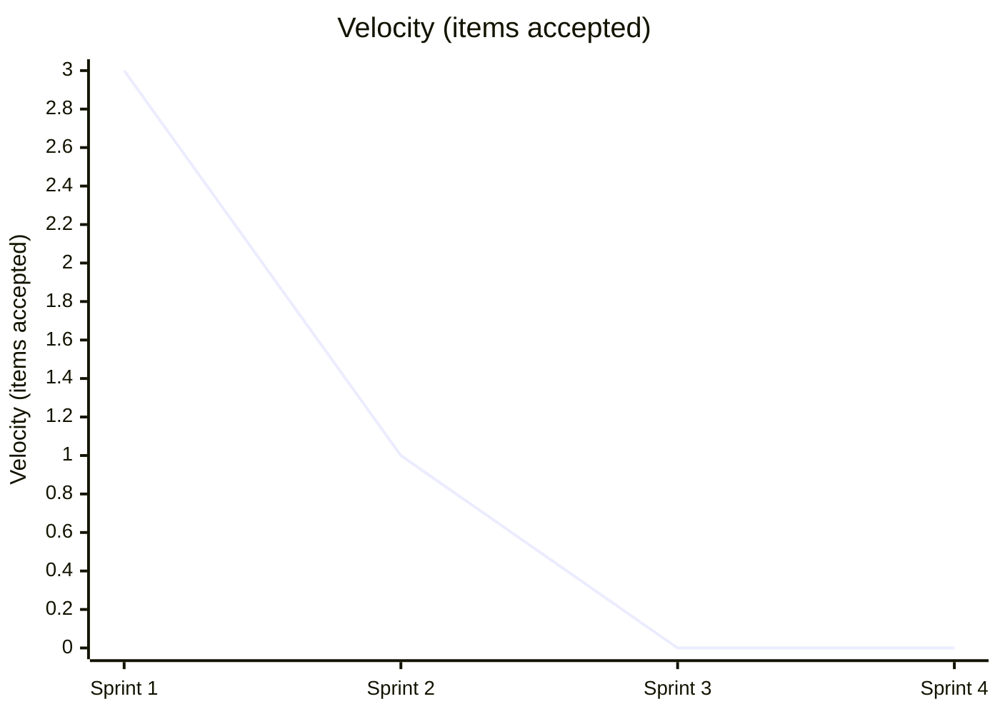
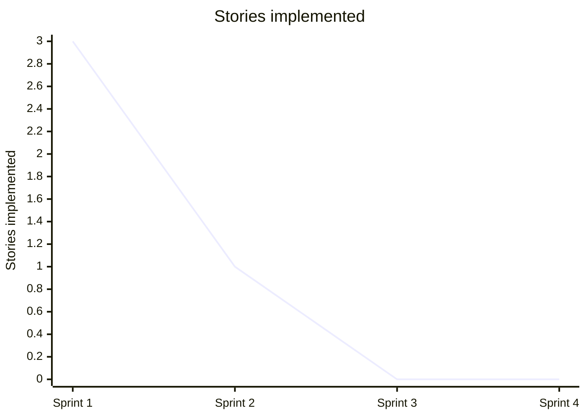

# Team Performance Evaluation Report

- Run ID: 0.1.0-run54
- Horseless Carriage commit: 8432fa4b495fec9be1910753fadffe16506ed109
- Branch: eval/0.1.0-run54/main
- Model: scrum-eval-cheap
- Sprints requested: 5, completed: 4
- Started: 2026-10-09T11:13:41.945064+00:00
- Finished: 2026-10-09T11:21:53.181170+00:00

## ⚠️ Evaluation Stopped Early

Only 4 of 5 requested sprints completed - **a BLOCKED story was still unresolved after a full sprint's own budget to fix it**.

- Stop reason: `blocked_unresolved_across_sprint`
- Blocked story: **ISSUE-0002** - product: ScrumOrchestrator and ProductOwner bounced transfer_to_agent 6x with no progress - 🔁 [TRANSFER LOOP DETECTED] 6 transfer_to_agent hops in a row with no other tool call in between (most recently ScrumOrchestrator -> ProductOwner) - refusing this transfer. This looks like an unproductive rotation between roles rather than a direct two-agent ping-pong. Stop transferring and actually call a tool that makes progress, or explain the blocker in plain text instead. (raised by ScrumOrchestrator)

## Blockers

- **ISSUE-0001** (Ensure untracked test databases (instance/todo.db) are ignored in .gitignore to prevent branch checkout blockage.) - product: ProductOwner and ScrumMaster bounced transfer_to_agent 3x with no progress - 🔁 [TRANSFER LOOP DETECTED] ProductOwner and ScrumMaster have handed off to each other 3 times in a row with no other tool call in between - refusing this transfer. Stop transferring and actually call a tool that makes progress (e.g. the mandatory step you're both routing around), or explain the blocker instead of handing off again. (raised by ProductOwner)
- **ISSUE-0002** (Local instance/todo.db untracked file blocked branch checkout during state push for US-0004 acceptance.) - product: ScrumOrchestrator and ProductOwner bounced transfer_to_agent 6x with no progress - 🔁 [TRANSFER LOOP DETECTED] 6 transfer_to_agent hops in a row with no other tool call in between (most recently ScrumOrchestrator -> ProductOwner) - refusing this transfer. This looks like an unproductive rotation between roles rather than a direct two-agent ping-pong. Stop transferring and actually call a tool that makes progress, or explain the blocker in plain text instead. (raised by ScrumOrchestrator)

## Methodology note
This run used a scripted, unattended driver (`run_eval.py`) that pre-approves every sprint goal/backlog and auto-merges any PR that opens against the eval branch, standing in for the human review gate real usage requires. Results reflect the team's real behavior under those conditions, not under full human-in-the-loop review - a lower bar in that one specific respect.

## Per-sprint metrics
| Sprint | Tokens Used | Stories Planned | Sprint Report? | PR Merges (after) |
|---|---|---|---|---|
| 1 | 4785122 | 4 | no | 0/0 |
| 2 | 1734724 | 0 | yes | 0/0 |
| 3 | 4328819 | 0 | no | 1/1 |
| 4 | 385910 | 0 | no | 0/0 |

## KPI Trends

| KPI | Sprint 1 | Sprint 2 | Sprint 3 | Sprint 4 |
|---|---|---|---|---|
| Velocity (items accepted) | 3 | 1 | 0 | 0 |
| Issues fixed | 0 | 0 | 0 | 0 |
| Stories implemented | 3 | 1 | 0 | 0 |
| Testplan scenarios | 4 | 4 | 4 | 4 |
| Say-Do Ratio | n/a | 1 | n/a | n/a |
| Quality (defect escape rate) | n/a | n/a | n/a | n/a |
| Test Coverage | n/a | 0.99 | n/a | n/a |

### Velocity (items accepted)

```mermaid
xychart-beta
    title "Velocity (items accepted)"
    x-axis ["Sprint 1", "Sprint 2", "Sprint 3", "Sprint 4"]
    y-axis "Velocity (items accepted)"
    line [3, 1, 0, 0]
```

### Issues fixed

```mermaid
xychart-beta
    title "Issues fixed"
    x-axis ["Sprint 1", "Sprint 2", "Sprint 3", "Sprint 4"]
    y-axis "Issues fixed"
    line [0, 0, 0, 0]
```

### Stories implemented

```mermaid
xychart-beta
    title "Stories implemented"
    x-axis ["Sprint 1", "Sprint 2", "Sprint 3", "Sprint 4"]
    y-axis "Stories implemented"
    line [3, 1, 0, 0]
```

### Testplan scenarios

```mermaid
xychart-beta
    title "Testplan scenarios"
    x-axis ["Sprint 1", "Sprint 2", "Sprint 3", "Sprint 4"]
    y-axis "Testplan scenarios"
    line [4, 4, 4, 4]
```

### Say-Do Ratio

```mermaid
xychart-beta
    title "Say-Do Ratio"
    x-axis ["Sprint 2"]
    y-axis "Say-Do Ratio"
    line [1]
```

(3 of 4 sprints have no data point for this KPI and are omitted above - see the table for exactly which.)

### Quality (defect escape rate)

No data available for this run - not_available - no defect tracking exists yet (Scrum Master's calculate_kpis did run this run, this specific metric just has no data source yet).

### Test Coverage

```mermaid
xychart-beta
    title "Test Coverage"
    x-axis ["Sprint 2"]
    y-axis "Test Coverage"
    line [0.99]
```

(3 of 4 sprints have no data point for this KPI and are omitted above - see the table for exactly which.)

## Token & Cost Summary

- Total tokens used: 11,234,575
- Expected cost: $1.1235 - $4.4938 (rough estimate from litellm's static pricing for `gemini/gemini-flash-lite-latest` - token_usage doesn't split prompt/completion tokens, so this is an all-input-vs-all-output bound, not an exact figure)

## Code Quality

**Score: 4/5**

The application core in app.py and templates/index.html is clean, functional, and accurately implements Flask with SQLAlchemy models (TodoList and Task) matching the product vision. The test suite in tests/test_app.py provides solid in-memory coverage for all CRUD and state toggling endpoints. A minor omission was initially made in requirements.txt (omitting Flask-SQLAlchemy), but it was caught and corrected during review.

## Requirements Quality

**Score: 3/5**

While individual user stories (US-0001 through US-0004) and the PRD in specs/requirements/PRD-Todo-App.md are well-defined, project tracking files like specs/ROADMAP.md were left largely unpopulated with release goals and kanban states. Additionally, repetitive transfer loops between agents caused friction, resulting in tracked issues like ISSUE-0001 and ISSUE-0002 for unignored local databases.

## Team Efficiency

**Score: 2/5**

The AI scrum team experienced severe workflow overhead and communication loops, notably documented in ISSUE-0001 and ISSUE-0002 where agent hand-offs triggered refusal guardrails ('🔁 [TRANSFER LOOP DETECTED]'). Despite completing all four user stories and staying well under budget ($0.53 of $15.00), the process generated excessive redundant dialogue and process debt.

## Top Problems

1. **Untracked SQLite database files are left inside the working tree under instance/todo.db.** (severity: medium)
   - Evidence: instance/todo.db in file tree and specs/reports/RETRO-001.md referencing ISSUE-0001/ISSUE-0002
   - Suggested fix: Add instance/ to .gitignore to prevent local database files from interfering with branch checkouts.

2. **Agent workflow suffered from recurring infinite transfer loops between ScrumMaster, ProductOwner, and DevTeam.** (severity: medium)
   - Evidence: specs/requirements/ISSUE-0001-...md citing 'ProductOwner and ScrumMaster have handed off to each other 3 times in a row'
   - Suggested fix: Refine agent prompting and orchestration logic to enforce direct tool execution instead of repetitive peer hand-offs.

3. **The product roadmap file was left unpopulated with standard release metrics and kanban boards.** (severity: low)
   - Evidence: specs/ROADMAP.md containing empty version goals and blank Kanban tables under '### v0.1 Kanban'
   - Suggested fix: Automate roadmap population or provide a template step in the ScrumMaster workflow so version planning matches story statuses.

4. **Required runtime dependencies were initially omitted from requirements.txt, causing a build failure caught late by QA.** (severity: low)
   - Evidence: TRANSCRIPT-001.md showing QA denying US-0001 because 'flask_sqlalchemy is missing from requirements.txt'
   - Suggested fix: Ensure DevTeam runs local dependency validation checks before submitting PRs for review.
