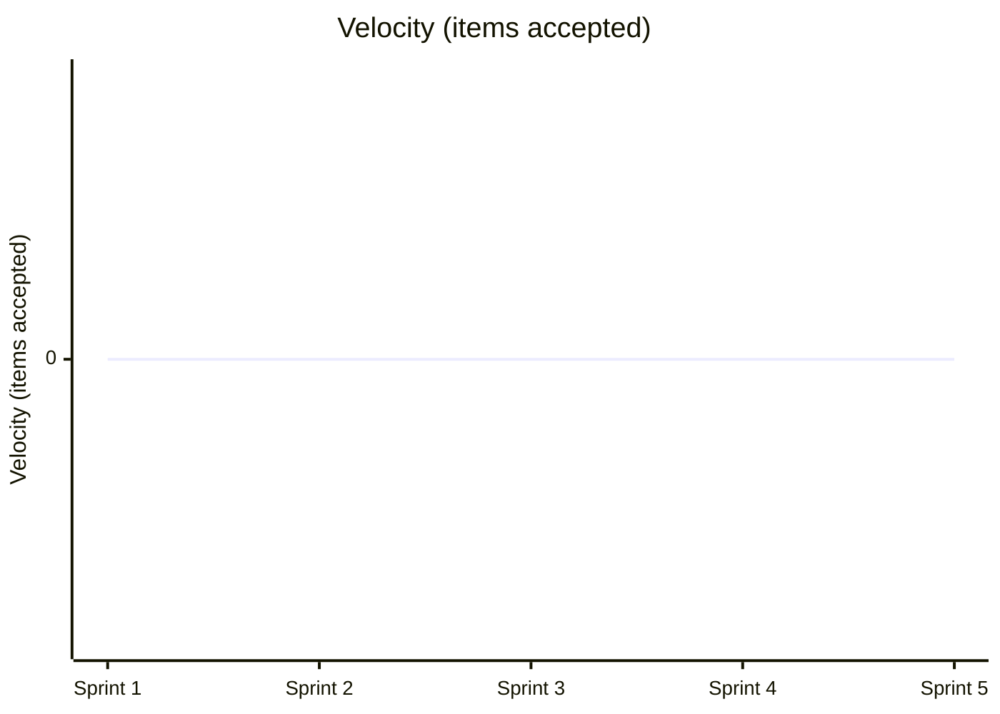
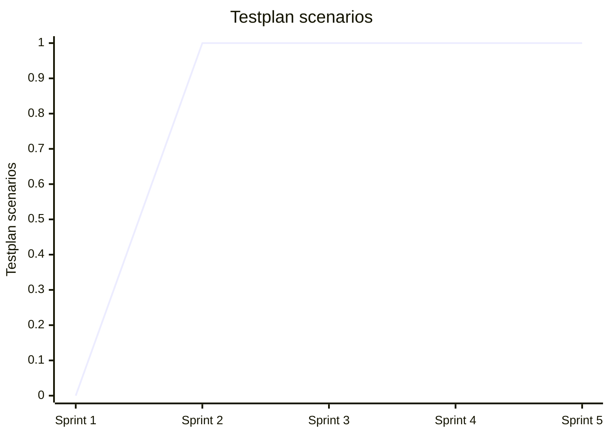

# Team Performance Evaluation Report

- Run ID: 0.1.0-run51
- Horseless Carriage commit: 856a31e5cdee5be88af2ca0410246fb1834d9c78
- Branch: eval/0.1.0-run51/main
- Model: scrum-eval-cheap
- Sprints requested: 5, completed: 5
- Started: 2026-10-07T20:08:25.801613+00:00
- Finished: 2026-10-07T20:09:48.403698+00:00

## ⚠️ Evaluation Stopped Early

Only 5 of 5 requested sprints completed - **a BLOCKED story was still unresolved after a full sprint's own budget to fix it**.

- Stop reason: `blocked_unresolved_across_sprint`
- Blocked story: **US-0001** - product: ProductOwner and ScrumMaster bounced transfer_to_agent 6x with no progress - 🔁 [TRANSFER LOOP DETECTED] 6 transfer_to_agent hops in a row with no other tool call in between (most recently ProductOwner -> ScrumMaster) - refusing this transfer. This looks like an unproductive rotation between roles rather than a direct two-agent ping-pong. Stop transferring and actually call a tool that makes progress, or explain the blocker in plain text instead. (raised by ProductOwner)

## Blockers

- **US-0001** (Create To-Do List) - product: ProductOwner and ScrumMaster bounced transfer_to_agent 6x with no progress - 🔁 [TRANSFER LOOP DETECTED] 6 transfer_to_agent hops in a row with no other tool call in between (most recently ProductOwner -> ScrumMaster) - refusing this transfer. This looks like an unproductive rotation between roles rather than a direct two-agent ping-pong. Stop transferring and actually call a tool that makes progress, or explain the blocker in plain text instead. (raised by ProductOwner)

## Methodology note
This run used a scripted, unattended driver (`run_eval.py`) that pre-approves every sprint goal/backlog and auto-merges any PR that opens against the eval branch, standing in for the human review gate real usage requires. Results reflect the team's real behavior under those conditions, not under full human-in-the-loop review - a lower bar in that one specific respect.

## Per-sprint metrics
| Sprint | Tokens Used | Stories Planned | Sprint Report? | PR Merges (after) |
|---|---|---|---|---|
| 1 | 246430 | 0 | no | 0/0 |
| 2 | 194301 | 0 | no | 0/0 |
| 3 | 229322 | 0 | no | 0/0 |
| 4 | 528012 | 0 | no | 0/0 |
| 5 | 197545 | 0 | yes | 0/0 |

## KPI Trends

| KPI | Sprint 1 | Sprint 2 | Sprint 3 | Sprint 4 | Sprint 5 |
|---|---|---|---|---|---|
| Velocity (items accepted) | 0 | 0 | 0 | 0 | 0 |
| Issues fixed | 0 | 0 | 0 | 0 | 0 |
| Stories implemented | 0 | 0 | 0 | 0 | 0 |
| Testplan scenarios | 0 | 1 | 1 | 1 | 1 |
| Say-Do Ratio | n/a | n/a | n/a | n/a | n/a |
| Quality (defect escape rate) | n/a | n/a | n/a | n/a | n/a |
| Test Coverage | n/a | n/a | n/a | n/a | 0 |

### Velocity (items accepted)

```mermaid
xychart-beta
    title "Velocity (items accepted)"
    x-axis ["Sprint 1", "Sprint 2", "Sprint 3", "Sprint 4", "Sprint 5"]
    y-axis "Velocity (items accepted)"
    line [0, 0, 0, 0, 0]
```

### Issues fixed

```mermaid
xychart-beta
    title "Issues fixed"
    x-axis ["Sprint 1", "Sprint 2", "Sprint 3", "Sprint 4", "Sprint 5"]
    y-axis "Issues fixed"
    line [0, 0, 0, 0, 0]
```

### Stories implemented

```mermaid
xychart-beta
    title "Stories implemented"
    x-axis ["Sprint 1", "Sprint 2", "Sprint 3", "Sprint 4", "Sprint 5"]
    y-axis "Stories implemented"
    line [0, 0, 0, 0, 0]
```

### Testplan scenarios

```mermaid
xychart-beta
    title "Testplan scenarios"
    x-axis ["Sprint 1", "Sprint 2", "Sprint 3", "Sprint 4", "Sprint 5"]
    y-axis "Testplan scenarios"
    line [0, 1, 1, 1, 1]
```

### Say-Do Ratio

No data available for this run - no stories committed to this sprint yet (Scrum Master's calculate_kpis did run this run, this specific metric just has no data source yet).

### Quality (defect escape rate)

No data available for this run - not available - no defect/bug-lifecycle tracking exists yet (Scrum Master's calculate_kpis did run this run, this specific metric just has no data source yet).

### Test Coverage

```mermaid
xychart-beta
    title "Test Coverage"
    x-axis ["Sprint 5"]
    y-axis "Test Coverage"
    line [0]
```

(4 of 5 sprints have no data point for this KPI and are omitted above - see the table for exactly which.)

## Token & Cost Summary

- Total tokens used: 1,395,610
- Expected cost: $0.1396 - $0.5582 (rough estimate from litellm's static pricing for `gemini/gemini-flash-lite-latest` - token_usage doesn't split prompt/completion tokens, so this is an all-input-vs-all-output bound, not an exact figure)

## Code Quality

**Score: 1/5**

No application code, backend files, or web templates were produced across the entire run. The workspace is completely devoid of implementation code, containing only markdown documentation and empty tracking directories. Consequently, code quality cannot be evaluated beyond noting a total absence of delivery.

## Requirements Quality

**Score: 2/5**

Initial project artifacts were established, including a Product Requirements Document in specs/requirements/PRD-Todo-MVP.md and user story files like specs/stories/US-0001-Create-To-Do-List.md. However, the requirements remain incomplete, blocked, and disconnected from any actual development execution.

## Team Efficiency

**Score: 1/5**

The agent team suffered from severe orchestration failures, getting trapped in a transfer loop where ProductOwner and ScrumMaster bounced transfers back and forth 6 times without making progress. Across all 5 sprints, 0 stories were completed, and the team spent tokens solely on setup and recursive handoff deadlocks.

## Top Problems

1. **Complete absence of product implementation code or web UI files.** (severity: high)
   - Evidence: File tree shows only markdown files in specs/ and README.md; no Python, JavaScript, or HTML source files exist.
   - Suggested fix: Implement the core Flask/FastAPI application and frontend templates outlined in specs/requirements/PRD-Todo-MVP.md.

2. **Agent team陷入 unproductive transfer loops between ProductOwner and ScrumMaster.** (severity: high)
   - Evidence: specs/stories/US-0001-Create-To-Do-List.md notes: 'ProductOwner and ScrumMaster bounced transfer_to_agent 6x with no progress - 🔁 [TRANSFER LOOP DETECTED]'
   - Suggested fix: Refine agent instruction prompts and orchestrator guardrails to prevent recursive role-swapping without tool calls.

3. **Sprint backlog PR creation failures halted all development work.** (severity: high)
   - Evidence: specs/requirements/ISSUE-0002-...md states: 'Sprint backlog PR could not be created because no new planning output was detected or sprint backlog needs explicit creation flow.'
   - Suggested fix: Fix the sprint backlog PR generation tool integration so that planning outputs properly trigger PR creation.

4. **Zero user stories were completed across all five sprints.** (severity: high)
   - Evidence: Per-sprint metrics table and specs/reports/SPRINT-REPORT-LATEST.md confirm: 'Stories: 0/0 completed this sprint'.
   - Suggested fix: No clear fix - systemic workflow and orchestration blockers prevented the team from advancing stories past the planning stage within the 5-sprint limit.
