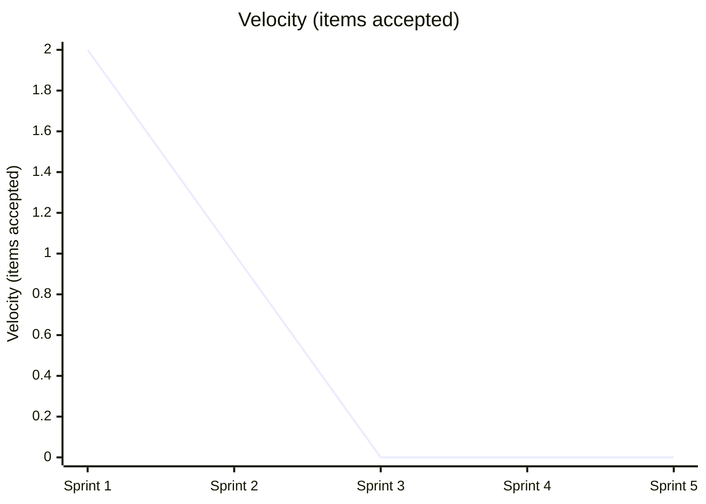
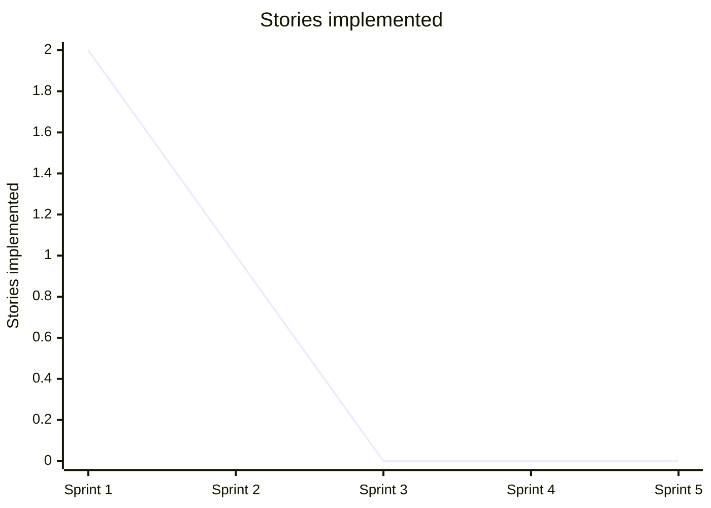
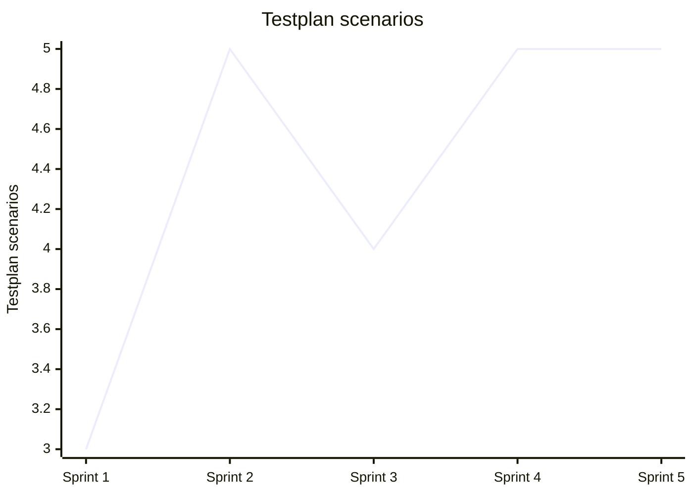

# Team Performance Evaluation Report

- Run ID: 0.1.0-run50
- Horseless Carriage commit: 9895e60b3a7d6af673609563939309535342989f
- Branch: eval/0.1.0-run50/main
- Model: scrum-eval-cheap
- Sprints requested: 5, completed: 5
- Started: 2026-10-07T14:54:55.539570+00:00
- Finished: 2026-10-07T15:04:47.280701+00:00

## Blockers

No stories are blocked as of the last completed sprint.

## Methodology note
This run used a scripted, unattended driver (`run_eval.py`) that pre-approves every sprint goal/backlog and auto-merges any PR that opens against the eval branch, standing in for the human review gate real usage requires. Results reflect the team's real behavior under those conditions, not under full human-in-the-loop review - a lower bar in that one specific respect.

## Per-sprint metrics
| Sprint | Tokens Used | Stories Planned | Sprint Report? | PR Merges (after) |
|---|---|---|---|---|
| 1 | 4334067 | 2 | yes | 1/1 |
| 2 | 6845722 | 0 | fallback | 1/1 |
| 3 | 5830350 | 0 | yes | 0/0 |
| 4 | 5999676 | 0 | fallback | 1/1 |
| 5 | 5789854 | 0 | fallback | 0/0 |

## KPI Trends

| KPI | Sprint 1 | Sprint 2 | Sprint 3 | Sprint 4 | Sprint 5 |
|---|---|---|---|---|---|
| Velocity (items accepted) | 2 | 1 | 0 | 0 | 0 |
| Issues fixed | 0 | 0 | 0 | 0 | 0 |
| Stories implemented | 2 | 1 | 0 | 0 | 0 |
| Testplan scenarios | 3 | 5 | 4 | 5 | 5 |
| Say-Do Ratio | 1 | 1 | 1 | 1 | 1 |
| Quality (defect escape rate) | n/a | n/a | n/a | n/a | n/a |
| Test Coverage | 0.98 | 0.98 | 0.98 | 0.98 | 0.98 |

### Velocity (items accepted)

```mermaid
xychart-beta
    title "Velocity (items accepted)"
    x-axis ["Sprint 1", "Sprint 2", "Sprint 3", "Sprint 4", "Sprint 5"]
    y-axis "Velocity (items accepted)"
    line [2, 1, 0, 0, 0]
```

### Issues fixed

```mermaid
xychart-beta
    title "Issues fixed"
    x-axis ["Sprint 1", "Sprint 2", "Sprint 3", "Sprint 4", "Sprint 5"]
    y-axis "Issues fixed"
    line [0, 0, 0, 0, 0]
```

### Stories implemented

```mermaid
xychart-beta
    title "Stories implemented"
    x-axis ["Sprint 1", "Sprint 2", "Sprint 3", "Sprint 4", "Sprint 5"]
    y-axis "Stories implemented"
    line [2, 1, 0, 0, 0]
```

### Testplan scenarios

```mermaid
xychart-beta
    title "Testplan scenarios"
    x-axis ["Sprint 1", "Sprint 2", "Sprint 3", "Sprint 4", "Sprint 5"]
    y-axis "Testplan scenarios"
    line [3, 5, 4, 5, 5]
```

### Say-Do Ratio

```mermaid
xychart-beta
    title "Say-Do Ratio"
    x-axis ["Sprint 1", "Sprint 2", "Sprint 3", "Sprint 4", "Sprint 5"]
    y-axis "Say-Do Ratio"
    line [1, 1, 1, 1, 1]
```

### Quality (defect escape rate)

No data available for this run - not available - no defect/bug-lifecycle tracking exists yet (Scrum Master's calculate_kpis did run this run, this specific metric just has no data source yet).

### Test Coverage

```mermaid
xychart-beta
    title "Test Coverage"
    x-axis ["Sprint 1", "Sprint 2", "Sprint 3", "Sprint 4", "Sprint 5"]
    y-axis "Test Coverage"
    line [0.98, 0.98, 0.98, 0.98, 0.98]
```

## Token & Cost Summary

- Total tokens used: 28,799,669
- Expected cost: $2.8800 - $11.5199 (rough estimate from litellm's static pricing for `gemini/gemini-flash-lite-latest` - token_usage doesn't split prompt/completion tokens, so this is an all-input-vs-all-output bound, not an exact figure)

## Code Quality

**Score: 3/5**

The Flask backend and Tailwind CSS frontend in app.py and templates/index.html correctly implement list creation and task addition. However, the application completely lacks task completion toggling, task deletion, and list deletion functionality despite stories being marked accepted. Furthermore, global ID counters and an in-memory list make the application unsuitable for concurrent or production use.

## Requirements Quality

**Score: 2/5**

The roadmap in specs/ROADMAP.md and story tracking files contain severe discrepancies and incomplete updates across sprints. While US-0001 and US-0003 are marked accepted, other stories like US-0002 are left in draft or unassigned states across multiple sprint reports. Documentation tracking fell apart as token budgets were exhausted.

## Team Efficiency

**Score: 2/5**

The AI team repeatedly breached token budgets across multiple sprints, averaging nearly 6 million tokens per sprint against a 5-million token limit. This triggered mechanical sprint report fallbacks and agent transfer loops, such as the 6x transfer loop cited in specs/reports/SPRINT-REPORT-001.md.

## Top Problems

1. **Core CRUD features missing from implementation despite roadmap and sprint reports claiming completion.** (severity: high)
   - Evidence: app.py only implements index(), create_list(), and add_task(); functions for completing or deleting tasks and lists are entirely absent.
   - Suggested fix: Implement remaining routes for deleting tasks, deleting lists, and toggling task completion status in app.py and templates/index.html.

2. **Agent transfer loops and communication deadlocks waste significant token budgets.** (severity: high)
   - Evidence: specs/reports/SPRINT-REPORT-001.md states: 'ProductOwner and ScrumMaster bounced transfer_to_agent 6x with no progress - 🔁 [TRANSFER LOOP DETECTED]'
   - Suggested fix: Add hard orchestration guardrails in the agent harness to prevent circular transfers between ProductOwner and ScrumMaster.

3. **Token budget exhaustion consistently forces mechanical sprint report fallbacks.** (severity: medium)
   - Evidence: All sprint reports except 1 and 3 note: 'This sprint's token/USD budget was used in full before Scrum Master's own create_sprint_report call could run'
   - Suggested fix: no clear fix - 5 sprints with strict token caps constrain complex agentic multi-turn workflows without changing the evaluation methodology.

4. **In-memory state persistence with global ID counters causes test leakage and race conditions.** (severity: medium)
   - Evidence: app.py uses global lists_store = [], next_list_id = 1, and next_task_id = 1 requiring manual test fixture resets in tests/test_app.py.
   - Suggested fix: Refactor app.py to encapsulate state within a class or lightweight database layer (like SQLite) rather than mutable global variables.
