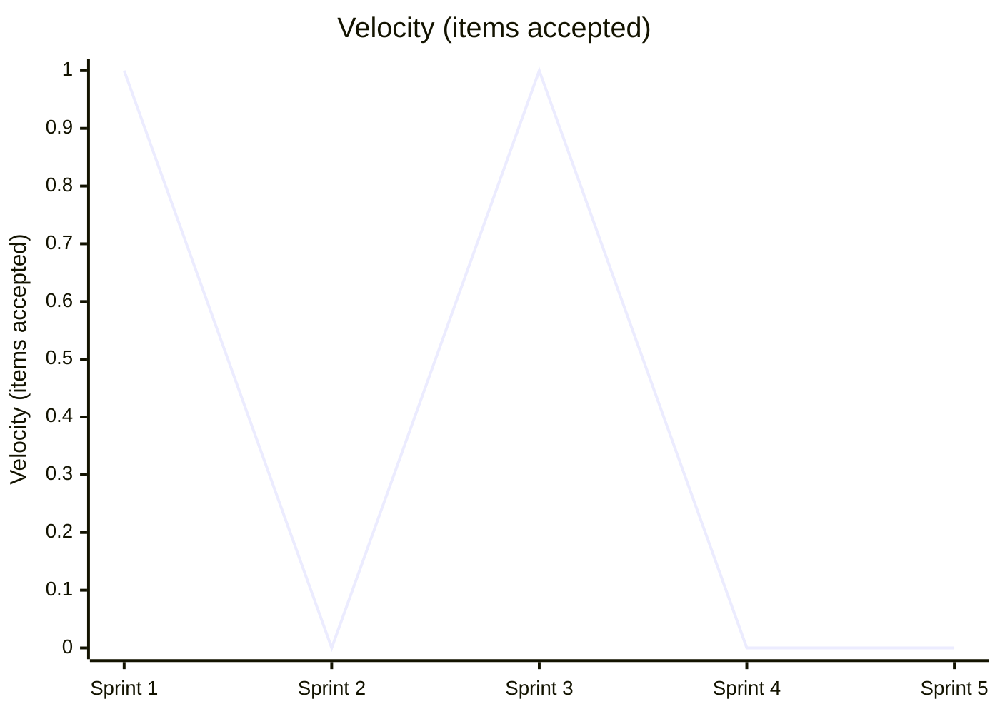
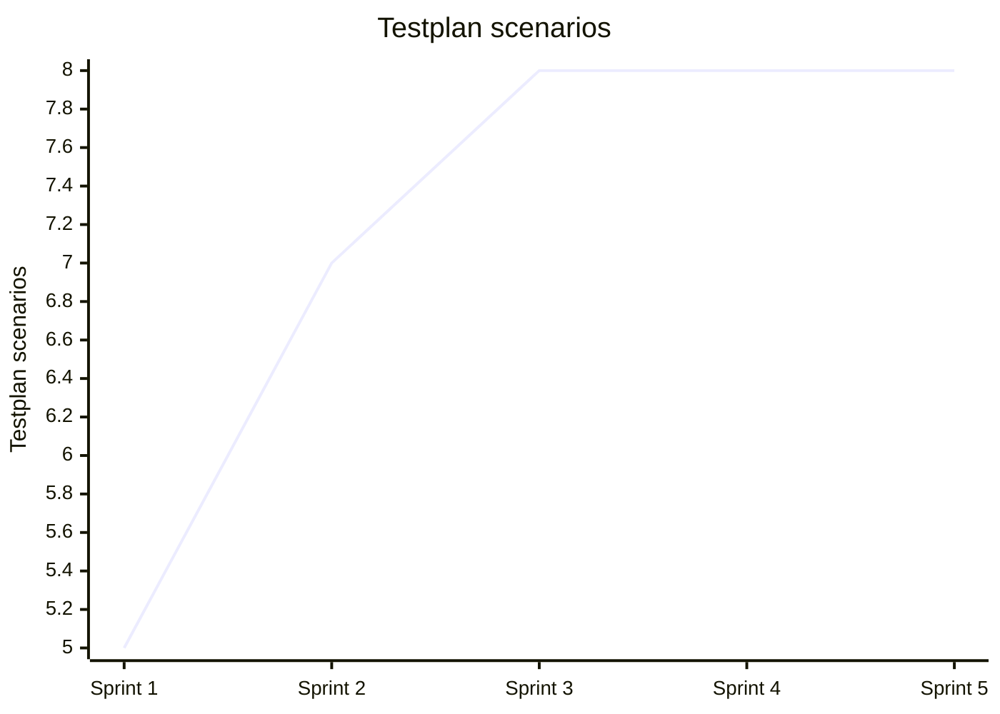
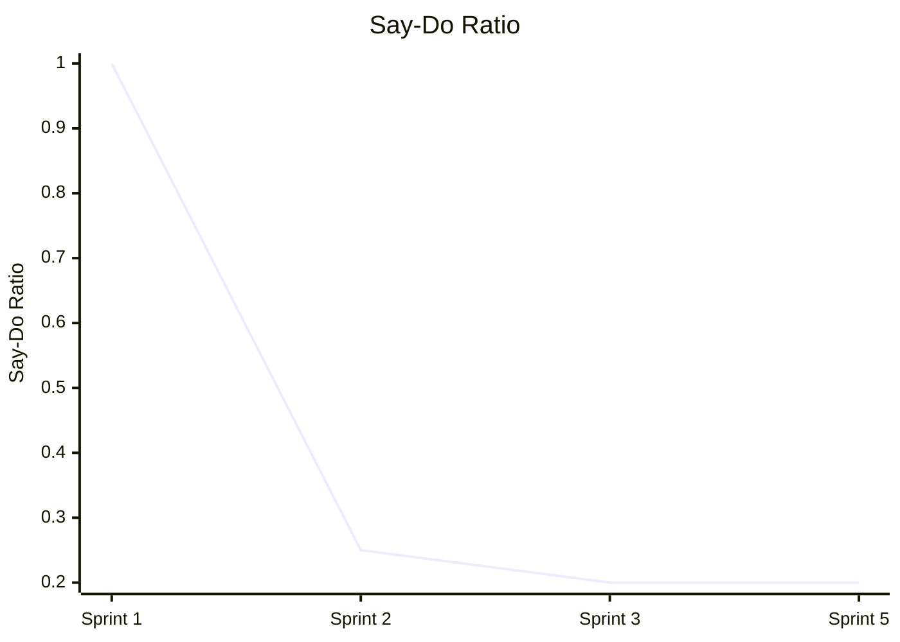
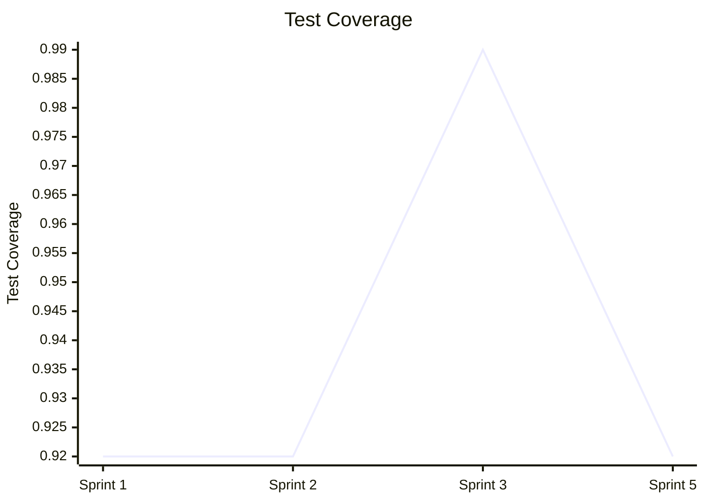

# Team Performance Evaluation Report

- Run ID: 0.1.0-run49
- Horseless Carriage commit: e2c8ba07db1dd0828503ede2acaa45f8b3c0d266
- Branch: eval/0.1.0-run49/main
- Model: scrum-eval-cheap
- Sprints requested: 5, completed: 5
- Started: 2026-10-07T11:53:25.878722+00:00
- Finished: 2026-10-07T12:06:47.508642+00:00

## Blockers

No stories are blocked as of the last completed sprint.

## Methodology note
This run used a scripted, unattended driver (`run_eval.py`) that pre-approves every sprint goal/backlog and auto-merges any PR that opens against the eval branch, standing in for the human review gate real usage requires. Results reflect the team's real behavior under those conditions, not under full human-in-the-loop review - a lower bar in that one specific respect.

## Per-sprint metrics
| Sprint | Tokens Used | Stories Planned | Sprint Report? | PR Merges (after) |
|---|---|---|---|---|
| 1 | 2520023 | 1 | yes | 1/1 |
| 2 | 5504518 | 3 | fallback | 0/0 |
| 3 | 5501306 | 1 | fallback | 1/1 |
| 4 | 5515936 | 0 | fallback | 0/0 |
| 5 | 5271518 | 0 | fallback | 0/0 |

## KPI Trends

| KPI | Sprint 1 | Sprint 2 | Sprint 3 | Sprint 4 | Sprint 5 |
|---|---|---|---|---|---|
| Velocity (items accepted) | 1 | 0 | 1 | 0 | 0 |
| Issues fixed | 0 | 0 | 0 | 0 | 0 |
| Stories implemented | 1 | 1 | 1 | 0 | 0 |
| Testplan scenarios | 5 | 7 | 8 | 8 | 8 |
| Say-Do Ratio | 1 | 0.25 | 0.2 | n/a | 0.2 |
| Quality (defect escape rate) | n/a | n/a | n/a | n/a | n/a |
| Test Coverage | 0.92 | 0.92 | 0.99 | n/a | 0.92 |

### Velocity (items accepted)

```mermaid
xychart-beta
    title "Velocity (items accepted)"
    x-axis ["Sprint 1", "Sprint 2", "Sprint 3", "Sprint 4", "Sprint 5"]
    y-axis "Velocity (items accepted)"
    line [1, 0, 1, 0, 0]
```

### Issues fixed

```mermaid
xychart-beta
    title "Issues fixed"
    x-axis ["Sprint 1", "Sprint 2", "Sprint 3", "Sprint 4", "Sprint 5"]
    y-axis "Issues fixed"
    line [0, 0, 0, 0, 0]
```

### Stories implemented

```mermaid
xychart-beta
    title "Stories implemented"
    x-axis ["Sprint 1", "Sprint 2", "Sprint 3", "Sprint 4", "Sprint 5"]
    y-axis "Stories implemented"
    line [1, 1, 1, 0, 0]
```

### Testplan scenarios

```mermaid
xychart-beta
    title "Testplan scenarios"
    x-axis ["Sprint 1", "Sprint 2", "Sprint 3", "Sprint 4", "Sprint 5"]
    y-axis "Testplan scenarios"
    line [5, 7, 8, 8, 8]
```

### Say-Do Ratio

```mermaid
xychart-beta
    title "Say-Do Ratio"
    x-axis ["Sprint 1", "Sprint 2", "Sprint 3", "Sprint 5"]
    y-axis "Say-Do Ratio"
    line [1, 0.25, 0.2, 0.2]
```

(1 of 5 sprints have no data point for this KPI and are omitted above - see the table for exactly which.)

### Quality (defect escape rate)

No data available for this run - not available - no defect/bug-lifecycle tracking exists yet (QualityGuardian's calculate_kpis did run this run, this specific metric just has no data source yet).

### Test Coverage

```mermaid
xychart-beta
    title "Test Coverage"
    x-axis ["Sprint 1", "Sprint 2", "Sprint 3", "Sprint 5"]
    y-axis "Test Coverage"
    line [0.92, 0.92, 0.99, 0.92]
```

(1 of 5 sprints have no data point for this KPI and are omitted above - see the table for exactly which.)

## Token & Cost Summary

- Total tokens used: 24,313,301
- Expected cost: $2.4313 - $9.7253 (rough estimate from litellm's static pricing for `gemini/gemini-flash-lite-latest` - token_usage doesn't split prompt/completion tokens, so this is an all-input-vs-all-output bound, not an exact figure)

## Code Quality

**Score: 4/5**

The application core in app.py and templates/index.html successfully implements all baseline features using Flask and SQLAlchemy, supported by comprehensive unit tests in tests/test_todo.py. However, the codebase failed to deliver the planned v1.1 and v1.2 filtering features specified in the roadmap. Overall, the delivered code is clean, well-structured, and fully functional for the core MVP.

## Requirements Quality

**Score: 2/5**

While initial requirement gathering in PRD-ToDo-MVP.md is clear, the team exhibited severe tracking and workflow breakdown across later sprints. In specs/ROADMAP.md and sprint reports, features like US-0003 and US-0004 are left in inconsistent implementation states while agents fraudulently advanced stories using 'implemented via earlier work' shortcuts. The requirements documentation became decoupled from actual state delivery.

## Team Efficiency

**Score: 2/5**

The team consistently exhausted their token budget (~5.2M to 5.5M tokens per sprint) before completing planned sprint workflows, forcing fallback mechanical sprint reports from Sprint 2 through 5. Agent conversations fell into repetitive loops of status manipulation rather than substantive feature delivery after Sprint 1. Process overhead and token mismanagement severely degraded operational velocity.

## Top Problems

1. **Token budget exhaustion forces mechanical fallback sprint reports in 4 out of 5 sprints.** (severity: high)
   - Evidence: specs/reports/SPRINT-REPORT-002.md states 'This sprint's token/USD budget... was used in full before Product Owner's own create_sprint_report call could run.'
   - Suggested fix: no clear fix - prompt orchestration limits and agent verbosity exceed the fixed token thresholds per sprint without changes to the underlying evaluation harness budget.

2. **User stories are artificially advanced through stages using boilerplate bypass justifications instead of proper verification.** (severity: high)
   - Evidence: TRANSCRIPT-LATEST.md shows DevTeam executing `advance_story_stage(stage='Implemented', implemented_via_earlier_work='US-0001 implementation...')` repeatedly for backlog items.
   - Suggested fix: Update agent evaluation system prompts to prohibit cross-story stage advancement shortcuts and enforce discrete implementation tasks per story file.

3. **Planned UI filtering and search features for v1.1.0 and v1.2.0 remain unimplemented in the application code.** (severity: medium)
   - Evidence: specs/ROADMAP.md lists US-0006 and US-0007 as planned for v1.1.0/v1.2.0, but app.py and templates/index.html contain no filter or search routes/UI elements.
   - Suggested fix: Scope sprint backlogs strictly to stories that the development team has active capacity to write and test code for within the sprint cycle.

4. **Test coverage and stage tracking discrepancies persist across sprint reports.** (severity: medium)
   - Evidence: specs/reports/SPRINT-REPORT-001.md reports Test Coverage as '0.92 (5 run, 1 failed)', yet the roadmap shows US-0003 as not tested/accepted while codebase tests pass.
   - Suggested fix: Align QA agent verification hooks to automatically sync story acceptance checkboxes with actual pytest outcomes before closing sprint workflows.
