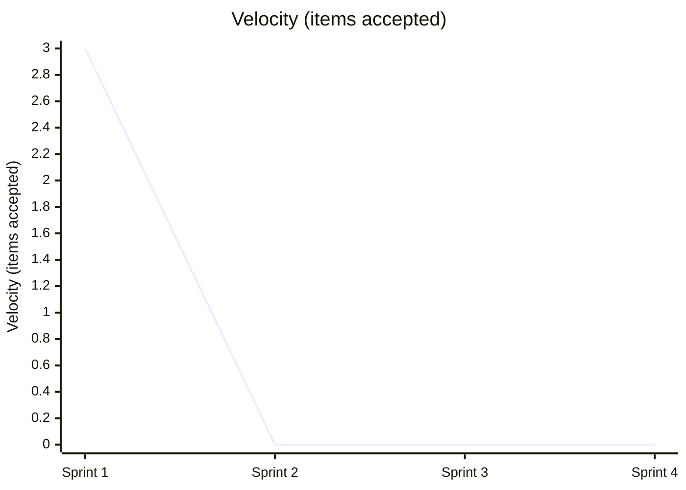
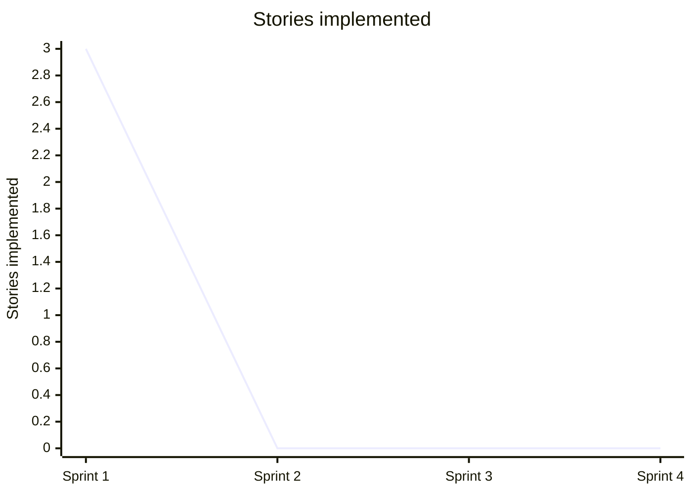

# Team Performance Evaluation Report

- Run ID: 0.1.0-run55
- Horseless Carriage commit: a0cd0e3a48d167f815ffc94436a3eafeacab4ae1
- Branch: eval/0.1.0-run55/main
- Model: scrum-eval-cheap
- Sprints requested: 5, completed: 4
- Started: 2026-10-09T14:28:04.769020+00:00
- Finished: 2026-10-09T14:34:52.822142+00:00

## ⚠️ Evaluation Stopped Early

Only 4 of 5 requested sprints completed - **a sprint hit a critical token/USD budget halt with no clean close-out afterward**.

- Stop reason: `budget_critical_halt`

## Blockers

No stories are blocked as of the last completed sprint.

## Methodology note
This run used a scripted, unattended driver (`run_eval.py`) that pre-approves every sprint goal/backlog and auto-merges any PR that opens against the eval branch, standing in for the human review gate real usage requires. Results reflect the team's real behavior under those conditions, not under full human-in-the-loop review - a lower bar in that one specific respect.

## Per-sprint metrics
| Sprint | Tokens Used | Stories Planned | Sprint Report? | PR Merges (after) |
|---|---|---|---|---|
| 1 | 5110763 | 3 | no | 0/0 |
| 2 | 5816031 | 0 | yes | 1/1 |
| 3 | 6075226 | 0 | yes | 0/0 |
| 4 | 6075226 | 0 | yes | 0/0 |

## KPI Trends

| KPI | Sprint 1 | Sprint 2 | Sprint 3 | Sprint 4 |
|---|---|---|---|---|
| Velocity (items accepted) | 3 | 0 | 0 | 0 |
| Issues fixed | 0 | 0 | 0 | 0 |
| Stories implemented | 3 | 0 | 0 | 0 |
| Testplan scenarios | 6 | 6 | 6 | 6 |
| Say-Do Ratio | n/a | 1 | n/a | n/a |
| Quality (defect escape rate) | n/a | n/a | n/a | n/a |
| Test Coverage | n/a | 0.96 | n/a | n/a |

### Velocity (items accepted)

```mermaid
xychart-beta
    title "Velocity (items accepted)"
    x-axis ["Sprint 1", "Sprint 2", "Sprint 3", "Sprint 4"]
    y-axis "Velocity (items accepted)"
    line [3, 0, 0, 0]
```

### Issues fixed

```mermaid
xychart-beta
    title "Issues fixed"
    x-axis ["Sprint 1", "Sprint 2", "Sprint 3", "Sprint 4"]
    y-axis "Issues fixed"
    line [0, 0, 0, 0]
```

### Stories implemented

```mermaid
xychart-beta
    title "Stories implemented"
    x-axis ["Sprint 1", "Sprint 2", "Sprint 3", "Sprint 4"]
    y-axis "Stories implemented"
    line [3, 0, 0, 0]
```

### Testplan scenarios

```mermaid
xychart-beta
    title "Testplan scenarios"
    x-axis ["Sprint 1", "Sprint 2", "Sprint 3", "Sprint 4"]
    y-axis "Testplan scenarios"
    line [6, 6, 6, 6]
```

### Say-Do Ratio

```mermaid
xychart-beta
    title "Say-Do Ratio"
    x-axis ["Sprint 2"]
    y-axis "Say-Do Ratio"
    line [1]
```

(3 of 4 sprints have no data point for this KPI and are omitted above - see the table for exactly which.)

### Quality (defect escape rate)

No data available for this run - not available - no defect/bug-lifecycle tracking exists yet (Scrum Master's calculate_kpis did run this run, this specific metric just has no data source yet).

### Test Coverage

```mermaid
xychart-beta
    title "Test Coverage"
    x-axis ["Sprint 2"]
    y-axis "Test Coverage"
    line [0.96]
```

(3 of 4 sprints have no data point for this KPI and are omitted above - see the table for exactly which.)

## Token & Cost Summary

- Total tokens used: 23,077,246
- Expected cost: $2.3077 - $9.2309 (rough estimate from litellm's static pricing for `gemini/gemini-flash-lite-latest` - token_usage doesn't split prompt/completion tokens, so this is an all-input-vs-all-output bound, not an exact figure)

## Code Quality

**Score: 4/5**

The application core in models.py and routes in app.py are clean, concise, and correctly implement local JSON persistence for lists and tasks. The test suite in test_app.py uses temporary files and Flask's test client effectively to secure 96% coverage across all implemented operations. However, the UI template in templates/index.html is quite basic, and execution stalls after completing US-0001 through US-0003.

## Requirements Quality

**Score: 2/5**

While the PRD in specs/requirements/PRD-TodoList-MVP.md accurately captures the full vision, the roadmap in specs/ROADMAP.md and sprint reporting are severely misaligned with reality. Stories US-0004, US-0005, and US-0006 remain marked as [ ] IMPLEMENTED in the roadmap despite code existing for them in models.py and app.py, and sprint reports redundantly duplicate the text from Sprint 3 across multiple later sprints.

## Team Efficiency

**Score: 2/5**

The AI team completed the first three user stories in Sprint 1/2 with good test coverage, but stalled completely afterward, repeatedly churning token budgets (exceeding 5M to 6M tokens per sprint) without finishing the remaining backlog items (US-0004, US-0005, US-0006). Furthermore, sprint reports for Sprints 3 and 4 failed to generate new updates, instead copying the exact summary of Sprint 3 ('Sprint 3 conducted planning for task deletion').

## Top Problems

1. **Incomplete roadmap synchronization leaves core user stories marked as unimplemented.** (severity: high)
   - Evidence: specs/ROADMAP.md shows US-0004, US-0005, and US-0006 with unchecked implementation boxes ([ ] IMPLEMENTED), even though backend logic and tests for list/task deletion are present in models.py and test_app.py.
   - Suggested fix: Update agent workflows to automatically synchronize story status flags in specs/ROADMAP.md upon successful PR merges.

2. **Duplicate and stale sprint reports across later sprints.** (severity: medium)
   - Evidence: specs/reports/SPRINT-REPORT-001.md, SPRINT-REPORT-LATEST.md, and the Sprint 4 report all repeat the exact same text: 'Sprint 3 conducted planning for task deletion, hitting token limits before story completion.'
   - Suggested fix: Fix the ScrumMaster reporting logic to fetch and render the correct active sprint index and accomplishments instead of reusing cached boilerplate.

3. **Severe token budget overruns relative to velocity.** (severity: high)
   - Evidence: specs/reports/SPRINT-REPORT-LATEST.md shows 5,920,216 tokens used against a 5,000,000 token budget (118%) while completing zero new stories in the final sprints.
   - Suggested fix: no clear fix - agent loop orchestration logic needs macro-level architectural revisions to curtail infinite review/transfer cycles.
