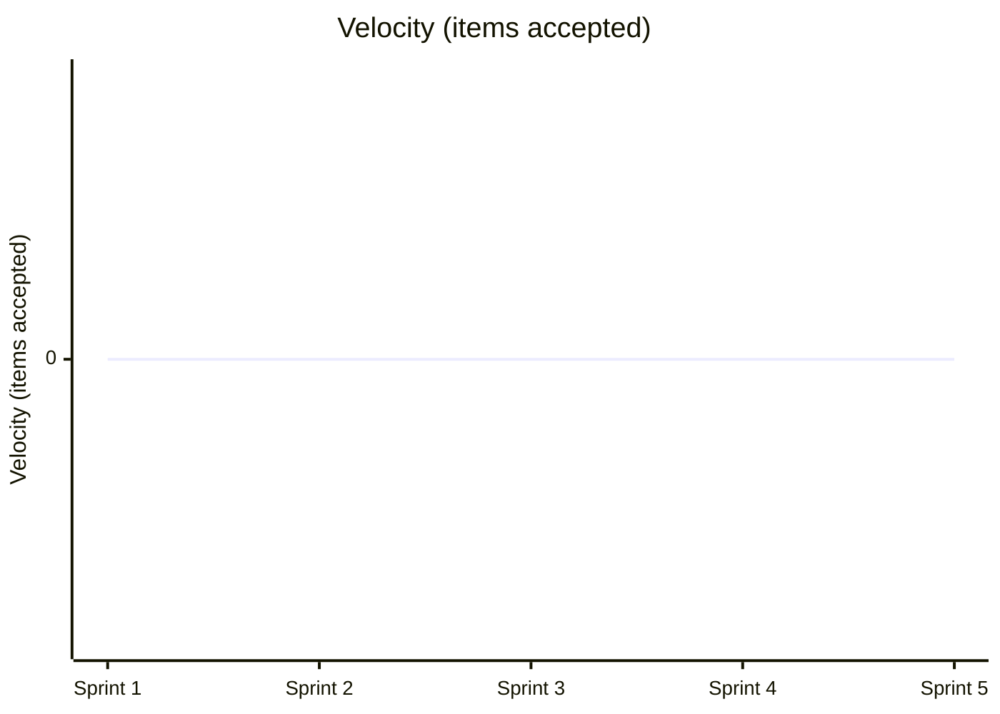

# Team Performance Evaluation Report

- Run ID: 0.1.0-run46
- Horseless Carriage commit: d51c8f511e0e9c8f7840091af5189c1024305a32
- Branch: eval/0.1.0-run46/main
- Model: scrum-eval-cheap
- Sprints requested: 5, completed: 5
- Started: 2026-10-05T13:45:53.801489+00:00
- Finished: 2026-10-05T13:58:02.132317+00:00

## Blockers

No stories are blocked as of the last completed sprint.

## Methodology note
This run used a scripted, unattended driver (`run_eval.py`) that pre-approves every sprint goal/backlog and auto-merges any PR that opens against the eval branch, standing in for the human review gate real usage requires. Results reflect the team's real behavior under those conditions, not under full human-in-the-loop review - a lower bar in that one specific respect.

## Per-sprint metrics
| Sprint | Tokens Used | Stories Planned | Sprint Report? | PR Merges (after) |
|---|---|---|---|---|
| 1 | 4646454 | 0 | no | 0/0 |
| 2 | 5558564 | 0 | yes | 0/0 |
| 3 | 5539116 | 0 | yes | 0/0 |
| 4 | 2076566 | 0 | yes | 1/1 |
| 5 | 2336214 | 0 | yes | 1/1 |

## KPI Trends

| KPI | Sprint 1 | Sprint 2 | Sprint 3 | Sprint 4 | Sprint 5 |
|---|---|---|---|---|---|
| Velocity (items accepted) | 0 | 0 | 0 | 0 | 0 |
| Issues fixed | 0 | 0 | 0 | 0 | 0 |
| Stories implemented | 0 | 0 | 0 | 0 | 0 |
| Testplan scenarios | 0 | 0 | 0 | 0 | 0 |
| Say-Do Ratio | n/a | n/a | n/a | n/a | n/a |
| Quality (defect escape rate) | n/a | n/a | n/a | n/a | n/a |
| Test Coverage | n/a | 0 | 0 | 0 | 0 |

### Velocity (items accepted)

```mermaid
xychart-beta
    title "Velocity (items accepted)"
    x-axis ["Sprint 1", "Sprint 2", "Sprint 3", "Sprint 4", "Sprint 5"]
    y-axis "Velocity (items accepted)"
    line [0, 0, 0, 0, 0]
```

### Issues fixed

```mermaid
xychart-beta
    title "Issues fixed"
    x-axis ["Sprint 1", "Sprint 2", "Sprint 3", "Sprint 4", "Sprint 5"]
    y-axis "Issues fixed"
    line [0, 0, 0, 0, 0]
```

### Stories implemented

```mermaid
xychart-beta
    title "Stories implemented"
    x-axis ["Sprint 1", "Sprint 2", "Sprint 3", "Sprint 4", "Sprint 5"]
    y-axis "Stories implemented"
    line [0, 0, 0, 0, 0]
```

### Testplan scenarios

```mermaid
xychart-beta
    title "Testplan scenarios"
    x-axis ["Sprint 1", "Sprint 2", "Sprint 3", "Sprint 4", "Sprint 5"]
    y-axis "Testplan scenarios"
    line [0, 0, 0, 0, 0]
```

### Say-Do Ratio

No data available for this run - no stories committed to this sprint yet (QualityGuardian's calculate_kpis did run this run, this specific metric just has no data source yet).

### Quality (defect escape rate)

No data available for this run - not available - no defect/bug-lifecycle tracking exists yet (QualityGuardian's calculate_kpis did run this run, this specific metric just has no data source yet).

### Test Coverage

```mermaid
xychart-beta
    title "Test Coverage"
    x-axis ["Sprint 2", "Sprint 3", "Sprint 4", "Sprint 5"]
    y-axis "Test Coverage"
    line [0, 0, 0, 0]
```

(1 of 5 sprints have no data point for this KPI and are omitted above - see the table for exactly which.)

## Token & Cost Summary

- Total tokens used: 20,156,914
- Expected cost: $2.0157 - $8.0628 (rough estimate from litellm's static pricing for `gemini/gemini-flash-lite-latest` - token_usage doesn't split prompt/completion tokens, so this is an all-input-vs-all-output bound, not an exact figure)

## Code Quality

**Score: 1/5**

The repository contains zero application source code files, application entrypoints, database models, templates, or functional test files. While architecture documents like specs/architecture/ARCHITECTURE-VISION.md outline a Flask and SQLAlchemy design, no actual implementation exists in the file tree.

## Requirements Quality

**Score: 2/5**

The project documents user stories and an MVP PRD (specs/requirements/PRD-TodoList-MVP.md, specs/stories/US-0001-Create-a-New-To-Do-List.md), but the roadmap (specs/ROADMAP.md) shows that stories remain stuck in early validation loops. Furthermore, automated test metrics across reports continuously reflect 0% test coverage and unexecuted tests.

## Team Efficiency

**Score: 1/5**

Across 5 sprints, the AI agent team burned millions of tokens (e.g., 5,558,564 tokens in Sprint 2) while completing 0 stories per sprint. The transcript entries and sprint reports reveal severe infinite loops around test collection (ISSUE-0005/ISSUE-0007) and failure to progress tasks past initial draft stages.

## Top Problems

1. **Complete absence of application source code files in the repository tree.** (severity: high)
   - Evidence: File tree shows only documentation, specifications, and reports—no application files like app.py, models.py, or routes.py exist.
   - Suggested fix: Implement the core Flask application factory and models matching specs/architecture/ARCHITECTURE-VISION.md.

2. **Persistent test collection and configuration failures blocking feature sign-off.** (severity: high)
   - Evidence: specs/reports/RETRO-002.md lists ISSUE-0005: 'Implement a standard pytest-compatible test suite structure in the repository root so coverage is correctly parsed during QA verification.'
   - Suggested fix: Establish a standardized pytest configuration and directory structure in the root during sprint setup.

3. **Zero user stories completed across all 5 evaluation sprints.** (severity: high)
   - Evidence: specs/reports/SPRINT-REPORT-LATEST.md states 'Stories: 0/0 completed this sprint' and ROADMAP.md shows US-0002 through US-0006 stuck with un-implemented checkboxes.
   - Suggested fix: no clear fix - agent token allocation and sprint orchestration logic failed to transition tasks from drafting to implementation.

4. **Spurious test file manipulation loops in conversation transcripts.** (severity: medium)
   - Evidence: specs/reports/TRANSCRIPT-001.md shows repeated transfers between DevTeam and QA attempting to write, remove, and git rm test files like tests/test_direct.py and tests/test_todo_unit.py.
   - Suggested fix: Refactor agent prompts and guardrails to prevent redundant file deletion/creation loops during quality checks.
